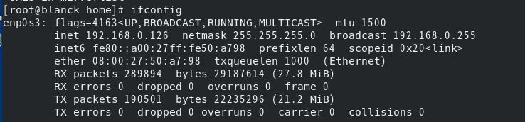

# [笔记目录](目录.md)
# Linux部分
在b站上跟随[【小白入门 通俗易懂】2021韩顺平 一周学会Linux](https://www.bilibili.com/video/BV1Sv411r7vd/?spm_id_from=333.337.search-card.all.click&vd_source=3b0e33a626cf5e45835cac5d91093908)开始进行Linux的学习

## 常见问题
* vmware在使用一段时间后就卡死
    * 可能是虚拟机的内存给小了或者处理器给少了
    * 可能是虚拟机在下载的时候出现损坏？
    * 直接换VirtualBox，问题基本都能解决
* 换VirtualBox没法用vmtools
    * 安装VirtualBox的增强功能，效果一样的
* 视频里远程连接的软件没法下
    * 用MobaXterm也能行，还能直接传本地文件
* 为什么我远程连接不上我的虚拟机
  *  可能是虚拟机ip地址无效(建议ping通了再试)
  *  ping通了还不行？还出现下面这样的报错？
    
        * 你确定你的虚拟机开机了？

## 远程连接
1. 在虚拟机中连接上网
2. 通过`ifconfig`指令获取虚拟机的ip地址(不联网的话是拿不到ip地址的)
   
3. 在本机中通过`ping`指令来确认ip地址的有效性
4. 确认ip地址的有效性后通过MobaXterm的Session选项来实现SSH显示的远程连接。
 
5. 将获取到的虚拟机ip地址填入Remote host中即可实现

6. 在登录后就可以正常使用虚拟机了(当然,只有命令行没有桌面)

## Vim
### 简介
Vim是Linux和Unix系统上最基本的文本编辑器
### 使用指南
## 常见指令

