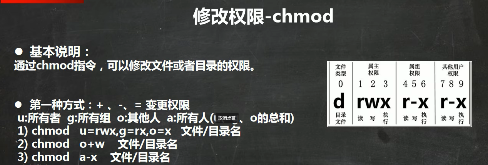

# [笔记目录](目录.md)
# Linux部分
在b站上跟随[【小白入门 通俗易懂】2021韩顺平 一周学会Linux](https://www.bilibili.com/video/BV1Sv411r7vd/?spm_id_from=333.337.search-card.all.click&vd_source=3b0e33a626cf5e45835cac5d91093908)开始进行Linux的学习

## 1.常见问题
* vmware在使用一段时间后就卡死
    * 可能是虚拟机的内存给小了或者处理器给少了
    * 可能是虚拟机在下载的时候出现损坏？
    * 直接换VirtualBox，问题基本都能解决
* 换VirtualBox没法用vmtools
    * 安装VirtualBox的增强功能，效果一样的
* 视频里远程连接的软件没法下
    * 用MobaXterm也能行，还能直接传本地文件
* 为什么我远程连接不上我的虚拟机
  *  可能是虚拟机ip地址无效(建议ping通了再试)
  *  可能是虚拟网卡拿错了，,如果是使用wifi进行连接的话主要使用带wireless的网卡.
  *  ping通了还不行？还出现下面这样的报错？
    
        * 你确定你的虚拟机开机了？

## 2.远程连接
1. 在虚拟机中连接上网
2. 通过`ifconfig`指令获取虚拟机的ip地址(不联网的话是拿不到ip地址的)
   
3. 在本机中通过`ping`指令来确认ip地址的有效性
4. 确认ip地址的有效性后通过MobaXterm的Session选项来实现SSH显示的远程连接。
 
5. 将获取到的虚拟机ip地址填入Remote host中即可实现

6. 在登录后就可以正常使用虚拟机了(当然,只有命令行没有桌面)

## 3.Vim
___
### 3.1 简介
&emsp; Vi是Linux和Unix系统上最基本的文本编辑器,而Vim可以看做是Vi的增强版本，可以主动以字体颜色辨别语法的正确性

### 3.2 使用指南
&emsp; Vim有三种常见的模式
1. 正常模式
&emsp;  打开文档后的默认模式，可以通过移动光标来实现定位，并通过指令进行复制与删除操作
2. 插入模式
&emsp;  通过输入任意一个字母进入，只有在插入模式下才能对文档输入字符。
3. 命令行模式
&emsp;  在插入模式下通过输入esc返回正常模式后再输入:进入，在此模式下可以通过指令来实现文档的保存与退出

### 3.3 常见指令
正常模式下
> * `yy` :拷贝当前行
> * `nyy`:拷贝当前行向下的`n`行 
> * `p` :在光标行的下一行进行粘贴拷贝内容
> * `dd` :删除当前行
> * `ndd`:删除当前行向下的`n`行 
> * 输入数字`n`后按下`shift+g`:跳转到当前文件的第`n`行
> * `G` :跳转到文档最末行
> * `gg`:跳转到文档最首行
> * `u` :撤销上一次输入
>
命令行模式下
>`:set nu`/`:set nonu`:设置/取消文件的行号
>`:wq` :保存文档并退出
>`:q` :正常退出(未修改文档时)
>`:q!` :不保存退出(不保存已有更改)

____
## 4.shell指令大全(实操篇)

### 4.1 关机&重启命令
* `shutdown -h now` : 立刻关机
* `shutdown -h 1`   : 一分钟后执行关机
* `shutdown -r now` : 立刻重启
* `shutdown -c` : 取消预设的关机/重启指令
* `halt`  : 立刻关机
* `reboot` :  立刻重启
* `sync` : 把内存的数据同步到磁盘
___
### 4.2 用户登录登出
* `logout` : 注销当前用户
* `su - 用户名` : 尝试切换至另一用户，有密码则需输入密码
___
### 4.3 用户管理
* `useradd 用户名` : 添加一个用户
* `passwd 用户名` : 给用户指定密码
注：当密码过于简单时会出现这样的报错信息，但是可以不用管，在第二次确认后一样能用!

* `userdel 用户名` : 删除用户但保留其家目录
* `userdel -r 用户名` : 删除用户及其家目录
* `id 用户名` : 查询用户的信息
* `whoami/who am i` : 查看当前用户
___
### 4.4 用户组
&emsp;  将用户进行分类,并对同组用户进行统一的管理
* `groupadd 组名` : 新增组
* `groupdel 组名` : 删除组
* `useradd -g 用户组 用户名` : 在新增用户时直接加入组
* `usermod -g 用户组 用户名` : 修改用户的组
___
#### 4.4.1 相关文件

* `/etc/passwd` : 用户的配置文件，记录用户的信息
  

内容含义 : `用户名:口令:用户标识号:组标识号:注释性描述:主目录:登录Shell`
______
* `/etc/shadow` : 用户口令的配置文件
  

内容含义 : `登录名:加密口令:最后一次修改时间:最小时间间隔:最大时间间隔:警告时间:不活动时间:失效时间:标识`
______
* `/etc/group` : 组的配置文件,记录Linux包含的组的信息

内容含义 :`组名:口令:组标识号:组内用户列表`
___
### 4.5 指定运行级别
&emsp; Linux中有着7个运行级别分别是
* `0` : 关机
*  `1` : 单用户[找回丢失密码]

* `2` : 多用户状态没有网络服务

* `3` : 多用户状态有网络服务

* `4` : 安全模式
* `5` : 图形界面

* `6` : 系统重启
使用`init`命令可以实现不同运行级别的切换(仅root用户可以)

* `systemctl get-default` : 查看默认运行级别
* `systemctl set-default multi-user.target` : 设置默认运行级别为多用户模式
______

### 4.6 [root用户找回密码](https://blog.csdn.net/shenzhi0518/article/details/124091254?ops_request_misc=%257B%2522request%255Fid%2522%253A%2522169173440016800215012329%2522%252C%2522scm%2522%253A%252220140713.130102334.pc%255Fall.%2522%257D&request_id=169173440016800215012329&biz_id=0&utm_medium=distribute.pc_search_result.none-task-blog-2~all~first_rank_ecpm_v1~rank_v31_ecpm-2-124091254-null-null.142^v92^chatsearchT3_1&utm_term=centos%208%20%E5%A6%82%E4%BD%95%E6%89%BE%E5%9B%9Eroot%E5%AF%86%E7%A0%81&spm=1018.2226.3001.4187)
(centos7和centos8的方式不太一样，下文是另一教程的总结与实践，原文请点击标题处)
1. 重启虚拟机，在出现以下页面时快速移动光标，防止自动登录

2. 界面保持后按下键盘`e`键进入以下界面

3. 找到`linux`开头`quiet`结尾的行尾输入`空格+rd.break`,然后键盘按`ctrl+x` 进入紧急救援模式

> * 输入`mount`将光标移动到末尾处可以看见`sysroot`是以只读模式挂载的，需要将其转换为读写模式重新挂载
  
4. 输入 `mount -o remount,rw /sysroot`重新挂载sysroot为读写模式
5. 输入 `chroot /sysroot/`将目录切换至`sysroot`中
> 由于中文语言在后续操作中会产生乱码，故要先改成英语模式。若已经是英语模式了，可以跳过
6. 输入 `LANG=en`
7. 输入 `touch /.autorelabel`来更新系统信息,否则可能会出现`passwd`更改并重启后依然无法登陆的情况
8. 输入`passwd`以进行新密码的设置
9. 输入`exit` 以退出sysroot 再输入`reboot`进行重启(重启时间可能会有点久)
____
### 4.7 帮助指令
* `man [命令或配置文件]` : 查看命令的帮助信息
* `help` : 获得shell内置命令的帮助信息
______
### 4.8 文件目录类
* `pwd` : 显示当前工作目录的绝对路径
* `ls [选项] [目录]`
  > 常用选项
  > * `-a` : 显示当前目录所有的文件和目录，包括隐藏的
  > * `-l` : 显示文件的详细信息
  > * `-h` : 将文件的大小切换为更易阅读的模式
* `cd [参数]` : 切换到指定目录
  > * `cd ~/cd` ： 回到当前用户的家目录
  > * `cd..`    : 回到当前目录的上一级目录
* `mkdir [选项] 要创建的目录` : 创建目录
  > * `-p` :  创建多级目录

* `rmdir [选项] 要删除的空目录` : 删除指定的空目录
* `touch 文件名称` :  在指定位置创建一个空文件
* `cp [选项] [文件/文件夹的目录]` : 拷贝文件到指定目录
  >* `-r` : 递归复制整个文件夹
* `rm [选项] 要删除的文件或目录` : 移除文件或目录
    > * `-r` : 递归删除整个文件夹
    > * `-f` : 强制删除不提示
> &emsp;在Linux中所有选项都可以一起使用,例如`-rf`便是递归删除所有文件夹并且不提示。巧的是Linux中万物皆文件，所以万恶的 `rm -rf /*` 的意思便是递归删除根目录下的所有文件。
&emsp;如果实在想试试的话建议先使用虚拟机的快照功能弄个备份，备份完了再开始大胆整花活
* `mv [文件1] [文件名2]` : 将文件1的文件名修改为文件名2
* `mv [目录1] [目录2]` : 将目录1中文件移动到目录2中
___
### 4.9 查看类
* `cat [选项] 要查看的文件` : 查看指定文件内容
  > * `-n` : 显示行号
* `more` : 按全屏幕的方式按页显示文本文件的内容，其中内置了若干快捷键
&emsp;

  *  快捷键大全
  
|  操作 | 功能说明 |
| :-------: | :------: |
| 空格键 | 下翻一页 |
| Enter | 下翻一行 |
| q | 退出 |
| Ctrl + F | 向下滚动一屏(效果==空格) |
| Ctrl + B | 返回上一页 |
| = | 输出当前行的行号 |
|  :f   | 输出文件名和当前行的行号 | 

* `less` : 按分屏的方式按页显示文本文件的内容，其中内置了若干快捷键
&emsp;

  *  快捷键大全
  
|  操作 | 功能说明 |
| :-------: | :------: |
| 空格键 | 下翻一页 |
| [pagedown] | 下翻一页 |
| [pageup] | 返回上一页 |
| /字串 | 向下查询字串 |
| Ctrl + B | 返回上一页 |
| = | 输出当前行的行号 |
|  :f   | 输出文件名和当前行的行号 | 

___
#### 4.9.1 分屏和全屏的区别
&emsp;&emsp;全屏查看是将**文件全部读取完成后再进行显示**而分屏查看是**根据显示的需要逐步加载内容**。分屏查看在显示大型文件方面具有较高的效率。
___
* `echo [选项] [输出内容]` : 输出内容到控制台(可用于输出环境变量与用户名)
* `head [选项] [文件]` :  显示文件的开头部分内容，默认显示前十行
  > * `-n` : 显示行号
* `tail [选项] [文件]` :  显示文件的结尾部分内容，默认显示后十行
  > * `-n` : 显示行号
  > * `-f` : 实时监控文件的变化
* `>`  : 输出重定向 , `>>` : 追加
    1. `ls -l > 文件` : 将列表内容写入文件中(覆盖写)
    2. `ls -al >> 文件` : 将列表内容追加到文件的末尾
    3. `cat 文件1 > 文件2` : 将文件1的内容覆盖到文件2 
    4. `echo "内容" >> 文件` : 将内容追加到文件中
* `ln -s [原文件或目录] [软链接名]` : 为原文件创建一个软链接(快捷方式)
  
* `history` : 查看所有已经执行过的历史命令
  * `history n` ：显示最近使用过的`n`条指令
  * `!n` : 执行历史编号为n的指令
  
______
### 4.10 时间日期类
* `date` : 显示时间 
    1. `date` ：显示当时时间
    2. `date %Y` : 显示当前年份
    3. `date %m` : 显示当前月份
    4. `date %d` : 显示当前日期
    
    5. `date -s 字符串时间` : 设置系统当前时间
   
* `cal [选项]` : 默认显示当月日历
    
    * `cal n` ： 显示n年日历
    
____
### 4.11 搜索查找类
* `find [搜索范围] [选项]` : 将指定目录向下递归地遍历其各个子目录,将满足条件的文件或者目录显示在终端
  * `-name [查询方式]` : 按照指定的文件名查找文件
  * `-user [用户名]` : 查找属于指定用户名的所有文件
  * `-size [文件大小]` : 按照指定的文件大小查找文件(+n 大于 ，-n 小于 ，n 等于,单位有k，M，G)
* `locate [搜索文件]` : 快速定位搜索文件路径
* `grep [选项] ` : 过滤查找
    * `-n` : 显示匹配行及行号
    * `-i` : 忽略字母大小写
* `|` : 将前一个命令的处理结果输出给后面的命令处理
    
___
### 4.12 压缩/解压缩类
* `gzip 文件` ： 压缩文件，只能将文件压缩为*.gz文件
* `gunzip 文件.gz` : 解压缩文件
&emsp;
  &emsp;
*  `zip [选项] 压缩后文件.zip` : 将要压缩的内容 ： 压缩文件和目录
   * `-r` : 递归压缩，压缩路径下的所有文件(否则不会压缩进任何文件)  
* `unzip [选项] 压缩后文件.zip` : 解压缩文件
  * `-d [目录]` : 指定解压后文件的存放目录
  &emsp;
    &emsp;
* `tar[选项] XXX.tat.gz 打包的内容` : 打包目录，压缩后的文件格式为.tar.gz
  * `-c` :  产生.tar打包文件
  * `-v` : 显示详细信息
  * `-f` : 指定压缩后的文件名
  * `-z` : 打包同时压缩
  * `-x` : 解包.tar文件
  
____

## 5.权限管理
  &emsp;  &emsp;Linux中文件都是有归属的，通常情况下，文件属于该文件的创建者。也属于创建者所在的组
  * ` ls -ahl `: 显示当前文件夹下所有文件的所有者

  * `chown 用户名 文件名` : 修改文件的所有者
     * `-r` : 使得修改对目录下所有文件生效
     * `用户名:组名` : 同时修改所属用户与组
  * `chgrp 组名   文件名` : 修改文件所在的组  

> 第0位为`-`表示为普通文件
> 空格后的数字表示该目录下有多少文件(文件则是文件本身)
> 在后为所属用户名 ， 所属组名 ， 文件大小 
>

### 5.1实例 :
#### 5.1.1 警匪游戏

* `su root`  ： 切换至root用户才能添加组和新用户
* `groupadd police ` ： 加组
* `groupadd bandit` ： 
* `useradd -g police jack` ： 加人
* `useradd -g police jerry` ： 
* `useradd -g bandit xh` ： 
* `useradd -g bandit xq` ： 
* `su jack` ： 切换至jack用户
* `touch jack.txt`  ： 以jack的身份创建文件
* `chmod 770 jack.txt`  ： 更改权限
* `su root` ： 切换至root用户才能添加组和新用户
* `usermod -g police xh` ： 
> 注: 当jack在家目录中创建文件时
___
## 6.任务调度

> 注意/1后*前均存在空格

____
## 7.定时任务

### 7.1实例

___
## 8.磁盘
### 8.1 磁盘分区

#### 8.1.1 案例

 &emsp;  &emsp;由于此处VirtualBox与Vmware差距较大，故开始采用手动记录。
1. 添加磁盘
1.1 在virtualbox的主界面中选择虚拟机的设置

1.2 点击储存选项后选择对应的控制器(**下方存在虚拟机名字的控制器**)

1.3 选择添加虚拟硬盘(如果无法进行操作建议先关闭虚拟机)
   

1.4 点击创建
   

1.5 随后选择自己想要安装的目录与对应的大小即可
   

1.6 重新打开虚拟机，输入`lsblk`,可以看到已经完成了虚拟硬盘的添加

2. 分区

2.1 进入分区指令

2.2 创建新的分区(分区号为分区的个数)

2.3 保存分区操作

未经格式化的磁盘分区不存在uuid，无法被使用。

3. 挂载磁盘
   

3.1 进行格式化

3.2 进行挂载

 &emsp;  &emsp;在挂载完成后如果向挂载目录添加文件，则实际存储位置是在磁盘上。而且使用命令行进行挂载时在重启后，挂载会消失。

3.3 取消挂载

注意，需要退出被挂载目录后才能取消挂载

4. 永久挂载
  **所有永久性的操作前均建议进行一波快照**，一步一存档，主打的就是一个稳健。

 &emsp;  &emsp;进入/etc/fstab，按照已有磁盘的格式添加需要挂载的磁盘

 &emsp;  &emsp;重启后即可看到实现了挂载
 
## 8.2 磁盘使用情况查询
### 8.2.1 系统整体磁盘

### 8.2.2 指定目录磁盘

### 8.2.3 实例
 

## 9.网络配置