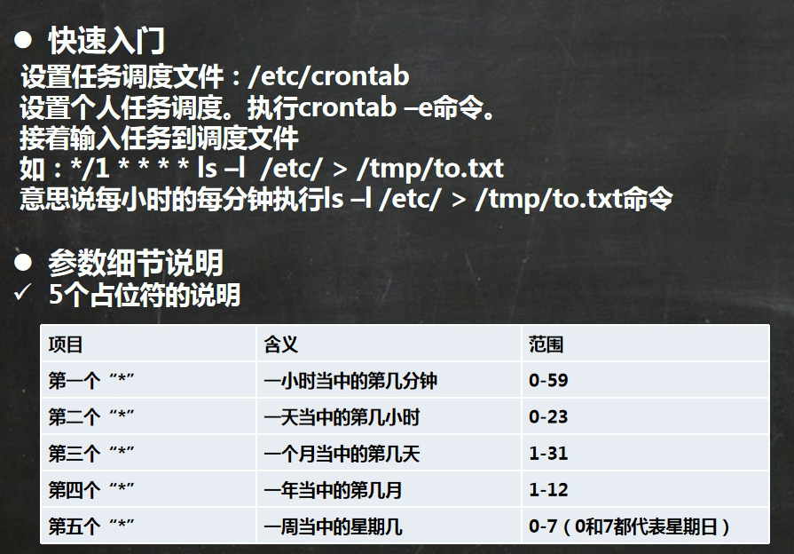
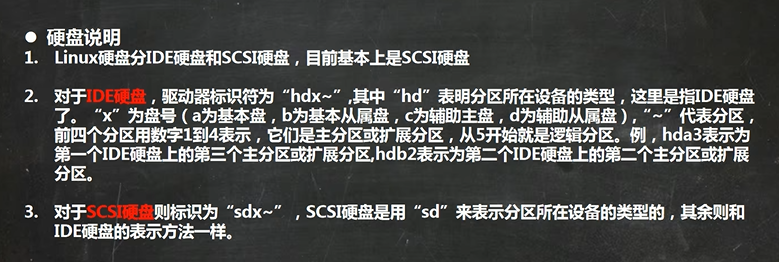
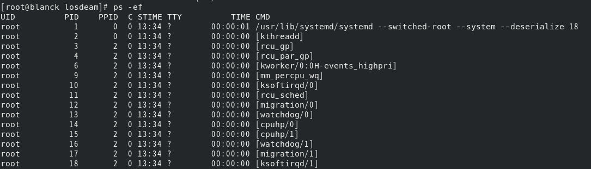
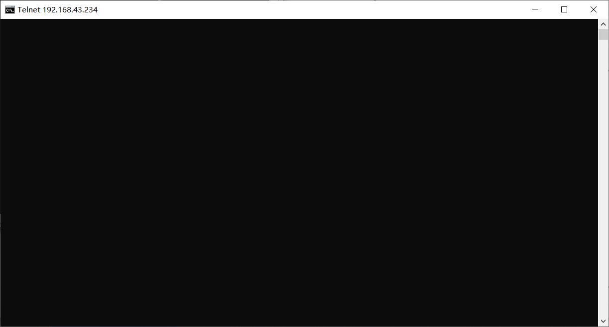

# [笔记目录](目录.md)
____
[TOC]
___
# Linux 基础部分
在b站上跟随[【小白入门 通俗易懂】2021韩顺平 一周学会Linux](https://www.bilibili.com/video/BV1Sv411r7vd/?spm_id_from=333.337.search-card.all.click&vd_source=3b0e33a626cf5e45835cac5d91093908)开始进行Linux的学习

## 1.常见问题
* vmware在使用一段时间后就卡死
    * 可能是虚拟机的内存给小了或者处理器给少了
    * 可能是虚拟机在下载的时候出现损坏？
    * 直接换VirtualBox，问题基本都能解决
* 换VirtualBox没法用vmtools
    * 安装VirtualBox的增强功能，效果一样的
* 视频里远程连接的软件没法下
    * 用MobaXterm也能行，还能直接传本地文件
* 为什么我远程连接不上我的虚拟机
  *  可能是虚拟机ip地址无效(建议ping通了再试)
  *  可能是虚拟网卡拿错了，,如果是使用wifi进行连接的话主要使用带`wireless`的网卡.
  *  ping通了还不行？还出现下面这样的报错？
    
        * 你确定你的虚拟机开机了？

## 2.远程连接
1. 在虚拟机中连接上网
2. 通过`ifconfig`指令获取虚拟机的ip地址(不联网的话是拿不到ip地址的)
   
3. 在本机中通过`ping`指令来确认ip地址的有效性
4. 确认ip地址的有效性后通过MobaXterm的Session选项来实现SSH显示的远程连接。
 
5. 将获取到的虚拟机ip地址填入Remote host中即可实现

6. 在登录后就可以正常使用虚拟机了(当然,只有命令行没有桌面)

## 3.Vim
___
### 3.1 简介
&emsp; Vi是Linux和Unix系统上最基本的文本编辑器,而Vim可以看做是Vi的增强版本，可以主动以字体颜色辨别语法的正确性

### 3.2 使用指南
&emsp; Vim有三种常见的模式
1. 正常模式
&emsp;  打开文档后的默认模式，可以通过移动光标来实现定位，并通过指令进行复制与删除操作
2. 插入模式
&emsp;  通过输入任意一个字母进入，只有在插入模式下才能对文档输入字符。
3. 命令行模式
&emsp;  在插入模式下通过输入esc返回正常模式后再输入:进入，在此模式下可以通过指令来实现文档的保存与退出

### 3.3 常见指令
正常模式下
> * `yy` :拷贝当前行
> * `nyy`:拷贝当前行向下的`n`行 
> * `p` :在光标行的下一行进行粘贴拷贝内容
> * `dd` :删除当前行
> * `ndd`:删除当前行向下的`n`行 
> * 输入数字`n`后按下`shift+g`:跳转到当前文件的第`n`行
> * `G` :跳转到文档最末行
> * `gg`:跳转到文档最首行
> * `u` :撤销上一次输入
>
命令行模式下
>`:set nu`/`:set nonu`:设置/取消文件的行号
>`:wq` :保存文档并退出
>`:q` :正常退出(未修改文档时)
>`:q!` :不保存退出(不保存已有更改)

____
## 4.shell指令大全(实操篇)

### 4.1 关机&重启命令
* `shutdown -h now` : 立刻关机
* `shutdown -h 1`   : 一分钟后执行关机
* `shutdown -r now` : 立刻重启
* `shutdown -c` : 取消预设的关机/重启指令
* `halt`  : 立刻关机
* `reboot` :  立刻重启
* `sync` : 把内存的数据同步到磁盘
___
### 4.2 用户登录登出
* `logout` : 注销当前用户
* `su - 用户名` : 尝试切换至另一用户，有密码则需输入密码
___
### 4.3 用户管理
* `useradd 用户名` : 添加一个用户
* `passwd 用户名` : 给用户指定密码
注：当密码过于简单时会出现这样的报错信息，但是可以不用管，在第二次确认后一样能用!

* `userdel 用户名` : 删除用户但保留其家目录
* `userdel -r 用户名` : 删除用户及其家目录
* `id 用户名` : 查询用户的信息
* `whoami/who am i` : 查看当前用户
___
### 4.4 用户组
&emsp;  将用户进行分类,并对同组用户进行统一的管理
* `groupadd 组名` : 新增组
* `groupdel 组名` : 删除组
* `useradd -g 用户组 用户名` : 在新增用户时直接加入组
* `usermod -g 用户组 用户名` : 修改用户的组
___
#### 4.4.1 相关文件

* `/etc/passwd` : 用户的配置文件，记录用户的信息
  

内容含义 : `用户名:口令:用户标识号:组标识号:注释性描述:主目录:登录Shell`
______
* `/etc/shadow` : 用户口令的配置文件
  

内容含义 : `登录名:加密口令:最后一次修改时间:最小时间间隔:最大时间间隔:警告时间:不活动时间:失效时间:标识`
______
* `/etc/group` : 组的配置文件,记录Linux包含的组的信息

内容含义 :`组名:口令:组标识号:组内用户列表`
___
### 4.5 指定运行级别
&emsp; Linux中有着7个运行级别分别是
* `0` : 关机
*  `1` : 单用户[找回丢失密码]

* `2` : 多用户状态没有网络服务

* `3` : 多用户状态有网络服务

* `4` : 安全模式
* `5` : 图形界面

* `6` : 系统重启
使用`init`命令可以实现不同运行级别的切换(仅root用户可以)

* `systemctl get-default` : 查看默认运行级别
* `systemctl set-default multi-user.target` : 设置默认运行级别为多用户模式
______

### 4.6 [root用户找回密码](https://blog.csdn.net/shenzhi0518/article/details/124091254?ops_request_misc=%257B%2522request%255Fid%2522%253A%2522169173440016800215012329%2522%252C%2522scm%2522%253A%252220140713.130102334.pc%255Fall.%2522%257D&request_id=169173440016800215012329&biz_id=0&utm_medium=distribute.pc_search_result.none-task-blog-2~all~first_rank_ecpm_v1~rank_v31_ecpm-2-124091254-null-null.142^v92^chatsearchT3_1&utm_term=centos%208%20%E5%A6%82%E4%BD%95%E6%89%BE%E5%9B%9Eroot%E5%AF%86%E7%A0%81&spm=1018.2226.3001.4187)
(centos7和centos8的方式不太一样，下文是另一教程的总结与实践，原文请点击标题处)
1. 重启虚拟机，在出现以下页面时快速移动光标，防止自动登录

2. 界面保持后按下键盘`e`键进入以下界面

3. 找到`linux`开头`quiet`结尾的行尾输入`空格+rd.break`,然后键盘按`ctrl+x` 进入紧急救援模式

> * 输入`mount`将光标移动到末尾处可以看见`sysroot`是以只读模式挂载的，需要将其转换为读写模式重新挂载
  
4. 输入 `mount -o remount,rw /sysroot`重新挂载sysroot为读写模式
5. 输入 `chroot /sysroot/`将目录切换至`sysroot`中
> 由于中文语言在后续操作中会产生乱码，故要先改成英语模式。若已经是英语模式了，可以跳过
6. 输入 `LANG=en`
7. 输入 `touch /.autorelabel`来更新系统信息,否则可能会出现`passwd`更改并重启后依然无法登陆的情况
8. 输入`passwd`以进行新密码的设置
9. 输入`exit` 以退出sysroot 再输入`reboot`进行重启(重启时间可能会有点久)
____
### 4.7 帮助指令
* `man [命令或配置文件]` : 查看命令的帮助信息
* `help` : 获得shell内置命令的帮助信息
______
### 4.8 文件目录类
* `pwd` : 显示当前工作目录的绝对路径
* `ls [选项] [目录]`
  > 常用选项
  > * `-a` : 显示当前目录所有的文件和目录，包括隐藏的
  > * `-l` : 显示文件的详细信息
  > * `-h` : 将文件的大小切换为更易阅读的模式
* `cd [参数]` : 切换到指定目录
  > * `cd ~/cd` ： 回到当前用户的家目录
  > * `cd..`    : 回到当前目录的上一级目录
* `mkdir [选项] 要创建的目录` : 创建目录
  > * `-p` :  创建多级目录

* `rmdir [选项] 要删除的空目录` : 删除指定的空目录
* `touch 文件名称` :  在指定位置创建一个空文件
* `cp [选项] [文件/文件夹的目录]` : 拷贝文件到指定目录
  >* `-r` : 递归复制整个文件夹
* `rm [选项] 要删除的文件或目录` : 移除文件或目录
    > * `-r` : 递归删除整个文件夹
    > * `-f` : 强制删除不提示
> &emsp;在Linux中所有选项都可以一起使用,例如`-rf`便是递归删除所有文件夹并且不提示。巧的是Linux中万物皆文件，所以万恶的 `rm -rf /*` 的意思便是递归删除根目录下的所有文件。
&emsp;如果实在想试试的话建议先使用虚拟机的快照功能弄个备份，备份完了再开始大胆整花活
* `mv [文件1] [文件名2]` : 将文件1的文件名修改为文件名2
* `mv [目录1] [目录2]` : 将目录1中文件移动到目录2中
___
### 4.9 查看类
* `cat [选项] 要查看的文件` : 查看指定文件内容
  > * `-n` : 显示行号
* `more` : 按全屏幕的方式按页显示文本文件的内容，其中内置了若干快捷键
&emsp;

  *  快捷键大全
  
|  操作 | 功能说明 |
| :-------: | :------: |
| 空格键 | 下翻一页 |
| Enter | 下翻一行 |
| q | 退出 |
| Ctrl + F | 向下滚动一屏(效果==空格) |
| Ctrl + B | 返回上一页 |
| = | 输出当前行的行号 |
|  :f   | 输出文件名和当前行的行号 | 

* `less` : 按分屏的方式按页显示文本文件的内容，其中内置了若干快捷键
&emsp;

  *  快捷键大全
  
|  操作 | 功能说明 |
| :-------: | :------: |
| 空格键 | 下翻一页 |
| [pagedown] | 下翻一页 |
| [pageup] | 返回上一页 |
| /字串 | 向下查询字串 |
| Ctrl + B | 返回上一页 |
| = | 输出当前行的行号 |
|  :f   | 输出文件名和当前行的行号 | 

___
#### 4.9.1 分屏和全屏的区别
&emsp;&emsp;全屏查看是将**文件全部读取完成后再进行显示**而分屏查看是**根据显示的需要逐步加载内容**。分屏查看在显示大型文件方面具有较高的效率。
___
* `echo [选项] [输出内容]` : 输出内容到控制台(可用于输出环境变量与用户名)
* `head [选项] [文件]` :  显示文件的开头部分内容，默认显示前十行
  > * `-n` : 显示行号
* `tail [选项] [文件]` :  显示文件的结尾部分内容，默认显示后十行
  > * `-n` : 显示行号
  > * `-f` : 实时监控文件的变化
* `>`  : 输出重定向 , `>>` : 追加
    1. `ls -l > 文件` : 将列表内容写入文件中(覆盖写)
    2. `ls -al >> 文件` : 将列表内容追加到文件的末尾
    3. `cat 文件1 > 文件2` : 将文件1的内容覆盖到文件2 
    4. `echo "内容" >> 文件` : 将内容追加到文件中
* `ln -s [原文件或目录] [软链接名]` : 为原文件创建一个软链接(快捷方式)
  
* `history` : 查看所有已经执行过的历史命令
  * `history n` ：显示最近使用过的`n`条指令
  * `!n` : 执行历史编号为n的指令
  
______
### 4.10 时间日期类
* `date` : 显示时间 
    1. `date` ：显示当时时间
    2. `date %Y` : 显示当前年份
    3. `date %m` : 显示当前月份
    4. `date %d` : 显示当前日期
    
    5. `date -s 字符串时间` : 设置系统当前时间
   
* `cal [选项]` : 默认显示当月日历
    
    * `cal n` ： 显示n年日历
    
____
### 4.11 搜索查找类
* `find [搜索范围] [选项]` : 将指定目录向下递归地遍历其各个子目录,将满足条件的文件或者目录显示在终端
  * `-name [查询方式]` : 按照指定的文件名查找文件
  * `-user [用户名]` : 查找属于指定用户名的所有文件
  * `-size [文件大小]` : 按照指定的文件大小查找文件(+n 大于 ，-n 小于 ，n 等于,单位有k，M，G)
* `locate [搜索文件]` : 快速定位搜索文件路径
* `grep [选项] ` : 过滤查找
    * `-n` : 显示匹配行及行号
    * `-i` : 忽略字母大小写
* `|` : 将前一个命令的处理结果输出给后面的命令处理
    
___
### 4.12 压缩/解压缩类
* `gzip 文件` ： 压缩文件，只能将文件压缩为*.gz文件
* `gunzip 文件.gz` : 解压缩文件
&emsp;
  &emsp;
*  `zip [选项] 压缩后文件.zip` : 将要压缩的内容 ： 压缩文件和目录
   * `-r` : 递归压缩，压缩路径下的所有文件(否则不会压缩进任何文件)  
* `unzip [选项] 压缩后文件.zip` : 解压缩文件
  * `-d [目录]` : 指定解压后文件的存放目录
  &emsp;
    &emsp;
* `tar[选项] XXX.tat.gz 打包的内容` : 打包目录，压缩后的文件格式为.tar.gz
  * `-c` :  产生.tar打包文件
  * `-v` : 显示详细信息
  * `-f` : 指定压缩后的文件名
  * `-z` : 打包同时压缩
  * `-x` : 解包.tar文件
  
____

## 5.权限管理
  &emsp;  &emsp;Linux中文件都是有归属的，通常情况下，文件属于该文件的创建者。也属于创建者所在的组
  * ` ls -ahl `: 显示当前文件夹下所有文件的所有者

  * `chown 用户名 文件名` : 修改文件的所有者
     * `-r` : 使得修改对目录下所有文件生效
     * `用户名:组名` : 同时修改所属用户与组
  * `chgrp 组名   文件名` : 修改文件所在的组  

> 第0位为`-`表示为普通文件
> 空格后的数字表示该目录下有多少文件(文件则是文件本身)
> 在后为所属用户名 ， 所属组名 ， 文件大小 
>

### 5.1实例 :
#### 5.1.1 警匪游戏

* `su root`  ： 切换至root用户才能添加组和新用户
* `groupadd police ` ： 加组
* `groupadd bandit` ： 
* `useradd -g police jack` ： 加人
* `useradd -g police jerry` ： 
* `useradd -g bandit xh` ： 
* `useradd -g bandit xq` ： 
* `su jack` ： 切换至jack用户
* `touch jack.txt`  ： 以jack的身份创建文件
* `chmod 770 jack.txt`  ： 更改权限
* `su root` ： 切换至root用户才能添加组和新用户
* `usermod -g police xh` ： 
> 注: 当jack在家目录中创建文件时
___
## 6.任务调度

> 注意/1后*前均存在空格

____
## 7.定时任务

### 7.1实例

___
## 8.磁盘
### 8.1 磁盘分区

#### 8.1.1 案例

 &emsp;  &emsp;由于此处VirtualBox与Vmware差距较大，故开始采用手动记录。
1. 添加磁盘
1.1 在virtualbox的主界面中选择虚拟机的设置

1.2 点击储存选项后选择对应的控制器(**下方存在虚拟机名字的控制器**)

1.3 选择添加虚拟硬盘(如果无法进行操作建议先关闭虚拟机)
   

1.4 点击创建
   

1.5 随后选择自己想要安装的目录与对应的大小即可
   

1.6 重新打开虚拟机，输入`lsblk`,可以看到已经完成了虚拟硬盘的添加

2. 分区

2.1 进入分区指令

2.2 创建新的分区(分区号为分区的个数)

2.3 保存分区操作

未经格式化的磁盘分区不存在uuid，无法被使用。

3. 挂载磁盘
   

3.1 进行格式化

3.2 进行挂载

 &emsp;  &emsp;在挂载完成后如果向挂载目录添加文件，则实际存储位置是在磁盘上。而且使用命令行进行挂载时在重启后，挂载会消失。

3.3 取消挂载

注意，需要退出被挂载目录后才能取消挂载

4. 永久挂载
  **所有永久性的操作前均建议进行一波快照**，一步一存档，主打的就是一个稳健。

 &emsp;  &emsp;进入/etc/fstab，按照已有磁盘的格式添加需要挂载的磁盘

 &emsp;  &emsp;重启后即可看到实现了挂载
 
## 8.2 磁盘使用情况查询
### 8.2.1 系统整体磁盘

### 8.2.2 指定目录磁盘

### 8.2.3 实例
 

## 9.网络配置
### 9.1 配置ip地址
#### 9.1.1 自动获取
 &emsp;&emsp; 在登录后根据网络情况自动获取ip，每次自动获取的ip地址可能不同

#### 9.1.2 指定ip
&emsp;&emsp; 直接修改配置文件来指定ip，并可优化连接到外网。
* 编辑 /etc/sysconfig/network-scripts/ifcfg-ens33
  
&emsp;&emsp; **ifcfg-ens33 文件说明**
>  DEVICE=eth0  #接口名(设备，网卡)
  HWADDR = 00:0c:2x:6x:0x:xx #MAC地址
  TYPE = Ethernt # 网络类型(通常是Ethemet)
  UUID = 926 ........       #随机id
  #系统启动的时候网络接口是否有效(yes/no)
  ONBOOT =yes
  #IP的配置方式`[none|static|bootp|dhcp]`
  BOOTPROTO = static
  #IP地址
  IPADDR = 192.168.200.130
  #网关
  GATEWAY = 192.168.200.2
  #域名解析器
  DN51 = 192.168.200.2

当然，操作要在进行重启(`reboot`)后才可以生效。
### 9.2 设置主机名和hosts映射
#### 9.2.1 主机名
* `hostname` : 查看当前主机名
  

* 在/etc/hostname中进行修改

当然，依旧是重启后才能生效
#### 9.2.2 hosts映射
在日常使用时，我们通常使用主机名来指代ip地址
但是在如果我们真的在命令中使用主机名来指代ip地址的话会出现这样的错误

所以需要进行下面的操作(设置主机名与host映射)

1. 寻找本机的host文件
   

2. 往里头添加自己的主机名与对应的ip地址
   

3. 成了
   

当然linux下也是同理

#### 9.2.3 DNS(域名系统)

## 10.进程管理

### 10.1 显示进程

* `PPID` 为当前进程的父进程的`pid`

### 10.2 终止进程

#### 10.2.1 实例
1. 小红登录了

2. 管理员发现了并且找到了登录的pid为6253

3. 管理员出手杀死了登录的进程

4. 小红被踢下线了

### 10.3 查看进程树

### 10.4 服务管理
#### 10.4.1 service : 查看服务

本质上远程连接的端口号表示的就是当前远程连接守护进程的进程号

#### 10.4.1 setup

需要注意的是，centos8后的系统没有setup指令

#### 10.4.2 chkconfig ： 服务自启动

在centos8后只会显示这样的效果

  
chkconfig重新设置服务自启动后需要重启才能生效

#### 10.4.3 systemctl ： 服务管理

* `systemctl stop/start 服务名` : 关闭/开启服务(临时更改)
* `systemctl enable/disable 服务名` : 关闭/开启服务(自启动，永久更改)
* `systemctl is-enabled 服务名` : 查看该服务是否为自启动

* `netstat -anp` | 访问网络状态

此时若是防火墙失效那么我们可以直接连接虚拟机的111端口
测试防火墙时需要用到本机的telnet指令 `telnet ip地址 想访问的端口号`

出现以上问题后需要`打开控制面板` -> `启动或关闭Windows功能`  -> `Telnet客户端`

命令成功，在防火墙开启的情况下我们主机无法使用Telnet直接连接到虚拟机的111端口

让我们把防火墙关掉试试？

成功了

记得在最后把防火墙开起来

#### 10.4.4 firewall : 防火墙设置

1. 使用 netstat -ant 查看端口号所使用的协议

2. 使用 firewall-cmd --permanent --add-port=111/tcp 开放虚拟机的111端口

3. 重新载入防火墙(使得改动生效)

4. 成功进入

5. 关闭端口

6. 连接失败

#### 10.5  动态进程监控

#### 10.6 服务监控

## 11. RPM与YUM
### 11.1 RPM

- rpm -qa | grep xxx / rpm -q xxx

- rpm -qi xxx

- rpm -ql xxx

- rpm -qf xxx

- rpm -e xxx

- rpm ivh xxx

### 11.1 YUM
在centos8下进行实操时出现以下错误

输入以下代码：
- `cd /etc/yum.repos.d/`
- `sudo sed -i -e "s|mirrorlist=|#mirrorlist=|g" /etc/yum.repos.d/CentOS-*`
- `sudo sed -i -e "s|#baseurl=http://mirror.centos.org|baseurl=http://vault.centos.org|g" /etc/yum.repos.d/CentOS-*`
恢复了

[具体原因点这里](https://blog.csdn.net/misterhuangchao/article/details/125042901?ops_request_misc=%257B%2522request%255Fid%2522%253A%2522169355963616800188564806%2522%252C%2522scm%2522%253A%252220140713.130102334..%2522%257D&request_id=169355963616800188564806&biz_id=0&utm_medium=distribute.pc_chrome_plugin_search_result.none-task-blog-2~all~sobaiduend~default-1-125042901-null-null.nonecase&utm_term=%E9%94%99%E8%AF%AF%EF%BC%9A%E4%B8%BA%E4%BB%93%E5%BA%93%20appstream%20%E4%B8%8B%E8%BD%BD%E5%85%83%E6%95%B0%E6%8D%AE%E5%A4%B1%E8%B4%A5%20%3A%20Cannot%20prepare%20internal%20mirrorlist%3A&spm=1018.2226.3001.4187)

Linux 基础篇学习完成。

# Linux 强化篇
## *1.python开发
### *1.0 问题
#### *1.0.1 无法进行远程连接
发现Ubuntu虚拟机上有网并且能与主机间互相ping通但是远程连接就是连不上

发现是压根就没有ssh服务
使用`sudo apt-get install ssh`安装后
### *1.1 Ubuntu安装
前往[Ubuntu官网](https://cn.ubuntu.com/download),以下载最新版本的Ubuntu。
然后的安装结合centos一样了。
### *1.2 python使用
Ubuntu安装会自带python环境

简约python程序的编写，
- 使用`vi helloworld.py`编写一个python 文件

- 使用`python3 helloworld.py`以执行该文件

#### *1.2.1 apt的使用

____
[返回目录](目录.md)

