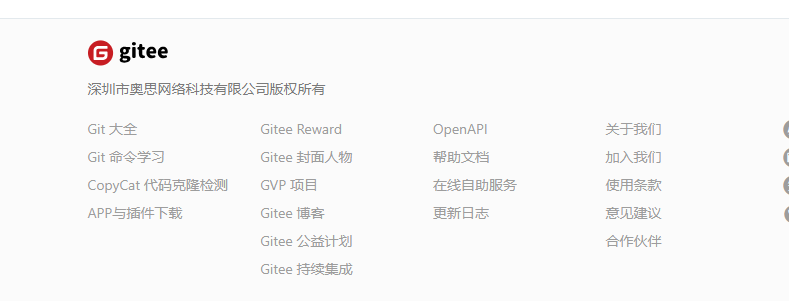
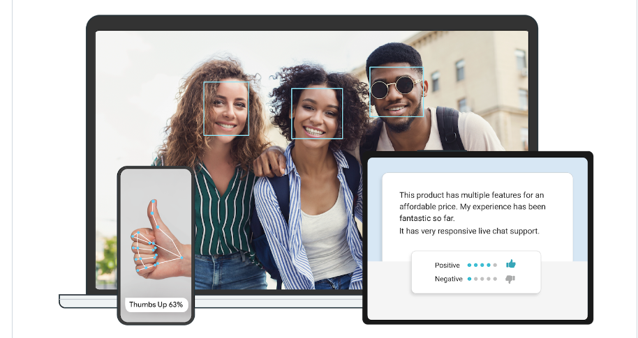
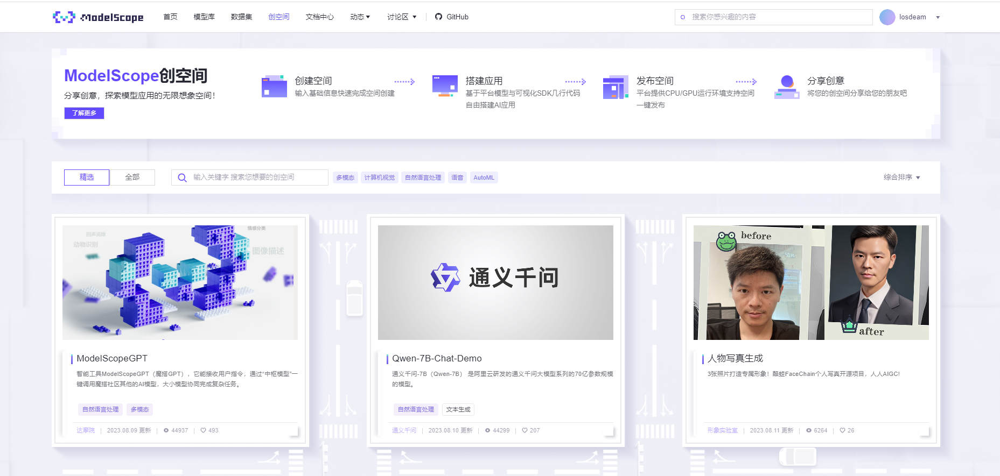

# AI工程师学习路径
&nbsp; 先叠个甲，本文档仅根据本人的学习经验与一点也不广的知识面来对后来的学弟学妹们一点忠告。如果有建议也可以尽管提,但是如果你要骂的话那就是你对。
## 首先一切方向都通用的
* 多记笔记或者日志，记录可以提高学习的热情以及积极性。不要觉得笔记没啥用也不要说就是应付一下。~~血泪的教训啊~~当你过完一个假期就会发现，自己学的啥都不记得了，真到了用的时候又是，诶，这个我有印象，具体是啥来着，忘了。笔记本身就是一种加固记忆的方式，也是后续真用到的时候快速寻找的一个备份。
* 多问多交流，我本身是一个双非二本的转专业才入行的，本来就只会一丢丢python就是靠着刷比赛和刷题才勉强能赶上同学的进度。要是有比赛的话一定要注意，这个比赛对你以后找工作啥的究竟有没有用，有些比赛是真的很耗时间的，一个学期可能就砸在这个比赛里了。所以一定要确定这个比赛和你未来的求职方向是不是沾边，但凡沾一点都能算是拓宽眼界了。
* 遇到问题别死扛，虽然思考是好事，但有的时候看看别人的思路会茅塞顿开。
## 然后就是专业一点的
* 咱们这个方向，说明白一点就是两级究极分化，你要么是去整研究的，要么就是帮别人的研究落地的。整研究的，好好卷学历吧，介就已经不算工程师了，介算研究员。要是准备当工程师的，准备自己做项目的，先想好，咱们这可太杂了，大多数时候做的都是对现有项目的针对性改进和优化。工作量大都集中在数据的分析和处理上，要先想想自己有没有一定的数据敏感性
* 多刷刷视频，不是那种短视频，是那种前沿的新技术的视频。你可以不懂它的原理，但一定要会用。说不定这玩意以后就能在你的项目里帮你大忙。

## 学习路径建议
怎么说呢，我也只能就我目前所感受的大致的指个方向了。
* 算法是肯定要刷的，只要还和计算机沾边，这基本就是逃不掉的。但我的建议是好好的刷几道题，别遇到困难睡大觉，困难题静下心来看看还是没那么难的。如果真的做不出来最好是看着别人的题解，别看别人的代码，顺着别人的思路，自己写代码。这样干一个月，算法的水平就能蹭的一下上升了。

* 就现在我的情况而言，咱们这个方向进可冲算法，退可守后端。但总体的意思就是，杂的一批。
    * 准备整算法的，那就好好的卷学习去，硕士起步。然后C++和python是少不了的。然后就是像knn,k-means和决策树这样经典的机器学习算法和CNN,RNN这样的神经网络。监督学习和k折这样的概念也是要牢记的。
    * 准备整工程的，首先要想好往啥方向走。和咱们这沾边的可太多了。当然所有工程方面的基本都逃不开git和Linux，要是实在不清楚自己想做什么方面的，可以把这两个先学好。
    * 要是想偏硬件一点的就冲C++和python，然后我就不熟了(来个懂哥救一下)。
    * 要是想冲个cv方向的，先去好好做几个项目，cv的能做项目可太多了。但是一定要做几个有分量的(当然你要是水水过然后临场准备效果也是一样的，但是我非常不建议这么做)。别人我不确定，但是就我目前的经历而言，项目经历还是十分重要的。(我面试的时候至少三分之一的时间再讲项目)学的东西基本和算法的一样。但是视情况还要学一定的flask(python的后端框架),还有一定的前端。
    * 要是想去大数据方向的，把前面的c++都换成java(至少在我目前看到的基本都是用java的)，其余部分来个人补充一下，不熟
    * 大数据方向，我学艺不精，只能给一点浅薄的建议。
        * 关于编程语言：大数据的话，确实基本都是以java编程为主，其他语言暂时都不行，java的大数据生态最成熟。scala是一种近几年在大数据领域兴起的函数式编程语言，但是事实证明，java生态不是一时半会能超越的，flink正在重新拥抱java。
        * 关于大数据的基础组件：包含hadoop，hive，hbase，flink，spark，kafka，zookeeper，flume等等。我的个人建议是先广泛了解一下，遇到需要对应的业务场景再选择合适的技术栈，深入学习一下。比如flink cdc+clickhouse的组合也蛮流行的。
        * 关于学习建议：反正，总的来说，大数据是业务驱动，有了相应的业务才有大数据的需求，所以，先学业务，再学技术，这样才能更好的理解大数据的价值，并且这样学习大数据的效率才最高。
        * 关于大数据研究方向：当然以上建议主要还是针对数据仓库方向，其他的大数据方向不太清楚，或许数据分析方向和人工智能结合会更紧密些。另外大数据方向还有新兴的数据元件加工、隐私计算、区块链、数据安全等等，这些方向都是大数据的延伸，也是大数据的未来，但是目前还不是很成熟，可以向这个方向发展。

___
 ## 网站推荐
* [力扣](https://leetcode.cn/)，年轻人的第一个刷题网站。
* [牛客](https://www.nowcoder.com/)，虽然我不在这上面刷算法，但是上面还有专项练习，查漏补缺还是很不错的。
* [B站](https://www.bilibili.com/)，当代大学生真正的大学。
* [kaggle](https://www.kaggle.com/)，ai的力扣，如果英语还不错的话可以尝试着直接在这个网站上进行python以及数据处理相关知识的学习
* [github](https://github.com/),世界上最大的~~同性~~程序员交友网站
* [gitee](https://gitee.com/explore)，中国版的github，目前还是有不少公司在用的
* [csdn](https://www.csdn.net/)，遇事不决搜一下
  ___
## 学习建议
&emsp; &emsp;我也没法给太多的建议，可以参考参考下面的几位
- [Ai-Learn](https://github.com/tangyudi/Ai-Learn)
- [Python2AI](https://github.com/Microstrong0305/Python2AI)

### 机器学习&深度学习
* [跟李沐学AI](https://space.bilibili.com/1567748478?spm_id_from=333.337.0.0)，机器学习和深度学习的大佬，讲解的还是很不错的
* 吴恩达，找不到主页了，但是课很不错
  
### git
gitee最下方的[git命令学习](https://oschina.gitee.io/learn-git-branching/)，可视化的展示git命令的效果，很好用。(要想直接看源码的在github上也有开源[点这里进入](https://github.com/pcottle/learnGitBranching))

这玩意多用用其实很简单

### Linux
[【小白入门 通俗易懂】2021韩顺平 一周学会Linux](https://www.bilibili.com/video/BV1Sv411r7vd/?spm_id_from=333.337.search-card.all.click&vd_source=3b0e33a626cf5e45835cac5d91093908)，别的人我不确定好不好，但是我确定这个老师讲的是真的细。零基础也能听。

### python
其实我本人一开始是跟着[夜曲编程](https://np.baicizhan.com/)学的，别的不说，基础是真基础，学的很轻松。要是对自己的学习能力不报那么大的期望或者是完完全全没有任何代码经验的话，我还是挺建议用这个学学的。(花钱的)
要是感觉自己能力还不错的，完完全全可以直接在b站随便找个视频学。这玩意入门是真不难，难的是精通。

### c++
我是买了本C++ primer Plus 学的，目前学的还不错
___
##  项目推荐
* [mediapipe](https://github.com/google/mediapipe)，谷歌的一个能识别人体姿态点的项目。可扩展性极强
 
* [魔搭平台](https://modelscope.cn/my/overview)，阿里的一个ai平台，上面项目还是很多的，可以多看看。

* yolo , 图像识别巨头，而且在csdn上有着丰富的教程。完全支持小白的学习
