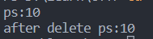
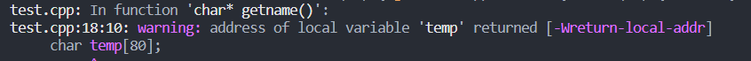

# [笔记目录](目录.md)

<p id= "head"></p>
[TOC]
# c++部分
&emsp;&emsp;本文档基于本人在使用[C++ Primer Plus(第6版)](https://detail.tmall.com/item.htm?ali_refid=a3_430673_1006:1110169018:N:1SEYC6BrFkWyec2+BRr6qNLV2e79Xy+FuLmx4IOJ/U4=:a4b7eae6733d3abccb1e46986f247992&ali_trackid=162_a4b7eae6733d3abccb1e46986f247992&id=40346852306&spm=a2e0b.20350158.31919782.1)中的学习总结而出。内容大都为书中的内容的。
* c++简单实例


```c++
#include <iostream>
int main()
{
    using namespace std;
    cout << "hello world"<< endl;
    return 0 ;
}
```

&emsp;&emsp;以上实例中可能会出现窗口迅速关闭无法观察到实际效果的情况，故在使用时通常在末尾加上`cin.get();`。即

```c++
#include <iostream>
int main()
{
    using namespace std;
    cout << "hello world"<< endl;
    cin.get();
    return 0 ;
}
```

## 1.C++的规范
______

### 1.1 C++的推荐代码规范
* 每条语句各占一行
* 每个函数都有一个开始花括号和一个结束花括号，这两个花括号各占一行
* 函数中的语句都相对于花括号进行缩进
* 与函数名称相关的圆括号周围没有空白
______

### 1.2 C++的语句规范
* 在变量使用前必须进行说明（==防止在运行过程中由于错误拼写导致的结果错误==）
* 面向分号(==以分号为行的分割==,语句的结尾必须添加分号)
* 允许在程序的任何位置声明新的变量
* 允许在创建变量时对其进行赋值


``` c++
int a = 5 ;
```

______
### 1.3 C++的函数规范
* 在定义时需要对函数的输出类型进行定义
* 在定义时需要对函数的输入参数类型进行定义

```c++
double sqrt(double);
```

* 在使用前必须保证
  * 在源代码文件中输入函数原型(声明函数)
  * 包含的头文件中定义了原型
* 通常将自定义函数防止在`main函数`之后进行定义，但在`main函数`前输入其函数原型


______

### 1.4 C++的变量命名规范
> * 在名称中只能使用字母字符、数字和下划线(_)
> * 名称的第一个字符不能是数字
> * 区分大小写
> * 不能将C++关键字用作名称
______
## 2.C++的数据类型

### 2.1 整型
* 赋值
```c++
int n_int = INT_MAX; //将int形式下的最大值赋值给n_int
int emus{7};         //将7赋值给emus
int rheads = {12}    //将12赋值给rheads
int rocs ={};        //将空值(0)赋值给rocs
int psychics{};      //将空值(0)赋值给psychics
```
* 知识
```c++
int  a= 'M';
cout << a << endl; // 77
```
&emsp;&emsp;如果将字符直接赋值给整型的变量，整型变量中将会保存其ASCII编码值。

### 2.2 无符号类型
&emsp;&emsp;整型通过声明可以转换为其**无法储存负数值**的无符号变体，其优势在于可以增大变量能够存储的最大值。
```c++
unsigned short change_1;// unsigned short type
unsigned int change_2;  // unsigned int type
unsigned change_3;      // unsigned int type
unsigned long change_4; // unsigned long type
```
&emsp;&emsp;`unsigned`本身便是`unsigned int`的缩写

### 2.3 进制问题
&emsp;&emsp; C++采用前一（两）位来表示数字常量的基数
```c++
    cout << 42 << "(42 表示十进制的42)\n";      //42(42 表示十进制的42)    
    cout << 0x42 << "(0x42 表示十六进制的42)\n";  //66(0x42 表示十六进制的42)
    cout << 042 << "(042 表示八进制的42)\n";     //34(042 表示八进制的42) 
```
&emsp;&emsp;在默认情况下，cout以十进制的格式显示整数，不论整数在程序中是几进制的。
&emsp;&emsp;当然如果想显示不同进制的整数也是可以的。
```c++
    cout << dec << "(42 的十进制)"<< 42 << endl;          //(42 的十进制)42
    cout << hex  << "(42 的十六进制)"<< 42 << endl; //(42 的十六进制)2a  
    cout << 42 << endl ;                           //2a
    cout <<  oct  << "(42 的八进制)" << 42 << endl; //   
```
> `dec` : 将cout中整型显示形式改为十进制
> `hex` : 将cout中整型显示形式改为十六进制
> `oct` : 将cout中整型显示形式改为八进制
> 在下一次声明前将永久保留声明的显示形式
___
### 2.4 char类型
* 赋值
```C++
char ch ;
```
#### 2.4.1 转义符

|字符名称    | 换行符   |水平制表符  |垂直制表符 |退格       |回车      |振铃    |反斜杠    |问号       |单引号   |双引号    |
|:------:   | :------: | :------:   |  :------:| :------:  | :------:| :------:| :------:|  :------:| ------:| :------:| 
|**c++代码**|`\n`        |  `\t`     |`\v`     |    ` \b `  |`\r`     |`\a`    |`\\ `    |`\?`    |`\'`      |`\"`     |


&emsp;&emsp; 转义符用于输入无法直接用键盘输入程序中的字符
___
### 2.5 const限定符
&emsp;&emsp;就像c语言中的`#define`,`const限定符`用于声明无法在程序执行过程中被更改的常量
```c++
const int a= 10;
```
___
### 2.6 浮点数
&emsp;&emsp;c++可以用两种不同的方式来书写浮点数
1. 小数点表示法
```
12.34
0.00023
8.0
```
2. E表示法

```
2.52e+4  // 25200 = 2.52 * 10^4
8.33E-4  //0.000833 = 8.33 * 10^-4
7E5      // 700000 = 7* 10^ 5
```
#### 2.6.1 浮点类型
1. `float`       
2. `double`         
3. `long double`
   
&emsp;&emsp;当我们使用`cout`函数进行输出时过于智能的`cout`会删除结尾的零,如果我们想要保留结尾的零或者想将显示的形式转换为`E表示法`时我们可以使用`cout.setf()`。`.`表示`setf`是`cout`对象的成员函数,只有通过对象才能进行调用。

#### 2.6.2 setf()函数
&emsp;&emsp;通过对于参数的设置来调节cout函数的显示模式
```c++
cout.setf(ios_base::oct,ios_base::basefield); //将后续cout中整型的默认显示方式修改为8进制
cout << 8 << endl; //10
```
<table>
    <tr>
        <td>第二个参数</td> 
        <td>第一个参数</td> 
        <td> 含义 </td>
   </tr>
    <tr>
        <td rowspan="3">ios_base::basefield</td>    
        <td >ios_base::dec</td>  
        <td >使用10进制</td>  
    </tr>
    <tr>
        <td >ios_base::oct</td>  
        <td >使用8进制</td> 
    </tr>
    <tr>
        <td >ios_base::hex</td>  
        <td >使用16进制</td> 
    </tr>
     <tr>
        <td rowspan="2">ios_base::floatfield</td>    
        <td >ios_base::fixed</td>  
        <td >使用定点计数法(即一般计数法)</td>  
    </tr>
    <tr>
        <td >ios_base::scientific</td>  
        <td >使用科学计数法</td> 
    </tr>
     <tr>
        <td rowspan="3">ios_base::adjustfield</td>    
        <td >ios_base::left</td>  
        <td >左对齐</td>  
    </tr>
    <tr>
        <td >ios_base::right</td>  
        <td >右对齐</td> 
    </tr>
    <tr>
        <td >ios_base::internal</td>  
        <td >符合或前缀左对齐，值右对齐</td> 
    </tr>
</table>

____

### 2.7 C++的类型转换
&emsp;&emsp; **C++** 会自动执行很多类型转换：

* 将一种算数类型的值赋给另一种算数类型的变量时，c++将对值进行转换
* 表达式中包含不同的类型时，C++将对值进行转换
* 将参数传递给函数时，C++将对值进行转换
  
  <table>
    <tr  align = "center">
        <td colspan="2">潜在的数值转换问题</td> 
   </tr>
    <tr>
        <td >转换</td>    
        <td >潜在的问题</td>  
    </tr>
    <tr>
        <td >将较大的浮点类型转换为较小的浮点类型</td>  
        <td >有效位数降低,值可能超出目标类型的取值范围,在这种情况下，结果是不确定的</td>  
    </tr>
        <tr>
        <td >将浮点类型转换为整型</td>  
        <td >小数部分丢失，原来的值可能超出目标类型的取值范围，在这种下，结果是不确定的</td>  
    </tr>
        <tr>
        <td >将较大的整数转换为较小的整数</td>  
        <td >原来的值可能超出目标类型的取值范围,通常只复制右边的字节</td>  
    </tr>
</table>

> `0`赋值给`bool`变量时，将被转换为`false`；而非零值将被转换为`true`

* 强制类型转换 
  * （类型） 变量
  *  类型   (变量)


### 2.8 复合类型

#### 2.8.1 数组
##### 2.8.1.1 声明
&emsp;&emsp;声明**数组**时应满足以下三点：
    1. 存储在每个元素中的值的类型；
    2.  数组名；
    3.  数组中的元素名
```c++
    typename arrayName[arrySize] ; 
```
##### 2.8.1.2 说明
- c++的数组从0开始编号
- c++的数组可以通过下标来直接获取数组中的对于值
- 当出现下标越界的情况时，c++将会出现报错

##### 2.8.1.3 初始化
&emsp;&emsp;有且仅有定义数组的时候可以对数组进行初始化
```c++
    int cards[4] = {3,6,8,10};
    int hand[4];
```
&emsp;&emsp;但是可以在运行过程中通过下标来对数组中的元素进行赋值
```c++
    cards[3] = 5;
```
&emsp;&emsp;在初始化数组时还可以留空，即提供少于元组的元素数目的值。未赋值部分将默认为0(字符情况下为空值)
```c++
    int cards[4] = {3,6};
```
&emsp;&emsp;也可以不设置元素数目，让c++编译器自动计算提供的元素的个数以作为元组的元素数目
```c++
    int cards[] = {3,6,8,10};
```
> 1. 初始化数组时，可省略等号
```c++
    int cards[4]{3,6,8,10};
```
> 2. 可不在大括号中包含任何东西，将所有元素设置为空值
```c++
    int cards[4]{};
```
> 3. 列表初始化禁止缩窄转换(内存占用多的类型转换为内存占用少的类型)
```c++
    long plifs[] = {25,92,3.0};   // 报错
```
____
#### 2.8.2 字符串
&emsp;&emsp;存储在内存的连续字节中的一系列字符。

##### 2.8.2.1初始化
1. **c-风格字符串**
   
&emsp;&emsp;必须以空字符`\0`结尾。
```c++
    char dog[8] = {'b','y','e','y','e','y','e','\0'};
```
2. **使用引号**
```c++
    char bird[11] = "Mr. Cheeps";
    char fish[] = "Bubbles";
```
&emsp;&emsp;使用键盘进行字符串的输入或者是使用引号进行定义时结尾的空字符将会被**自动添加**。同时需要注意的是空**字符同样也会占据数组的一个位置**，在确认最小数组时请确保不会产生越界现象。
##### 2.8.2.2拼接字符串
&emsp;&emsp;任何两个由**空白**(**空格**、**制表符**和**换行符**)分隔的字符串常量都将自动拼接成一个。所以以下代码有着相同的输出
```c++
    cout << "aaaaaa" "bbbb\n";
    cout << "aaaaaabbbb\n";
    cout <<"aaaa"
    "aabbbb\n";
```
##### 2.8.2.3 相关函数
###### 2.8.2.3.1 strlen()
&emsp;&emsp;保存于头文件`<cstring>`中,功能为返回存储在数组中的字符串的长度，而不是数组本身的长度且计算长度时不计算空字符。
```c++
    char lis[] = {'a','b','\0','a','b','c','\0'};
    cout << strlen(lis)<<endl;  // 2 
    cout << sizeof(lis)<<endl;  // 7
```

###### 2.8.2.3.2 cin的缺陷
&emsp;&emsp;在输入字符串时`cin`函数以**空白**(**空格**、**制表符**和**换行符**)来确认字符串的结束位置。所以在输入的过程中无法输入空格(输入空格后会将后续内容存储至下一次输入中或者丢弃)。

```c++
    cin >> num ;  //输入abc def
    cout << num;  //输出abc
```

###### 2.8.2.3.3 getline()
&emsp;&emsp;保存于头文件`<iostream>`中,通过回车键输入的换行符来确认输入结尾。该函数有两个参数，第一个参数用于存储输入行的数组的名称，第二个参数是要读取的字符数。超过读取数或是遇到换行符时停止读取。

```c++
    cin.getline(name,20); //将该行的输入读取入name数组中，最大字符获取量为20
```
###### 2.8.2.3.4 get()
&emsp;&emsp;保存于头文件`<iostream>`中,与`getline`相似但是不再读取并丢弃换行符，而是将其留在输入队列中。
```c++
    cin.get(name,20); //将该行的输入读取入name数组中，最大字符获取量为20
```
&emsp;&emsp;但是有个问题就是当遇到换行符时，get函数依然不会跳出。幸运的是get有个好用的变体get()。它可以获得下一行字符(即使是换行符)
```c++
    cin.get(name,20);
    cin.get();
```
&emsp;&emsp;还有一种好用的方法就是把两者直接进行结合
```c++
    cin.get(name,20).get();
```

____

#### 2.8.3 String 
&emsp;&emsp;C++添加了`String`类使得对字符串的操作能够更加容易。要使用`String`类时，必须先声明头文件`<string>`,并且使用名称空间std。其特点在于可以**声明为简单变量而非数组**。
```c++
    string str1 ;
    string str2 = "test";
```
##### 2.8.3.1相关函数
###### 2.8.3.1.1 size
&emsp;&emsp;用于输出String变量的长度
```c++
    String word;
    ···
    cout << word.size()
```

___
#### 2.8.4 结构
&emsp;&emsp;类似于`python`中的类，其中关键字`struct`声明了后续为一个名字为`test`的结构。`test`结构拥有`name`和`num`两个结构成员.
```c++
    struct test{
        char name[20];
        int num ;
    };
    test n {"张三",10}; 
    test n_1 {};
```
> 注：不允许缩窄转换

需要获取成员的值时使用
```c++
    cout << n.name //没错是. 而不是->，详细见5.3
```
[看看动态结构？](#53-动态结构)
##### 2.8.4.1 结构数组
&emsp;&emsp;在c++里，你甚至可以创建一个把结构当做元素的数组
```c++
test n[2]={
    {"张三",10},
    {"李四",20}
};
```
在初始化的时候要注意像平时初始化数组一样的把花括号用逗号隔开
___
#### 2.8.5共用体
&emsp;&emsp;共用体在声明时会**按照最大的成员进行内存的分配**，而在使用时可以自由的使用所有成员类型，但是**同时仅能使用一种**(使用**同一物理地址**)。
```c++
    union one4all
    {
        int int_val;
        long long_val;
        double double_val;
    };
    one4all pail;
    pail.int_val = 15; //pail中保存int_val
    pail.double_val = 1.38; //pail.int_val被pail.double_val覆盖

```
___
#### 2.8.6 枚举
```c++
    enum spectrum {red,orange,yellow,green,blue};
```
这条语句完成以下两项工作:
* `spectrum`被称为枚举
* `red`,`orange`,`yellow`等作为符号常量,对应整数值为0~4。这些常量叫做`枚举量`
  
当后续使用red,orange,yellow等时将会直接被转换为整数值。当然直接赋值也是可以的。
```c++
    enum spectrum {red=1,orange=8,yellow=5,green=7,blue=3};
    enum spectrum {red=1,orange,yellow,green=7,blue=3};
```
____
#### 2.8.7指针
&emsp;&emsp;指针是c++中极为重要(~~折磨~~)的一种变量类型。由于储存值的地址而非值本身。其中&用于直接获取变量的地址，*应用于指针以获取指针处保存的值
```c++
    int num = 6;
    int * address ;
    address = &num; // address中保存num的地址值
    cout << *address ; //输出num值(6)
```
&emsp;&emsp;虽然计算机通常将地址当做整型处理，但是无法直接将整型赋值给指针。
```c++
    int * pt;
    pt = 0xB8000000; //孬
    pt = (int *) 0xB8000000; //彳亍
```
##### 2.8.7.1相关函数
###### 2.8.7.1.1 new()
&emsp;&emsp;new可以分配一个对应类型长度的内存块，并返回该内存块的地址。c++中常使用new函数来为尚未指定地址的指针进行初始化
```c++
    typeName * pointer_name = new typeName;
```

###### 2.8.7.1.2 delete()
&emsp;&emsp;在使用完内存后，必须要释放**不会再被使用的**内存，并将其归还给内存值。需要注意的是，`delete`只是**释放的指针所对应的内存块**而**不会删除指针本身**，指针本事还是可以指向其他内存块的
```c++
    int * ps = new int ;
    delete ps;
```
[点击我去看看实例](#55-实例)
>注意，delete后指针对应的内存块只是单纯地解除了被指针的占用(可以被分配给其他变量)。但内存块本身还是不会发生变化的。
```c++
#include <iostream>
int main()
{
    using namespace std ;
    int a = 10 ;
    int * ps = &a ;
    cout <<"ps:"<< ps <<endl;
    delete(ps) ;
    cout <<"after delete ps:"<< *ps <<endl;
    return 1 ;
}
```



&emsp;&emsp;所以`delete`后要注意释放指针对内存块的占用(手动指向`NuLL`或是其他内存块),以免产生一些奇奇怪怪的bug
##### 2.8.7.2 动态数组
&emsp;&emsp;使用括号与`new`、`delete`函数可以快速建立/释放一个动态数组。(**动态指的是在运行过程中创建数组，而不是在编译时创建数组**)
```c++
    type_name * pointer_name = new type_name [num_elements];  //创建动态数组
    delete [] pointer_name; //释放动态数组
```
&emsp;&emsp;由于引入了`[]`,可能会导致格式的混乱，所以在使用时要遵守以下规则:
1. 不要使用 `delete` 来释放不是 `new` 分配的内存
2. 不要使用 `delete` 释放同一个内存块两次
3. 如果使用 `new []` 为数组分配内存，则应使用 `delete []` 来释放
4. 如果使用 `new` 为一个实体分配内存，则应使用 delete 释放
5. 对空指针应用 `delete` 是安全的


&emsp;&emsp;在声明动态数组后，指针会指向数组的第一个元素的地址。但此时指针与数组本身是等价的。
```c++
    int a[3] {0,1,2};
    int * ps = new int [3];
    ps[0]= 5 ;
```
##### 2.8.7.3 动态结构
[忘了结构是啥的点这里](#44-结构)
&emsp;&emsp;与动态数组相似。在声明一个动态结构的时候需要通过new来为其分配一个对应类型的内存空间。
```c++
    inflatable * ps = new inflatable;
```
&emsp;&emsp;但是与正常结构不同的是，动态结构的指针保存的不是结构本身，而是**结构所在的地址**。我们需要使用箭头成员运算符(`->`)来像(`.`)一样获取动态结构的成员。当然你要是想想先用`*`来获取结构本身也不是不行。
```c++
    (*ps).value == ps->value
```

##### 2.8.7.4 指针算术
&emsp;&emsp;对指针执行加减操作时，将会以其所指向的格式类型的字节数为单位进行移动。
```c++
    int * ps = new int [3];
    ps[1] = 2;
    cout<< ps  <<endl;      // 0x2692820        
    cout<< ps[1]  <<endl;   // 2
    cout<< ++ps <<endl;     // 0x2692824   
    cout<< ps[0]  <<endl;   // 2
```

##### 2.8.7.5 实例
```c++
#include <iostream>
#include <cstring>
using namespace std;
char * getname(void);

int main()
{
    char * name ;
    name = getname();
    cout << name << " at " << (int * ) name << "\n";
    delete [] name ;
    return 0;
}

char * getname()
{
    // char  * pn =new char[]
    char temp[80];

    cout<<"Enter name";
    cin >> temp ;
    char * pn = new char[strlen(temp)+1];
    strcpy(pn,temp);
    return pn;
}

```
* 疑问：
&emsp;&emsp;为什么要多走一步把temp赋值给pn呢，直接用temp不好吗
然后就出现了这样的报错

* 分析：
  &emsp;&emsp;temp是在使用getname函数时`自动存储`的变量，在函数结束后将会自动释放。*不清楚自动存储是啥意思没事等下就知道是啥了*。如果这时我们使用temp作为返回值的话，返回的就是一个不存在的地址。自然就报错了

##### 2.8.7.6 内存管理
&emsp;&emsp;根据内存分配方法，c++有三种内存管理方式，分别是`自动存储`，`静态存储`，`动态存储`；
###### 2.8.7.6.1 自动存储
&emsp;&emsp;在**函数内部定义的常规变量**使用自动存储空间，被称为`自动变量`。将会**在所属函数被调用时自动产生，同时也会在该函数结束时消亡**。所以自动变量也是一种局部变量。

###### 2.8.7.6.2 静态存储
&emsp;&emsp;`静态存储`是**整个程序执行期间都存在**的存储方式。使得变量成为静态的方式有两种
一种是**在函数外定义**它；另一种是**在声明变量时使用关键字`static`**;
```c++
    static double fee = 56.50;
```

###### 2.8.7.6.3 动态存储
&emsp;&emsp;使用`new`和`delete`运算符可以建立一个被称为`自由存储空间`的`独立内存池`(**与静态变量和自动变量的内存是分开的**)。在该内存池中的变量均被动态存储。

#### 2.8.8 数组的代替品
##### 2.8.8.1 vector 
&emsp;&emsp;vector同样也是一种动态数组,包含与头文件`<vector>`中。本质上，它是**使用new创建动态数组的替代品**。
```c++
#include <vector>
...
using namespace std;
vector<int> vi ;
int n ;
cin >> n ;
vector<double> vd(n);
```
好用的地方在于vector可以自动根据你的插入或是添加值自动调整长度。

##### 2.8.8.2 array
&emsp;&emsp;虽然vector好用，但是效率不高。而array在保**证了与数组相同的效率的同时还更加方便**,包含于头文件`<array>`中。array的长度是固定的。
```c++
#include <array>
...
using namespace std;
array<int,5> ai ;
array<double,4> ad = {1.2,1.3,1.4,1.5};
```
____
______
## 3.C++运算符
### 3.1 计算运算符
* `+` : 加法运算
> int a = 1+1
>a  -> 2  
* `-` : 减法运算
 >int a = 2-1 
 > a -> 1 
* `*` : 乘法运算
> a = 2*2 
> a -> 4
* `/` : 除法运算，除数与被除数均为整数时将会返回商的整数部分，小数部分将被忽略
> float a = 5 / 2 
> a -> 2 
>float a = 5.0 / 2 
> a -> 2.5 
* `%` ：取模运算，获取除后余数，用于浮点数时会出现报错
> int a  =   5 % 2
> a -> 1 
* `++` : 递增运算符，放置在变量**前**表示**在操作前进行+1**，放在变量**后**表示**操作完成后+1**
> int b = 5 
> int a = 2  +  ++b 
>  a -> 8  (b = b + 1,a = 2 + b) 
> int a = 2  + b++
> a ->  7 (a = 2 + b,b = b + 1 ) 
* `--` : 递减运算符，放置在变量**前**表示**在操作前进行-1**，放在变量**后**表示**操作完成后-1**
> int b = 5 
> int a = 2  +  --b 
>  a -> 6  (b = b - 1,a = 2 + b) 
> int a = 2  + b--
> a ->  7 (a = 2 + b,b = b - 1 ) 
* `+=`|`-=` : 将两数相加|相减(*/%同理)
> int a = 5 
> a += 2 
> a -> 7 
* `,` : 将两条语句进行合并操作
> for (j = 0 ,i = 1 ; j < i ; --i,++j)

### 3.2 关系表达运算符
<table >
    <tr  align = "center">
        <td colspan="2">操作符</td> 
        <td colspan="2">含义</td> 
   </tr>
    <tr align = "center">
        <td colspan="2"><</td>    
        <td colspan="2">小于</td>  
    </tr>
    <tr align = "center">
        <td colspan="2"> <= </td>    
        <td colspan="2"> 小于或等于 </td>  
    </tr>
    <tr align = "center">
        <td colspan="2"> == </td>    
        <td colspan="2"> 等于 </td>  
    </tr>
    <tr align = "center">
        <td colspan="2"> > </td>    
        <td colspan="2"> 大于 </td>  
    </tr>
    <tr align = "center">
        <td colspan="2"> >= </td>    
        <td colspan="2"> 大于或等于 </td>  
    </tr>
    <tr align = "center">
        <td colspan="2"> != </td>    
        <td colspan="2"> 不等于 </td>  
    </tr>
</table>

### 3.3 逻辑表达式
- `||` : 逻辑or运算符,顺序执行即当左侧已满足条件时不会对右侧进行判断；
```c++
int a = 6 , b = 8 ;
if(a == 6 || ++b == 9 ) cout << b ; // 8
if(++b == 9 || a == 6 )  cout << b; // 9
```
- `&&` : 逻辑AND运算符，同样也是顺序执行，当左侧不满足时不会对右侧进行判断；
```c++
int a = 6 , b = 8 ;
if(a != 6 && ++b != 9 )  cout << a ;  // 无输出
cout << b ;  // 8 
if(++b != 9 && a != 6 )  cout << a; // 无输出
cout << b ;  // 9
```
- `!` : 逻辑NOT运算符，真值取反
```c++
bool flag = false ;
if( !flag   ) cout << 1 << endl;  // 1
```
- `?` : 用于替代 `if else` 语句
```c++
bool flag = false ;
int c = flag ? 2 : 6;
cout << c ; // 6
```
<table>
    <tr align = "center">
        <td colspan = "2">运算符 </td>
        <td colspan = "2"> 另一种表示方式 </td>
    </tr>
    <tr align = "center">
        <td colspan = "2">&& </td>
        <td colspan = "2"> and </td>
    </tr>
        <tr align = "center">
        <td colspan = "2">|| </td>
        <td colspan = "2"> or </td>
    </tr>
        <tr align = "center">
        <td colspan = "2">! </td>
        <td colspan = "2"> not </td>
    </tr>
</table>

<hr>

## 5.C++的语句

### 5.1 cout
&emsp;&emsp;保存于头文件`<iostream>`中,`cout`是c++中常见的**输出方式**,与`printf`不同的是,`cout`利用了重载的方式使得其能自由的输出数据而不需要用户自行对输出数据的类型进行定义。

```c++
//使用cout不需要知道输出数据的类型
    cout << "hello world"<< endl;  
    cout << 25 <<;
//使用printf需要知道输出数据的类型并自行进行定义
    printf("%s"," hello world");
    printf("%d",25);
```

______

### 5.2 cin
&emsp;&emsp;保存于头文件`<iostream>`中,`cin`是c++中常见的**输入方式**,与`cout`相同，`cin`也是智能对象，能自由的输出数据而不需要用户自行对输出数据的类型进行定义。

```c++
int a ;
char b ;
//使用cin不需要知道输入数据的类型
    cin >> a;  
    cin >> b;
//使用scanf需要知道输入数据的类型并自行进行定义
    scanf("%d",&a);
    scanf("%c",&b);
```

&emsp;&emsp;需要注意的是`>>`与`<<`同样也是数据流的流向，`>>` 表示输入由`cin`(输入流)流向已定义的变量`<<` 表示输出由已定义变量流向`cout`(输出流)

___
### 5.3 sizeof
&emsp;&emsp;保存于头文件`<iostream>`中,`sizeof`常用于获取对应数据类型所占的数据长度(单位为**字节**)

```c++
cout << "int is " << sizeof(int) << "bytes" <<endl; // int is 4 bytes
```
### 5.4 strcmp
&emsp;&emsp;保存于头文件`<cstring>`中,`strcmp`常用于比较两个字符串是否相等。（字符串中保存的是地址，无法直接使用==进行比较）
```c++
strcmp(str1,str2) 
```
当`str1`与`str2`**完全相同**时返回**0**，当**str1 > str2** 时返回 **-1**，当**str1 < str2** 时返回 **1**。按照系统排序进行比较，大写字母在小写字母前。

> String类型可以直接使用关系表示符进行判断。

## 6.c++的语法
### 6.1循环结构
#### 6.1.1 for 
for循环是最为常用的循环结构
```c++
for (initialization;test_expression;update_expression)
{
    body
}
```
- **initialization**,在循环的开始执行一次，通常用于变量初始化
- **test_expression(测试表达式)**，判断循环体是否继续执行(当为bool是满足True，数值时需要满足不为0)
- **body(本体)**，每轮循环所要进行的操作
- **update_expression(更新表达式)**，在每轮循环结束时执行
实例 *(当只有一条语句时可以省略`{}`)*
```c++
for(i=0;i<5;i++) cout<<i ;
```
需要注意的是，在`initialization`中声明的变量也会在循环结束的同时被销毁
#### 6.1.2 while
本质上就是**没有初始化和更新部分的for循环**
```c++
while (test_condition)
    body
```
- **test_condition** ,判断循环体是否继续执行
  
实例：(实现延时操作)
```c++
#include <iostream>
#include <ctime>
int main()
{
    using namespace std;
    cout << "Enter the delay time , in seconds:";
    float secs;
    cin >> secs;
    clock_t delay = secs * CLOCKS_PER_SEC;
    cout << "starting\a\n";
    clock_t start = clock();
    while (clock() - start < delay);
    cout << "Done\a\n";
    return 0 ;
}
```
- `clock` : 返回程序开始执行后所用的系统时间
- `CLOCKS_PER_SEC` : 保存在`ctime`中，常量，等于每秒钟包含的系统时间单位数
- `clock_t` : clock函数的返回类型别名 

> 类型别名
> 替换类型的名称
> ```c++
> #define BYTE char     // 将BYTE作为char的别名
> typedef char BYTE;    // 将BYTE作为char的别名
>```

#### 6.1.3 do while 
出口条件循环，即必定先执行一次循环体再确定是否满足测试表达式 。
```c++
do
    body
while (test_expression)
```
实例：(实现输入判断)
```c++
#include <iostream>
int main()
{
    using namespace std;
    int n ;
    cout << "Enter numbers in the range 1-10 to find ";
    cout << "my favorite number\n";
    do 
    {
        cin >> n ;
    } while (n!= 7);
    cout << "Yes,7 is my favorite.\n";
    return 0 ;
}
```
不输入7就一直重复输入

#### 6.1.4 基于范围的for循环

不修改数据
```c++
double preices[5] = {4.99,10.99,6.87,7.99,8.49}
for (double x : prices)
    cont << x << std::endl;
```

修改数组数据
```c++
for (double &x : prices)
    x = x * 0.80;
```
### 6.2 分支语句
#### 6.2.1 if else
```c++
if (test_condition)
    statement1
else
    statement2
```
如果`test_condition`为真则执行statement1，否则执行statement2

#### 6.2.2 switch
```c++
switch(integer-expression)
{
    case label1 : statement(s1)
    case label2 : statement(s2)
    case label3 : statement(s3)
    ...
    default : statement(s)
}
```
跳转到integer-expression所标记的行进行执行，若不存在，则跳转至default行执行。需要注意的是，跳转执行并不会略过标记行后的语句，
```c++
switch(1)
{
    case 1 : cout << 1 ;
    case 2 : cout << 2 ;
    case 3 : cout << 3 ;
    default : cout << 4 ;
} // 1234 
```
所以需要在每一段的语句结尾处添加break以终止运行。
```c++
switch(1)
{
    case 1 : cout << 1 ;break;
    case 2 : cout << 2 ;break;
    case 3 : cout << 3 ;break;
    default : cout << 4;break;
} // 1s
```
但同样也可以利用这样的特性
```c++
switch(1)
{
    case 1 : 
    case 2 : cout << 1 ;break;
    case 3 : 
    case 4 : cout << 2;break;
    default : cout << 4;break;
} // 1
```
这样1,2 | 3,4 标签分组指向同一语句段。
#### 6.2.3 break
跳出循环

#### 6.2.4 continue
跳过当前循环

### 6.3 文件输入/输出
#### 6.3.1 输入


___
[返回头部](#head)
[返回目录](目录.md)