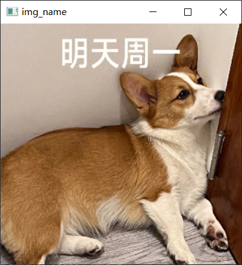
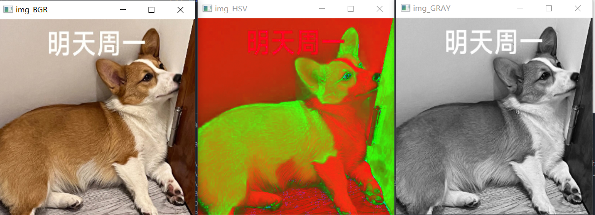
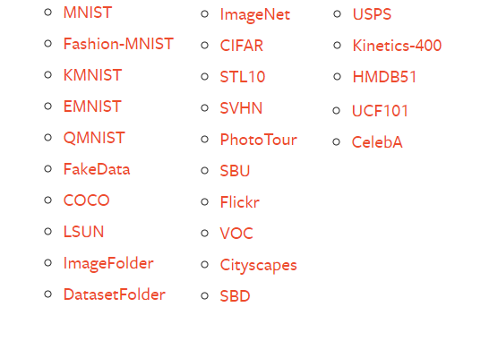

[返回AI主体部分](../../../ai.md)
# cv部分
____
## 1.经典库

### 1.1 opencv
#### 1.1.1 简介
#### 1.1.2 常用函数
##### 1.1.2.1 读取

###### 1.1.2.1.1 imread
* `imread`是opencv中最为常见的`图像读取`方式
```python 
    img = cv2.imread("image_path/test.jpg")
```
此时img中保存的为`nparray `多维数组。这意味着可以对其进行常见的矩阵操作。同时图片的格式也不止局限于`.jpg`,还支持`.tif`,`.bmp`,`.png`等多种格式(当输入四通道图片时则数组的通道数也是4)
###### 1.1.2.1.2 VideoCapture
* `VideoCapture`是opencv中最为常见的`视频读取`方式
```python
    video = cv2.VideoCapture("video_path/test.mp4")
```
此时video是一种特殊的类型，我们可以使用isOpened()函数来确认视频流是否能够被打开
```python
    flag = video.isOpened()
```
此时flag中保存的是video能否被打开的布尔值。

要获取视频流中具体的图像数据需要使用read函数
```python
    ret,frame = video.read()
```
其中`ret`是`video`获取的成功与否，`frame`则是该帧的图像数据，与`imread`中所获取的相同。

`VideoCapture`还有一种有趣的也是最为常用的用法
```python
    video = cv2.VideoCapture(0)
```
此时`VideoCapture`将会自动获取本机的摄像头进行拍摄。当然可以是1，2，3等等(前提是你有这么多的摄像头)。
需要注意的是，opencv中所有的函数都或多或少的存在大小写，而当格式不正确时，python便无法识别对应的函数
____
##### 1.1.2.2 输出
###### 1.1.2.2.1 imwrite
* `imwrite`是`opencv`中最为常见的`图像保存`方式
```python
    flag = cv2.imwrite("test.jpg",img,paras)
```    
> * `img`        : 需要保存的图像数组
> * `"test.jpg"` : 保存后的图像名称与格式
> * `flag`(选填) : 返回是否保存成功
> * `paras`(选填) : 不同的编码格式参数
>   - cv2.CV_IMWRITE_JPEG_QUALITY：设置 .jpeg/.jpg 格式的图片质量，取值为 0-100（默认值 95），数值越大则图片质量越高；
>   - cv2.CV_IMWRITE_WEBP_QUALITY：设置 .webp 格式的图片质量，取值为 0-100；
>   - cv2.CV_IMWRITE_PNG_COMPRESSION：设置 .png 格式图片的压缩比，取值为 0-9（默认值 3），数值越大则压缩比越大。

需要注意的是opencv并不支持在输出中使用中文(会出现乱码)，如果真的想使用中文可以使用`imencode`函数
___
###### 1.1.2.2.2 VideoWriter
* `VideoWriter`是`opencv`中最为常见的`视频保存`方式
```python
    VideoWriter(filename, fourcc, fps, frameSize[, isColor])
```
> filename : 保存的文件路径
> fourcc : 所选择的编码器
> fps   : 要保存视频的帧率
> frameSize : 待保存视频的画面尺寸
> isColor : 指示画面是否为彩色图像
注意此时**VideoWriter并不是一个能够返回值的函数**，而是一个**类**。需要**在声明类后，使用成员函数write来保存对应的帧**
```python
    fourcc = cv2.VideoWriter_fourcc(*'XVID')
    out = cv2.VideoWriter('testwrite.avi',fourcc, 20.0, (1920,1080),True)
    ...
    out.write(frame)
    ...
    out.release()
```
此时`testwrite.avi`中保存的就是对应的视频了

###### 1.1.2.2.3 imshow
* `imshow`是`opencv`中最为常见的`图像显示`方式
```python
    cv2.imshow('img_name',img)
```

`img_name` 为显示窗口的标题， `img`为待显示的图像数据。
需要注意的是，如果出现同名的显示框，那么会出现覆盖的现象，当然，我们也可以使用通过这样的特性来显示视频。

##### 1.1.2.3 等待
###### 1.1.2.3.1 waitKey
* `waitKey` : 是`opencv`中最为常见的`等待`方式,常用于保存`imshow`函数所产生的显示窗口.
``` python
    cv2.imshow('img_name',img)
    cv2.waitKey(5)
```
以上操作会使得`img_name`显示窗口在`5毫秒后关闭`(当然，不用函数的情况下会马上关闭)。本质上是在插入了5毫秒的延时(所有窗口会在程序结束后默认关闭)。
还有一种特殊的用法
``` python
    cv2.imshow('img_name',img)
    cv2.waitKey(0)
```
此时`img_name`显示窗口将不会自动关闭，需要手动关闭

##### 1.1.2.4 销毁
###### 1.1.2.4.1  destoryallwindows
* `destoryallwindows`: 是`opencv`中用于销毁显示窗口的函数。当调用该函数时将会销毁目前产生的所有显示窗口。
  
##### 1.1.2.5 颜色空间转换
###### 1.1.2.5.1 cvtColor
* `cvtColor` : 是`opencv`中用于进行色域转换的函数,当调用该函数时将会对所给图片进行颜色空间转换
```python
image_hsv = cv2.cvtColor(image,cv2.COLOR_BGR2HSV)
```
当然opencv支持的所有颜色空间如`BGR`、`RGB`、`GRAY`、`HSV`等均可以进行转换。只要更改格式为`cv2.COLOR_转换前格式 2 转换后格式`。即可


##### 1.1.2.6 图像修整
###### 1.1.2.6 resize
* `reshape` : 是`opencv`中用于进行色域转换的函数
```python
resize(src, dsize, dst=None, fx=None, fy=None, interpolation=None)
```
#### 1.2 实例
如果想快速实现某种操作可以在此处进行寻找
#### 1.2.1 显示一张图片(完整流程)
```python
import cv2
img  = cv2.imread("test.jpg") # 读取
cv2.imshow("img_name",img)  # 显示
cv2.waitKey(0)  # 等待
```

#### 1.2.2 显示摄像头获取的视频 (完整流程)
```python
import cv2
img  = cv2.VideoCapture(0)

while True :
    _,frame = img.read()
    print(frame)
    cv2.imshow("img_name",frame)
    if cv2.waitKey(1) &  0xff == ord("q"): # 在英文状态下，按下按s键 q 会关闭显示窗口    
        break
cv2.destoryallwindows()
```
当然直接写成`cv2.waitKey(1) == ord("q")`同样也是可以跑的,`waitKey`中的值决定了帧数的上限
#### 1.2.3 修整图像大小并进行颜色空间转换
```python
import cv2
img  = cv2.imread("test.jpg") # 读取
BGR_img =  cv2.resize(img,(320,320))
cv2.imshow("img_BGR",BGR_img)  # 显示
hsv_img = cv2.cvtColor(BGR_img,cv2.COLOR_BGR2HSV)
cv2.imshow("img_HSV",hsv_img)  # 显示
GRAY_img=cv2.cvtColor(BGR_img,cv2.COLOR_BGR2GRAY)
cv2.imshow("img_GRAY",GRAY_img)  # 显示
cv2.waitKey(0)
```


## 2.经典数据集

### 2.1 Fashion-mnist
Fashion-mnist是一个替代MNIST手写数字集的图像数据集。它是由Zalando（一家德国的时尚科技公司）旗下的研究部门提供。其涵盖了来自10种类别的共7万个不同商品的正面图片。Fashion-mnist的大小、格式和训练集/测试集划分与原始的MNIST完全一致。60000/10000的训练测试数据划分，28×28的灰度图片。你可以直接用它来测试你的机器学习和深度学习算法性能，且不需要改动任何的代码。
## 3.经典模型


## 4.模型实现
([里头请](img/model_1.ipynb))

## 5.模型微调
### 5.1 torchvision
- torchvision.datasets : 可以快速调用所有经典数据集。
示例：
>   `torchvision.datasets.MNIST(root: str, train: bool=True, transform: Optional[Callable]=None, target_transform: Optional[Callable]=None, download: bool=False)`
>          **root**：就是你想要保存MNIST数据集的位置，如果download是Flase的话，则会从目标位置读取数据集
>           **download**：True的话就会自动从网上下载这个数据集，到root的位置
>           **train**：True的话，数据集下载的是训练数据集；False的话则下载测试数据集
>           **transform**：这个是对图像进行处理的transform，比方说旋转平移缩放，输入的是PIL格式的图像
>           **target_transform**：这个是对图像标签进行处理的函数
- `torchvision.models` ：可以快速调用经典模型
示例：
```python
import torchvision.models as models
resnet18 = models.resnet18(pretrained=True)
alexnet = models.alexnet(pretrained=True)
squeezenet = models.squeezenet1_0(pretrained=True)
vgg16 = models.vgg16(pretrained=True)
densenet = models.densenet161(pretrained=True)
inception = models.inception_v3(pretrained=True)
googlenet = models.googlenet(pretrained=True)
shufflenet = models.shufflenet_v2_x1_0(pretrained=True)
mobilenet = models.mobilenet_v2(pretrained=True)
resnext50_32x4d = models.resnext50_32x4d(pretrained=True)
wide_resnet50_2 = models.wide_resnet50_2(pretrained=True)
mnasnet = models.mnasnet1_0(pretrained=True)
```
### STN

____
[返回AI主体部分](../../../ai.md)