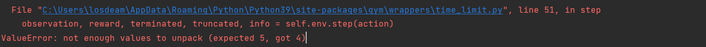

[返回AI主体部分](../../../ai.md)

## 强化学习部分
跟随天池上的教程 https://tianchi.aliyun.com/course/313/3561，进行基础的入门

### 1.ppo算法(超级玛丽实战)
&emsp;&emsp;`PPO`算法是强化学习中最为常用的算法
#### 1.1 环境构建

#### 1.1.1 使用conda构建一个新的虚拟环境


#### 1.1.2 安装所需的环境
`pip install gym gym_super_mario_bros opencv-python spinup joblib --user`

#### 1.1.3 克隆(抄)教程中的代码
代码内容在`data`文件夹下的`ppo.ipynb`文件中。
在学习过程中发现一个非常严肃的问题，教程的gym版本好像太低了，很多东西都对不上
##### 1.1.3.1 问题
1. env 中的 step 的返回值与所需的不同

> 经过查询后发现，gym已经经历了多次的版本升级。简称，这个问题很复杂。选择性放弃。先不复现了，学了先。
* 解决 ：根据`gym_super_mario_bros`所需的最低gym对gym进行重装，以求得能够复现教程的实例。
  

2. windows环境下无法使用
```python
from gym import wrappers
env = wrappers.Monitor(env,"./gym-results", force=True)
```
函数本身的作用是对训练过程进行录像，由于env.step()的返回值state中保存的就是当前的图像信息，所有我们完全可以通过自己编写显示函数来显示训练的过程
```python
import cv2  
def game_show(state):
# state为传入的图像信息，通常保存在env.step的第一个返回值中
    cv2.imshow("game",state)
    cv2.waitKey(1)
```
在data中的`ppo.ipynb `已经实现了代码的复现。

3. Spinning up库无法安装
   
###### 3.1  TensorFlow无法安装
逆天的是Spinning up库中使用的是TensorFlow<2.0 ，而只用3.7以下的python版本
所以需要创建一个3.7版本的python环境进行重写安装

###### 3.2 torch无法安装

然后逆天错误又出现了，torch版本已经低到找不到了，需要去https://download.pytorch.org/whl/torch_stable.html
找到对应版本的torch下载。然后进行本地安装


###### 3.3 box2d-py无法安装

通过报错信息可以看到主要原因在于没有swig.exe文件，这需要先执行`pip install swig`

然后就可以正常运行了。

###### 3.4 运行报错
>If this call came from a _pb2.py file, your generated code is out of date and must be regenerated with protoc >= 3.19.0. If you cannot immediately regenerate your protos, some other possible workarounds are:  
>1. Downgrade the protobuf package to 3.20.x or lower.  
> 2. Set PROTOCOL_BUFFERS_PYTHON_IMPLEMENTATION=python (but this will use pure-Python parsing and will be much slower).

经过查资料后发现是protobuf的版本过高的问题
使用`pip install protobuf==3.19.0 `即可解决问题 

[返回AI主体部分](../../../ai.md)