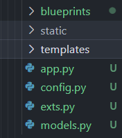

<font size="5">[返回目录](../../目录.md)</font>
<font size="5">[返回python笔记](../../../python.md/#31-flask)</font>
____
# flask 
## 1.安装

## 2.基础
### 蓝图
 蓝图是每个模块中可以重复使用的部分。使用蓝图可以大幅度的降低代码的复杂度
### SQLALchemy
### 
## 3.实战
### 3.1 整体结构
1. 创建`static文件夹`与`templates文件夹`与`app.py`文件。
    static :  用于存放静态文件
    templates : 用于存放html页面
    app.py : 项目的整体启动文件
2. 创建`config.py`即配置文件。当导入配置文件时，输入
`app.config.from_object(config)`
将会自动实现其中的配置。

3. 创建`exts.py`用于保存额外的拓展功能

4. 创建`blueprints文件夹`用于保存网页蓝图


### 3.2 数据库
1. 在MySQL中创建一个数据库
2. 配置文件中输入登录MySQL服务器需要的信息
```python
HOSTNAME = '127.0.0.1'
PORT = '3306'
DATABASE = 'flask_demo'
USERNAME = "root"
PASSWORD = 123456
DB_URI = "mysql+pymysql://{}:{}@{}:{}/{}?charset=utf8".format(USERNAME,PASSWORD,HOSTNAME,PORT,DATABASE)
SQLALCHEMY_DATABASE_URI = DB_URI
```
> 大多数时候照抄然后稍微修改一下就行了


3. 导入
```python
from flask_sqlalchemy import SQLAlchemy # 最好是重新创建一个新的文件来进行调用，否则可能会出现循环引用问题
#即在一个exts.py中进行导入，然后创建一个空的 db = SQLAlchemy()，然后通过from exts import db 来导入创建好的db对象 。
from flask_migrate import Migrate # 用于管理数据库
```

4. 初始化
```python
db.init_app(app) #来初始化已经创建的名为app的flask对象的数据库
migrate = Migrate(app,db) #使用Migrate来将app中的db数据库的版本信息保存至migrate中
```
然后在命令指示符中输入 
`flask db init`    : 初始化flask与db数据库的链接
`flask db migrate` ： 创建版本控制
`flask db upgrade` ： 就已进行的操作上传至数据库进行更新(新增表单等修改数据库结构的操作)
## 4.问题总结
> **问题：在输出flask db init时出现**
> PS D:\pythonProject> flask db init Usage: flask [OPTIONS] COMMAND [ARGS]... Try  'flask --help' for help. Error: No such command 'db'.
> **原因：**
> 未配置FLASK_APP环境变量
> **解决：**
> 在Windows上：
> 1. 打开命令提示符或PowerShell。
> 2. 使用以下命令设置FLASK_APP环境变量：
> `$env:FLASK_APP = "test.py"`
> 将test.py替换为你的应用程序的文件名。(注意要在使用对应的路径作为文件名)
> 3. 确认FLASK_APP环境变量是否已设置。你可以运行以下命令来检查：
> `echo %FLASK_APP%`

> **问题：在新的项目中连接至前一个项目的数据库时出现**
> INFO  [alembic.runtime.migration] Context impl MySQLImpl.
> INFO  [alembic.runtime.migration] Will assume non-transactional DDL.
> ERROR [flask_migrate] Error: Can't locate revision identified by 'd9103b7dbc24'
> **解决：**
> 在创建新的数据库后重新进行连接即可，预计问题为数据库版本需要与项目中migrations中的文件相对应。
> 在尝试将前一个项目中的migrations与现项目的migrations进行替换，即可成功连接之前的数据库


> **问题：课程中获取的html文件中出现乱码**
> **解决：**
> 获取的是完成后的html文件，其中存在待输入的数据，导致乱码的产生以及程序的无法使用。再删除报错对应部分后可以成功进行运行

> **问题：进行邮箱发送实验时出现该错误，**
> TimeoutError: [WinError 10060] 由于连接方在一段时间后没有正确答复或连接的主机没有反应，连接尝试失败。
> **解决：**
> 发现是MAIL_PORT 参数出错，该参数并不是自己网页所设置的端口号，而是邮箱服务的端口号，qq邮箱的端口号为465 ，更改后完成邮件的发送

> **问题：MySQL数据库密码遗忘**
> 解决：[忘记mysql密码后如何修改密码（2022最新版详细教程保姆级）](https://blog.csdn.net/qq_45890970/article/details/122944537)(2023.10 实测依然有效)