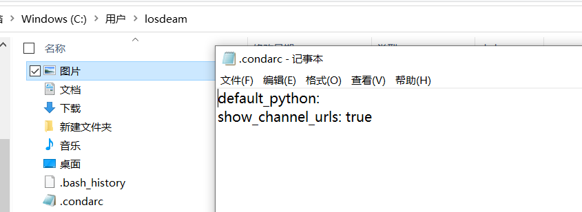
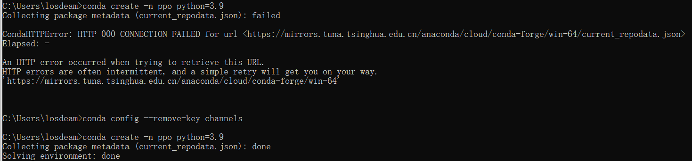

# conda的使用
## 1.环境创建 
*  `conda create  -n 环境名 python=版本号`
*  `conda create  --name 环境名 python=版本号`

## 2. 激活
* `activate 环境名`
  


## 3. 查看本机中存在的虚拟环境
* `conda info --envs`
* `conda env list`
  
## 4. 查看当前虚拟环境下已经安装的包
* `conda list`

## 5. 更改下载源
### 5.1 命令行操作
```python
conda config --add channels https://mirrors.tuna.tsinghua.edu.cn/anaconda/pkgs/free/
conda config --add channels https://mirrors.tuna.tsinghua.edu.cn/anaconda/cloud/conda-forge 
conda config --add channels https://mirrors.tuna.tsinghua.edu.cn/anaconda/cloud/msys2/
conda config --set show_channel_urls yes
```
### 5.2 寻找本地文件进行修改
1.找到 .condarc文件，并以文本的形式打开(**C:\Users\(你的用户名)\.condarc**)



2.将一下内容覆盖到该文件中
``` python
show_channel_urls: true
ssl_verify: true
channels:
  - https://mirrors.tuna.tsinghua.edu.cn/anaconda/cloud/msys2/
  - https://mirrors.tuna.tsinghua.edu.cn/anaconda/cloud/conda-forge
  - https://mirrors.tuna.tsinghua.edu.cn/anaconda/pkgs/free/
  - defaults
```
[原作者链接点击此处](https://blog.csdn.net/qq_43198568/article/details/105626024)

注： 有时会出现这样的错误，可以使用 `conda config --remove-key channels` 来进行下载源的初始化



## 6. 删除虚拟环境
* `conda remove -n env_name -all`  删除env_name环境及其所有的包