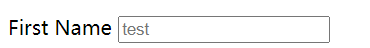
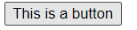
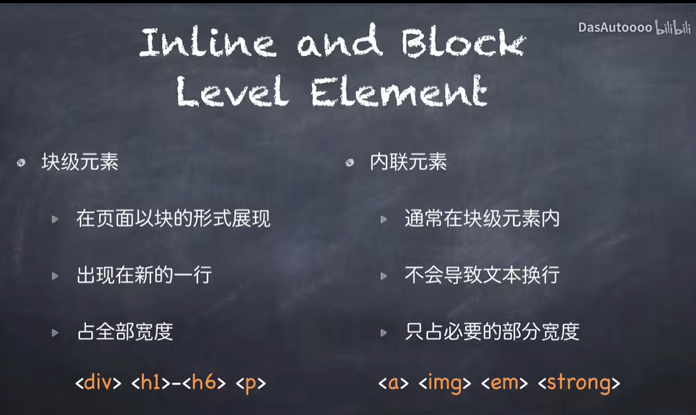

基础的html文件的构成
```html
<!DOCTYPE html>   # 解释代码的类型
<html> # 开头
    <head> # 页面的标题部分
        <titile> This is a page titile</title1> # 标题
        
    </head>
    <body> # 页面主体部分
        <h1>This is a heading</h1>
        <p>This is a paragraph</p>
        <p>This is a paragraph</p>
    </body>
</html>d
```
+ `<titile>` 标题  
- `<h n>` 正文部分,n为1~6 之间的整数，超过6会导致失效
<h1> Heading One1</h1>
<h2> Heading One2</h2>
<h3> Heading One3</h3>
<h4> Heading One4</h4>
<h5> Heading One5</h5>
<h6> Heading One6</h6>
<h7> Heading One7</h7>
<h8> Heading One8</h8>
<h9> Heading One9</h9>
<h10> Heading One10</h10>

- `<p>` 正文部分 ,无特殊效果


- `<ul>` 无序列表, 会自动在行前加冒号 

<ul>
    <li> ul 1 </li>
    <li> ul 2 </li>
    <li> ul 3 </li>
    <li> ul 4 </li>
    <li> ul 5 </li>
</ul>


- `<ol>`有序列表,会自动在行前加数字
<ol>
    <li> ol 1 </li>
    <li> ol 2 </li>
    <li> ol 3 </li>
    <li> ol 4 </li>
    <li> ol 5 </li>
</ol>


- `<li>` `<ul>`与`<ol>`下的行标签，当缺少`<ul>`或者`<ol>`时，默认使用`<ul>`的形式进行修饰


- `<table>` ,html中的列表
```  html
<table>
    <tr>
        <td>第一列</td> 
        <td>第二列</td> 
   </tr>
    <tr>
        <td rowspan="2">这里是合并列</td>    
        <td >行二列二</td>  
    </tr>
    <tr>
        <td >行三列二</td>  
    </tr>
</table>
```
<table>
    <tr>
        <td>第一列</td> 
        <td>第二列</td> 
   </tr>
    <tr>
        <td rowspan="2">这里是合并列</td>    
        <td >行二列二</td>  
    </tr>
    <tr>
        <td >行三列二</td>  
    </tr>
</table>

&emsp; &emsp; 当然列的合并便可以实现标题的功能了

```  html
<table>
    <tr  align = "center">
        <td colspan="2">这里是合并列</td> 
   </tr>
    <tr>
        <td >行二列一</td>    
        <td >行二列二</td>  
    </tr>
    <tr>
        <td >行三列一</td>  
        <td >行三列二</td>  
    </tr>
</table>
```
<table>
    <tr  align = "center">
        <td colspan="2">这里是合并列</td> 
   </tr>
    <tr>
        <td >行二列一</td>    
        <td >行二列二</td>  
    </tr>
    <tr>
        <td >行三列一</td>  
        <td >行三列二</td>  
    </tr>
</table>


&emsp; &emsp; 记得加上`align`,`align`可以实现文本的`靠右`，`靠左`，`居中`,三种模式的切换。

- `<form` ,表单
常用参数：
action : 将表单上传至文件中
method ：上传的方式

- `<br>` : 换行
<br>
- `<hr>` : 添加水平线
<hr>


- `<input>` ，可输入文本框
常用参数：
type : 输入的类型,当为submit时会作为按钮
name : 文本框标题
placehholder : 占位字，通常用于输入提示


- `<div>` ，基本框架
常用参数：
style : 风格修饰 

- `<button>`,按钮


- `` ，图片
常用参数：
src : 图片路径
alt : 图片的标签
style ： 图片格式设置



奇怪的函数：
lorem`n` : 生成n个词