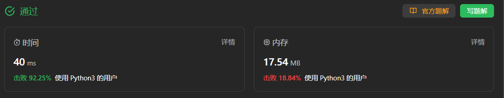
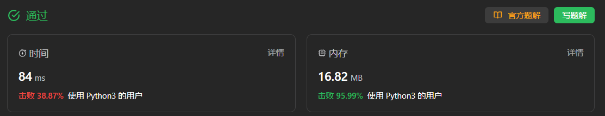

<font size="5">[返回目录](../../../目录.md)</font>
<font size="5">[返回算法笔记](../../../算法.md/#11位运算)</font>
____

### 137. 只出现一次的数字 II([原题](https://leetcode.cn/problems/single-number-ii/description/))

给你一个整数数组 nums ，除某个元素仅出现 一次 外，其余每个元素都恰出现 三次 。请你找出并返回那个只出现了一次的元素。

你必须设计并实现线性时间复杂度的算法且使用常数级空间来解决此问题。

 

> 示例 1：
> 
> 输入：nums = [2,2,3,2]
> 输出：3

> 示例 2：
> 
> 输入：nums = [0,1,0,1,0,1,99]
> 输出：99
 

提示：

- `1 <= nums.length <= 3 * 10^4`
- `-2^31 <= nums[i] <= 2^31 - 1`
- nums 中，除某个元素仅出现 一次 外，其余每个元素都恰出现 三次

#### 哈希表
```python
class Solution:
    def singleNumber(self, nums: List[int]) -> int:
        freq = collections.Counter(nums)
        ans = [num for num, occ in freq.items() if occ == 1][0]
        return ans

作者：力扣官方题解
链接：https://leetcode.cn/problems/single-number-ii/
来源：力扣（LeetCode）
著作权归作者所有。商业转载请联系作者获得授权，非商业转载请注明出处。
```


#### 位运算
```python
class Solution:
    def singleNumber(self, nums: List[int]) -> int:
        ans = 0
        for i in range(32):
            total = sum((num >> i) & 1 for num in nums)
            if total % 3:
                # Python 这里对于最高位需要特殊判断
                if i == 31:
                    ans -= (1 << i)
                else:
                    ans |= (1 << i)
        return ans

作者：力扣官方题解
链接：https://leetcode.cn/problems/single-number-ii/
来源：力扣（LeetCode）
著作权归作者所有。商业转载请联系作者获得授权，非商业转载请注明出处。
```
