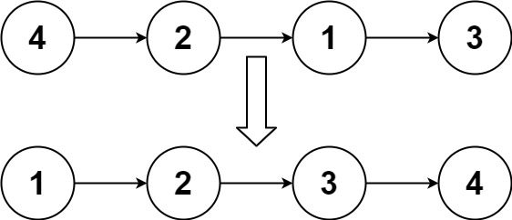
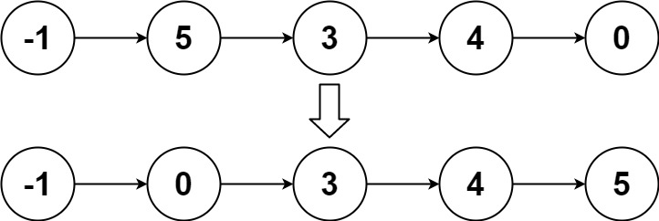
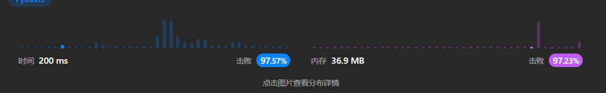

<font size="5">[返回目录](../../../目录.md)</font>
<font size="5">[返回算法笔记](../../../算法.md/#2链表)</font>
____

# 链表排序
## 148. 排序链表([原题](https://leetcode.cn/problems/sort-list/))
中等

给你链表的头结点 head ，请将其按 升序 排列并返回 排序后的链表 。

 
>   示例 1：
    
    输入：head = [4,2,1,3]
    输出：[1,2,3,4]

    

>    示例 2：
    
    输入：head = [-1,5,3,4,0]
    输出：[-1,0,3,4,5]

>   示例 3：
    输入：head = []
    输出：[]
 

提示：

- `链表中节点的数目在范围 [0, 5 * 104] 内`
* `-10^5 <= Node.val <= 10^5`
 

进阶：你可以在 O(n log n) 时间复杂度和常数级空间复杂度下，对链表进行排序吗？

本人解法：
```python
# Definition for singly-linked list.
# class ListNode:
#     def __init__(self, val=0, next=None):
#         self.val = val
#         self.next = next
class Solution:
    def sortList(self, head: Optional[ListNode]) -> Optional[ListNode]:

        # 选择排序
        # cur = head
        # while cur:
        #     p = cur
        #     mins = cur
        #     while p :
        #         if mins.val > p.val :mins = p
        #         p = p.next 
        #     cur.val,mins.val =mins.val, cur.val
        #     cur = cur.next
        # return head

        #冒泡排序
        # if not head :
        #     return head
        # flag = True 
        # while flag:
        #     flag = False
        #     p = head
        #     pre = p
        #     p = p.next 
        #     while p :
        #         if p.val < pre.val :
        #             pre.val,p.val = p.val,pre.val
        #             flag = True
        #         pre = p 
        #         p = p.next
        # return head

        #o(n).
        t = []
        q = head 
        while q :
            t.append(q.val)
            q = q.next
        t.sort()

        e  = 0 
        q = head 
        while q  :
            q.val = t[e]
            q = q.next 
            e+=1 
        return head
            
```
原本想试试O(1)能不能解的，发现都会超时，索性就直接暴力了
1. 先把链表q的值复制到列表t中
2. 将t排序
3. 把t中的值重新通过一次链表的遍历赋值给链表


很神奇，明明是O(n),但是好像内存用的比二分的o(1)还少

### 他人解法
#### 快排
```python
# Definition for singly-linked list.
# class ListNode:
#     def __init__(self, x):
#         self.val = x
#         self.next = None

class Solution:
    def sortList(self, head: ListNode) -> ListNode:
        if head is None:
            return head

        # 分成三个链表，分别是比轴心数小，相等，大的数组成的链表
        big = None
        small = None
        equal = None
        cur = head
        while cur is not None:
            t = cur
            cur = cur.next
            if t.val < head.val:
                t.next = small
                small = t
            elif t.val > head.val:
                t.next = big
                big = t
            else:
                t.next = equal
                equal = t
        
        # 拆完各自排序即可，equal 无需排序
        big = self.sortList(big)
        small = self.sortList(small)

        ret = ListNode(None)
        cur = ret

        # 将三个链表组合成一起，这一步复杂度是 o(n)
        # 可以同时返回链表的头指针和尾指针加速链表的合并。
        for p in [small, equal, big]:
            while p is not None:
                cur.next = p
                p = p.next
                cur = cur.next
                cur.next = None
        return ret.next
            

作者：小白二号
链接：https://leetcode.cn/problems/sort-list/solutions/289139/python-by-scut_dell/
来源：力扣（LeetCode）
著作权归作者所有。商业转载请联系作者获得授权，非商业转载请注明出处。
```
#### 归并排序
```python
class Solution:
    def sortList(self, head: ListNode) -> ListNode:
        if not head or not head.next: return head # termination.
        # cut the LinkedList at the mid index.
        slow, fast = head, head.next
        while fast and fast.next:
            fast, slow = fast.next.next, slow.next
        mid, slow.next = slow.next, None # save and cut.
        # recursive for cutting.
        left, right = self.sortList(head), self.sortList(mid)
        # merge `left` and `right` linked list and return it.
        h = res = ListNode(0)
        while left and right:
            if left.val < right.val: h.next, left = left, left.next
            else: h.next, right = right, right.next
            h = h.next
        h.next = left if left else right
        return res.next

作者：Krahets
链接：https://leetcode.cn/problems/sort-list/solutions/13728/sort-list-gui-bing-pai-xu-lian-biao-by-jyd/
来源：力扣（LeetCode）
著作权归作者所有。商业转载请联系作者获得授权，非商业转载请注明出处。
```

# 双向链表
## 146. LRU 缓存([原题](https://leetcode.cn/problems/lru-cache/description/?envType=study-plan-v2&envId=top-100-liked))

中等

请你设计并实现一个满足  LRU (最近最少使用) 缓存 约束的数据结构。
实现 LRUCache 类：
LRUCache(int capacity) 以 正整数 作为容量 capacity 初始化 LRU 缓存
int get(int key) 如果关键字 key 存在于缓存中，则返回关键字的值，否则返回 -1 。
void put(int key, int value) 如果关键字 key 已经存在，则变更其数据值 value ；如果不存在，则向缓存中插入该组 key-value 。如果插入操作导致关键字数量超过 capacity ，则应该 逐出 最久未使用的关键字。
函数 get 和 put 必须以 O(1) 的平均时间复杂度运行。

 

    示例：

    输入
    ["LRUCache", "put", "put", "get", "put", "get", "put", "get", "get", "get"]
    [[2], [1, 1], [2, 2], [1], [3, 3], [2], [4, 4], [1], [3], [4]]
    输出
    [null, null, null, 1, null, -1, null, -1, 3, 4]

    解释
    LRUCache lRUCache = new LRUCache(2);
    lRUCache.put(1, 1); // 缓存是 {1=1}
    lRUCache.put(2, 2); // 缓存是 {1=1, 2=2}
    lRUCache.get(1);    // 返回 1
    lRUCache.put(3, 3); // 该操作会使得关键字 2 作废，缓存是 {1=1, 3=3}
    lRUCache.get(2);    // 返回 -1 (未找到)
    lRUCache.put(4, 4); // 该操作会使得关键字 1 作废，缓存是 {4=4, 3=3}
    lRUCache.get(1);    // 返回 -1 (未找到)
    lRUCache.get(3);    // 返回 3
    lRUCache.get(4);    // 返回 4
    

提示：

- `1 <= capacity <= 3000`
- `0 <= key <= 10000`
- `0 <= value <= 105`
- `最多调用 2 * 10^5 次 get 和 put`

### 他人解法
```python
class DLinkedNode:
    def __init__(self, key=0, value=0):
        self.key = key
        self.value = value
        self.prev = None
        self.next = None


class LRUCache:

    def __init__(self, capacity: int):
        self.cache = dict()
        # 使用伪头部和伪尾部节点    
        self.head = DLinkedNode()
        self.tail = DLinkedNode()
        self.head.next = self.tail
        self.tail.prev = self.head
        self.capacity = capacity
        self.size = 0

    def get(self, key: int) -> int:
        if key not in self.cache:
            return -1
        # 如果 key 存在，先通过哈希表定位，再移到头部
        node = self.cache[key]
        self.moveToHead(node)
        return node.value

    def put(self, key: int, value: int) -> None:
        if key not in self.cache:
            # 如果 key 不存在，创建一个新的节点
            node = DLinkedNode(key, value)
            # 添加进哈希表
            self.cache[key] = node
            # 添加至双向链表的头部
            self.addToHead(node)
            self.size += 1
            if self.size > self.capacity:
                # 如果超出容量，删除双向链表的尾部节点
                removed = self.removeTail()
                # 删除哈希表中对应的项
                self.cache.pop(removed.key)
                self.size -= 1
        else:
            # 如果 key 存在，先通过哈希表定位，再修改 value，并移到头部
            node = self.cache[key]
            node.value = value
            self.moveToHead(node)
    
    def addToHead(self, node):
        node.prev = self.head
        node.next = self.head.next
        self.head.next.prev = node
        self.head.next = node
    
    def removeNode(self, node):
        node.prev.next = node.next
        node.next.prev = node.prev

    def moveToHead(self, node):
        self.removeNode(node)
        self.addToHead(node)

    def removeTail(self):
        node = self.tail.prev
        self.removeNode(node)
        return node
```
很标准的双向链表，特殊之处在于在头尾各使用了一个伪头部和伪尾部，使得在判断时不再需要判断前后的节点是否为空。

其实并不难，只要熟练双向链表就可以很容易的做出来~~可惜我不熟~~


## 460. LFU 缓存([原题)](https://leetcode.cn/problems/lfu-cache/description/)
困难

请你为 最不经常使用（LFU）缓存算法设计并实现数据结构。

实现 LFUCache 类：

LFUCache(int capacity) - 用数据结构的容量 capacity 初始化对象
int get(int key) - 如果键 key 存在于缓存中，则获取键的值，否则返回 -1 。
void put(int key, int value) - 如果键 key 已存在，则变更其值；如果键不存在，请插入键值对。当缓存达到其容量 capacity 时，则应该在插入新项之前，移除最不经常使用的项。在此问题中，当存在平局（即两个或更多个键具有相同使用频率）时，应该去除 最近最久未使用 的键。
为了确定最不常使用的键，可以为缓存中的每个键维护一个 使用计数器 。使用计数最小的键是最久未使用的键。

当一个键首次插入到缓存中时，它的使用计数器被设置为 1 (由于 put 操作)。对缓存中的键执行 get 或 put 操作，使用计数器的值将会递增。

函数 get 和 put 必须以 O(1) 的平均时间复杂度运行。

 

    示例：

    输入：
    ["LFUCache", "put", "put", "get", "put", "get", "get", "put", "get",    "get", "get"]
    [[2], [1, 1], [2, 2], [1], [3, 3], [2], [3], [4, 4], [1], [3], [4]]
    输出：
    [null, null, null, 1, null, -1, 3, null, -1, 3, 4]

    解释：
    // cnt(x) = 键 x 的使用计数
    // cache=[] 将显示最后一次使用的顺序（最左边的元素是最近的）
    LFUCache lfu = new LFUCache(2);
    lfu.put(1, 1);   // cache=[1,_], cnt(1)=1
    lfu.put(2, 2);   // cache=[2,1], cnt(2)=1, cnt(1)=1
    lfu.get(1);      // 返回 1
                     // cache=[1,2], cnt(2)=1, cnt(1)=2
    lfu.put(3, 3);   // 去除键 2 ，因为 cnt(2)=1 ，使用计数最小
                     // cache=[3,1], cnt(3)=1, cnt(1)=2
    lfu.get(2);      // 返回 -1（未找到）
    lfu.get(3);      // 返回 3
                     // cache=[3,1], cnt(3)=2, cnt(1)=2
    lfu.put(4, 4);   // 去除键 1 ，1 和 3 的 cnt 相同，但 1 最久未使用
                     // cache=[4,3], cnt(4)=1, cnt(3)=2
    lfu.get(1);      // 返回 -1（未找到）
    lfu.get(3);      // 返回 3
                     // cache=[3,4], cnt(4)=1, cnt(3)=3
    lfu.get(4);      // 返回 4
                     // cache=[3,4], cnt(4)=2, cnt(3)=3
    

提示：

- `1 <= capacity <= 10^4`
- `0 <= key <= 10^5`
- `0 <= value <= 10^9`
- `最多调用 2 * 10^5 次 get 和 put 方法`

### 他人解法：
```python
class Node(object):
    """
    双链表中的链表节点对象
    """
    def __init__(self,key=None,value=None,freq=0):
        """
        Args:
            key:对应输入的key
            value:对应输入的value
            freq:被访问的频率
            pre:指向前一个节点的指针
            next:指向后一个节点的指针
        """
        self.key = key
        self.value = value
        self.freq = freq
        self.pre = None
        self.next = None
        
class LinkedList(object):
    """
    自定义的双向链表
    """
    def __init__(self):
        """
        Args:
            __head:双向链表的头结点
            __tail:双向链表的尾节点
        """
        self.__head = Node()
        self.__tail = Node()
        self.__head.next = self.__tail
        self.__tail.pre = self.__head
        
    def insertFirst(self,node):
        """
        将指定的节点插入到链表的第一个位置 
        Args:
            node:将要插入的节点    
        """
        node.next = self.__head.next
        self.__head.next.pre = node
        self.__head.next = node
        node.pre = self.__head
        
    def delete(self,node):
        """
        从链表中删除指定的节点 
        Args:
            node:将要删除的节点 
        """
        if self.__head.next==self.__tail:
            return
        node.pre.next = node.next
        node.next.pre = node.pre
        node.next = None
        node.pre = None
        
    def getLast(self):
        """
        从链表中获取最后一个节点
        Returns:
            双向链表中的最后一个节点，如果是空链表则返回None
        """        
        if self.__head.next==self.__tail:
            return None
        return self.__tail.pre
        
    def isEmpty(self):
        """
        判断链表是否为空，除了head和tail没有其他节点即为空链表
        Returns:
            链表不空返回True，否则返回False
        """  
        return self.__head.next==self.__tail

class LFUCache(object):
    """
    自定义的LFU缓存
    """
    def __init__(self, capacity):
        """
        Args:
            __capacity:缓存的最大容量
            __keyMap: key->Node 这种结构的字典
            __freqMap:freq->LinkedList 这种结构的字典
            __minFreq:记录缓存中最低频率
        """
        self.__capacity = capacity
        self.__keyMap = dict()
        self.__freqMap = dict()
        self.__minFreq = 0
        

    def get(self, key):
        """
        获取一个元素，如果key不存在则返回-1，否则返回对应的value
        同时更新被访问元素的频率
        Args:
            key:要查找的关键字
        Returns:
            如果没找到则返回-1，否则返回对应的value
        """
        if key not in self.__keyMap:
            return -1
        node = self.__keyMap[key]
        self.__increment(node)
        return node.value

    def put(self, key, value):
        """
        插入指定的key和value，如果key存在则更新value，同时更新频率
        如果key不存并且缓存满了，则删除频率最低的元素，并插入新元素
        否则，直接插入新元素
        Args:
            key:要插入的关键字
            value:要插入的值
        """
        if key in self.__keyMap:
            node = self.__keyMap[key]
            node.value = value
            self.__increment(node)
        else:
            if self.__capacity==0:
                return
            if len(self.__keyMap)==self.__capacity:
                self.__removeMinFreqElement()
            node = Node(key,value,1)
            self.__increment(node,True)
            self.__keyMap[key] = node
        
    def __increment(self,node,is_new_node=False):
        """
        更新节点的访问频率
        Args:
            node:要更新的节点
            is_new_node:是否是新节点，新插入的节点和非新插入节点更新逻辑不同
        """
        if is_new_node:
            self.__minFreq = 1
            self.__setDefaultLinkedList(node)
        else:
            self.__deleteNode(node)
            node.freq += 1
            self.__setDefaultLinkedList(node)
            if self.__minFreq not in self.__freqMap:
                self.__minFreq += 1
    
    def __setDefaultLinkedList(self,node):
        """
        根据节点的频率，插入到对应的LinkedList中，如果LinkedList不存在则创建
        Args:
            node:将要插入到LinkedList的节点
        """
        if node.freq not in self.__freqMap:
            self.__freqMap[node.freq] = LinkedList()
        linkedList = self.__freqMap[node.freq]
        linkedList.insertFirst(node)
        
    def __deleteNode(self,node):
        """
        删除指定的节点，如果节点删除后，对应的双链表为空，则从__freqMap中删除这个链表
        Args:
            node:将要删除的节点
        """
        if node.freq not in self.__freqMap:
            return
        linkedList = self.__freqMap[node.freq]
        freq = node.freq
        linkedList.delete(node)
        if linkedList.isEmpty():
            del self.__freqMap[freq]
        
    def __removeMinFreqElement(self):
        """
        删除频率最低的元素，从__freqMap和__keyMap中都要删除这个节点，如果节点删除后对应的链表为空，则要从__freqMap中删除这个链表
        """
        linkedList = self.__freqMap[self.__minFreq]
        node = linkedList.getLast()
        linkedList.delete(node)
        del self.__keyMap[node.key]
        if linkedList.isEmpty():
            del self.__freqMap[node.freq]
        

作者：王尼玛
链接：https://leetcode.cn/problems/lfu-cache/
来源：力扣（LeetCode）
著作权归作者所有。商业转载请联系作者获得授权，非商业转载请注明出处。
```
思路其实很简单
1. 主体在于两个哈希表，一个用于保存节点目前的频率`self.__keyMap` ，        
        结构为`{key: freq}`，另一个用于保存每种频率的双向链表`self.__freqMap` ，结构为`{freq: LinkedList}`
2. 添加新节点时，将`self.__keyMap`中添加`{key:1}`,在`self.__freqMap[freq]`不存在的情况下，新建一个双向链表再添加节点。
3. 当修改节点时，先从`self.__keyMap`中找到当前节点的频率，在`self.__freqMap[freq]`中删去，在`self.__freqMap[freq+1]`中添加。由于存在删去，可能会导致空链表的出现，所以需要进行判断。
