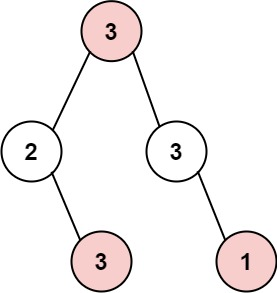
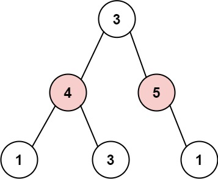

<font size="5">[返回目录](../../目录.md)</font>
<font size="5">[返回算法笔记](../../算法.md/##6动态规划)</font>
____
# 1.动态规划

## 1.1 单维动态规划
### 213. 打家劫舍 II([原题](https://leetcode.cn/problems/house-robber-ii/description/))

中等

你是一个专业的小偷，计划偷窃沿街的房屋，每间房内都藏有一定的现金。这个地方所有的房屋都 围成一圈 ，这意味着第一个房屋和最后一个房屋是紧挨着的。同时，相邻的房屋装有相互连通的防盗系统，如果两间相邻的房屋在同一晚上被小偷闯入，系统会自动报警 。

给定一个代表每个房屋存放金额的非负整数数组，计算你 在不触动警报装置的情况下 ，今晚能够偷窃到的最高金额。

 

    示例 1：

    输入：nums = [2,3,2]
    输出：3
    解释：你不能先偷窃 1 号房屋（金额 = 2），然后偷窃 3 号房屋（金额 = 2）, 因为他们是相邻的。
>
    示例 2：

    输入：nums = [1,2,3,1]
    输出：4
    解释：你可以先偷窃 1 号房屋（金额 = 1），然后偷窃 3 号房屋（金额 = 3）。
         偷窃到的最高金额 = 1 + 3 = 4 。

>

    示例 3：

    输入：nums = [1,2,3]
    输出：3
 

提示：

- `1 <= nums.length <= 100`
- `0 <= nums[i] <= 1000`


#### 本人解法
```python
class Solution:
    def rob(self, nums: List[int]) -> int:
        n = len(nums)
        flag = 0 
        if n <=2 :
            return max(nums)
        dp = [[0,0] for i in range(n)]
        dp1 = [[0,0] for i in range(n)]
        dp[0][1] = nums[0]
        dp1[0][1] = nums[-1]
        ans = 0 

        for i in range(1,n-1) :

            dp[i][1] = dp[i-1][0] +nums[i]
            dp[i][0] = max(dp[i-1][0], dp[i-1][1])
            dp1[i][1] = dp1[i-1][0] +nums[n-i-1]
            dp1[i][0] = max( dp1[i-1][0] , dp1[i-1][1])    

        return max(dp[n-2]+dp1[n-2])
```
写的很粗糙，但是能用

1. 从前往后抢，遇到最后一间就收手
2. 从后往前抢，遇到第一间就收手
3. 比较两种方式哪种赚的多。
#### 他人解法
```python
class Solution:
    def rob(self, nums: List[int]) -> int:
        n = len(nums)
        if n == 1:
            return nums[0]
        if n == 2:
            return max(nums[0], nums[1])
        f = [0]*(n+1)
        # 不偷index=0
        f[0] = 0
        f[1] = nums[1]
        for i in range(2, n):
            f[i] = max(f[i-1], f[i-2]+nums[i])
        ans = f[n-1]
        f[0] = nums[0]
        f[1] = max(nums[0], nums[1])
        for i in range(2, n-1):
            f[i] = max(f[i-1], f[i-2]+nums[i])
        ans = max(ans, f[n-2])
        return ans
```
同理，但是代码好看一些


### 188. 买卖股票的最佳时机 IV([原题](https://leetcode.cn/problems/best-time-to-buy-and-sell-stock-iv/))


困难

给你一个整数数组 prices 和一个整数 k ，其中 prices[i] 是某支给定的股票在第 i 天的价格。

设计一个算法来计算你所能获取的最大利润。你最多可以完成 k 笔交易。也就是说，你最多可以买 k 次，卖 k 次。

注意：你不能同时参与多笔交易（你必须在再次购买前出售掉之前的股票）。

 

> 示例 1：
> 
> 输入：k = 2, prices = [2,4,1]
> 输出：2
> 解释：在第 1 天 (股票价格 = 2) 的时候买入，在第 2 天 (股票价格 = 4) 的时候卖出，这笔交易所能获得利润 = 4-2 = 2 。

>示例 2：
>
>输入：k = 2, prices = [3,2,6,5,0,3]
>输出：7
>解释：在第 2 天 (股票价格 = 2) 的时候买入，在第 3 天 (股票价格 = 6) 的时候卖出, 这笔交易所能获得利润 = 6-2 = 4 。
     随后，在第 5 天 (股票价格 = 0) 的时候买入，在第 6 天 (股票价格 = 3) 的时候卖出, 这笔交易所能获得利润 = 3-0 = 3 。
 

提示：

- `1 <= k <= 100`
- `1 <= prices.length <= 1000`
- `0 <= prices[i] <= 1000`

#### 他人解法
```python 
class Solution:
    def maxProfit(self, k: int, prices: List[int]) -> int:
        f = [[-inf] * 2 for _ in range(k + 2)]
        for j in range(1, k + 2):
            f[j][0] = 0
        for i, p in enumerate(prices):
            for j in range(k + 1, 0, -1):
                f[j][0] = max(f[j][0], f[j][1] + p)
                f[j][1] = max(f[j][1], f[j - 1][0] - p)
        return f[-1][0]
```
对交易次数进行动态规划。策略为0 卖出/不进行操作, 进行购买操作或是保持购买状态。

## 1.2 多维动态规划
### 72. 编辑距离([原题](https://leetcode.cn/problems/edit-distance/description/))[多维动态规划]
困难

给你两个单词 word1 和 word2， 请返回将 word1 转换成 word2 所使用的最少操作数  。

你可以对一个单词进行如下三种操作：

插入一个字符
删除一个字符
替换一个字符
 

    示例 1：

    输入：word1 = "horse", word2 = "ros"
    输出：3
    解释：
    horse -> rorse (将 'h' 替换为 'r')
    rorse -> rose (删除 'r')
    rose -> ros (删除 'e')

>

    示例 2：

    输入：word1 = "intention", word2 = "execution"
    输出：5
    解释：
    intention -> inention (删除 't')
    inention -> enention (将 'i' 替换为 'e')
    enention -> exention (将 'n' 替换为 'x')
    exention -> exection (将 'n' 替换为 'c')
    exection -> execution (插入 'u')
 

提示：

* `0 <= word1.length, word2.length <= 500`
* `word1 和 word2 由小写英文字母组成`

##### 解法
```python
class Solution:
    def minDistance(self, word1: str, word2: str) -> int:
        n1 = len(word1)
        n2 = len(word2)
        dp = [[0] * (n2 + 1) for _ in range(n1 + 1)]
        # 第一行
        for j in range(1, n2 + 1):
            dp[0][j] = dp[0][j-1] + 1
        # 第一列
        for i in range(1, n1 + 1):
            dp[i][0] = dp[i-1][0] + 1
        for i in range(1, n1 + 1):
            for j in range(1, n2 + 1):
                if word1[i-1] == word2[j-1]:
                    dp[i][j] = dp[i-1][j-1]
                else:
                    dp[i][j] = min(dp[i][j-1], dp[i-1][j], dp[i-1][j-1] ) + 1
        #print(dp)      
        return dp[-1][-1]
```

1. 使用i作为x轴，j作为y轴建立二维矩阵
2. 空出一行的余量用于启动
3. 三种操作的前一状态分别对应 删除 (dp[i-1][j] 插入dp[i][j-1] 替换 dp[i-1][j-1])
4. 对角线保存的就是完成当前字符操作的最少步数

```python
class Solution:
    def minDistance(self, word1: str, word2: str) -> int:
        import functools
        @functools.lru_cache(None)
        def helper(i, j):
            if i == len(word1) or j == len(word2):
                return len(word1) - i + len(word2) - j
            if word1[i] == word2[j]:
                return helper(i + 1, j + 1)
            else:
                inserted = helper(i, j + 1)
                deleted = helper(i + 1, j)
                replaced = helper(i + 1, j + 1)
                return min(inserted, deleted, replaced) + 1
        return helper(0, 0)
作者：powcai
链接：https://leetcode.cn/problems/edit-distance/
来源：力扣（LeetCode）
著作权归作者所有。商业转载请联系作者获得授权，非商业转载请注明出处。
```
## 1.3 记忆化搜索
### 823. 带因子的二叉树([原题](https://leetcode.cn/problems/binary-trees-with-factors/description/))

中等

给出一个含有不重复整数元素的数组 arr ，每个整数 arr[i] 均大于 1。

用这些整数来构建二叉树，每个整数可以使用任意次数。其中：每个非叶结点的值应等于它的两个子结点的值的乘积。

满足条件的二叉树一共有多少个？答案可能很大，返回 对 109 + 7 取余 的结果。

 

    示例 1:

    输入: arr = [2, 4]
    输出: 3
    解释: 可以得到这些二叉树: [2], [4], [4, 2, 2]
>
    示例 2:

    输入: arr = [2, 4, 5, 10]
    输出: 7
    解释: 可以得到这些二叉树: [2], [4], [5], [10], [4, 2, 2], [10, 2, 5], [10, 5, 2].
    

提示：

* `1 <= arr.length <= 1000`
* `2 <= arr[i] <= 109`
* `arr 中的所有值 互不相同`

#### 本人解法
##### 初次尝试
```python
class Solution:
    def numFactoredBinaryTrees(self, arr: List[int]) -> int:
        arr.sort()
        n = len(arr)
        e = arr[-1]
        a= {}
        ans = 0 
        mod = 10**9+7
        for i in arr :
            a[i] = 1
            ans +=1 
        
        for i in range(n) :
            for j in range(n):
                num = arr[i] * arr[j]
                if num > e :
                    break
                elif num in arr :
                    a[num] += a[arr[i]] * a[arr[j]]

        for i in range(n) :
            for j in range(n):
                num = arr[i] * arr[j]
                if num > e :
                    break
                elif num in arr :
                    ans += a[arr[i]] * a[arr[j]] 
                    ans %= mod 
        return ans 
```
##### 分析
先将数组进行排序肯定是不会出现问题的。考虑到所给出的数组长度最长也只有1000，完全支持**O(n^2^)** 的计算。所有先将每种数字可能的情况全都通过一次二重循环保存至哈希表a中。然后再通过一次二重循环获取具体的解法。

##### 错误分析
在用例`[45,42,2,18,23,1170,12,41,40,9,47,24,33,28,10,32,29,17,46,11,759,37,6,26,21,49,31,14,19,8,13,7,27,22,3,36,34,38,39,30,43,15,4,16,35,25,20,44,5,48]`中出现了错误,对输出值进行分析
```python
#当num == 12 时输出arr[i],arr[j]与a[arr[i]] * a[arr[j]]
2 6
2
3 4
2
4 3
2
6 2
3
```
发现`同种组合在前后的值不同`，这与我们的要求不符合。错误出现在第一次循环处。
普通的遍历无法避免这种情况的发生，需要使用以数值为中心进行遍历。即**将一次双重循环完全留给单数值进行操作**。本质上是**使用一次三重循环**
优化：
1. 由于仅对单数值进行操作，故遍历范围仅需在(0,t)之间，其中t为当前数值的下标。
2. 可以在循环的末尾直接添加ans值，节省一次双重循环  

风险：
1. 三重循环时间复杂度为**O(n^3^)** 极易出现超时
   
##### 第二次提交
```python   
class Solution:
    def numFactoredBinaryTrees(self, arr: List[int]) -> int:
        arr.sort()
        n = len(arr)
        e = arr[-1]
        a= {}
        ans = 0 
        mod = 10**9+7
        for index,t in enumerate(arr) :
            a[t] = 1
            for i in range(index) :
                for j in range(index):
                    num = arr[i] * arr[j]
                    if num == t:
                        a[num] += a[arr[i]] * a[arr[j]]
            ans += a[t]
            ans %= mod 
          
        return ans 
```
果不其然，超出了时间限制。看来仅用哈希表是不得行了。
分析一下发现存在大量的重复运算，那是不是可以试下记忆化搜素？
记不出来一点。准备开摆了。
#### 他人解法
```python
class Solution:
    def numFactoredBinaryTrees(self, arr: List[int]) -> int:
        arr.sort()
        idx = {x: i for i, x in enumerate(arr)}
        @cache  # 缓存装饰器，避免重复计算 dfs 的结果
        def dfs(i: int) -> int:
            res = 1
            val = arr[i]
            for j in range(i):  # val 的因子一定比 val 小
                x = arr[j]
                if val % x == 0 and val // x in idx:  # 另一个因子 val/x 必须在 arr 中
                    res += dfs(j) * dfs(idx[val // x])
            return res
        return sum(dfs(i) for i in range(len(arr))) % (10 ** 9 + 7)

作者：灵茶山艾府
链接：https://leetcode.cn/problems/binary-trees-with-factors/
来源：力扣（LeetCode）
著作权归作者所有。商业转载请联系作者获得授权，非商业转载请注明出处。
```
可见至少思路是没有问题的，已经胜利了一大半了。
#### 总结
1. 如果出现遍历导致前后运算互相影响的情况可以试试递归
2. 如果递归或者循环中出现大量重复运算可以试着进行记忆化搜索


###  337. 打家劫舍 III([原题](https://leetcode.cn/problems/house-robber-iii/description/))

中等

小偷又发现了一个新的可行窃的地区。这个地区只有一个入口，我们称之为 root 。

除了 root 之外，每栋房子有且只有一个“父“房子与之相连。一番侦察之后，聪明的小偷意识到“这个地方的所有房屋的排列类似于一棵二叉树”。 如果 两个直接相连的房子在同一天晚上被打劫 ，房屋将自动报警。

给定二叉树的 root 。返回 在不触动警报的情况下 ，小偷能够盗取的最高金额 。

 

>    示例 1:
>   
>    输入: root = [3,2,3,null,3,null,1]
>    输出: 7 
>    解释: 小偷一晚能够盗取的最高金额 3 + 3 + 1 = 7


>   示例 2:
>   
>   输入: root = [3,4,5,1,3,null,1]
>   输出: 9
>   解释: 小偷一晚能够盗取的最高金额 4 + 5 = 9
 

提示：

- `树的节点数在 [1, 10^4] 范围内`
- `0 <= Node.val <= 10^4`
  
#### 本人解法
```python
# Definition for a binary tree node.
# class TreeNode:
#     def __init__(self, val=0, left=None, right=None):
#         self.val = val
#         self.left = left
#         self.right = right
class Solution:
    def rob(self, root: Optional[TreeNode]) -> int:

        @cache
        def dfs(node,flag):
            if not node :
                return 0
            left = dfs(node.left,not flag)
            right = dfs(node.right,not flag)
            if flag:
                return node.val + left + right 
            else:
                return max(left,dfs(node.left, flag)) + max(right,dfs(node.right, flag)) 

        return max(dfs(root,True),dfs(root,False)) 
```
1. 由于是树，所以很容易就想到进行搜索
2. 分别探究广度优先与深度优先
3. 广度优先的情况下，难以判断节点的前后关系
4. 进行深度优先，同时需要判断当前节点是否被选择
5. 当被选择的情况下，值为当前节点值与其左右子树（不含根节点）之和
6. 当不选的情况下，值为其左右子树包含根节点与不包含两种情况的最大值之和
7. 肉眼可见的存在大量重复运算，所以进行记忆化搜索

勉强通过，去学习一波


#### 他人解法
```python
# Definition for a binary tree node.
# class TreeNode:
#     def __init__(self, x):
#         self.val = x
#         self.left = None
#         self.right = None

class Solution:
    def rob(self, root: TreeNode) -> int:
        def _rob(root):
            if not root: return 0, 0  # 偷，不偷

            left = _rob(root.left)
            right = _rob(root.right)
            # 偷当前节点, 则左右子树都不能偷
            v1 = root.val + left[1] + right[1]
            # 不偷当前节点, 则取左右子树中最大的值
            v2 = max(left) + max(right)
            return v1, v2

        return max(_rob(root))

作者：dz-lee
链接：https://leetcode.cn/problems/house-robber-iii/
来源：力扣（LeetCode）
著作权归作者所有。商业转载请联系作者获得授权，非商业转载请注明出处。
```
简单递归就结束了，优雅。
