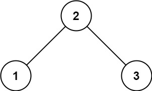
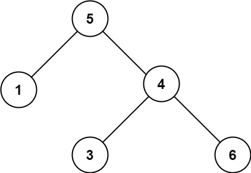
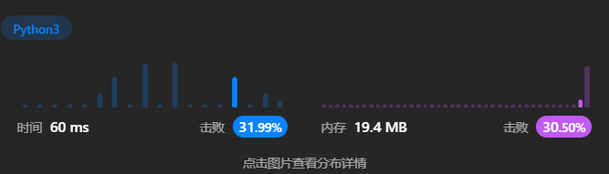
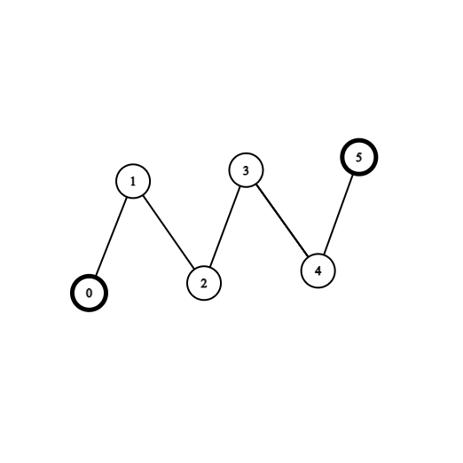
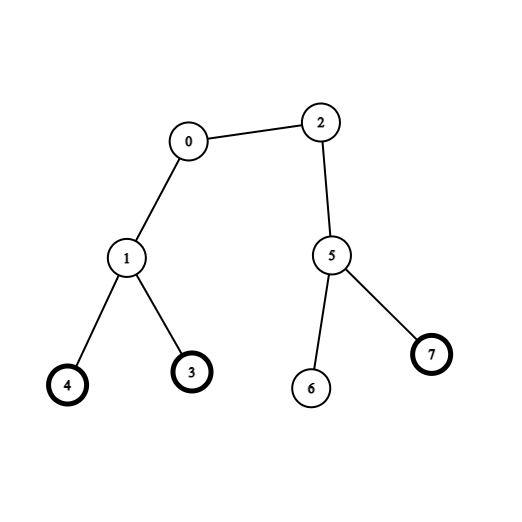

<font size="5">[返回目录](../../目录.md)</font>
<font size="5">[返回算法笔记](../../算法.md/##3.图)</font>
____
# 1. 图
## 1761. 一个图中连通三元组的最小度数([原题](https://leetcode.cn/problems/minimum-degree-of-a-connected-trio-in-a-graph/description/))

给你一个无向图，整数 `n` 表示图中节点的数目，`edges` 数组表示图中的边，其中 `edges[i] = [ui, vi]` ，表示 `ui` 和 `vi` 之间有一条无向边。

一个 连通三元组 指的是 三个 节点组成的集合且这三个点之间 两两 有边。

连通三元组的度数 是所有满足此条件的边的数目：一个顶点在这个三元组内，而另一个顶点不在这个三元组内。

请你返回所有连通三元组中度数的 最小值 ，如果图中没有连通三元组，那么返回 `-1` 。

 

    示例 1：


    输入：n = 6, edges = [[1,2],[1,3],[3,2],[4,1],[5,2],[3,6]]
    输出：3
    解释：只有一个三元组 [1,2,3] 。构成度数的边在上图中已被加粗。

>

    示例 2：


    输入：n = 7, edges = [[1,3],[4,1],[4,3],[2,5],[5,6],[6,7],[7,5],[2,6]]
    输出：0
    解释：有 3 个三元组：
    1) [1,4,3]，度数为 0 。
    2) [2,5,6]，度数为 2 。
    3) [5,6,7]，度数为 2 。

提示：

* `2 <= n <= 400`
* `edges[i].length == 2`
* `1 <= edges.length <= n * (n-1) / 2`
* `1 <= ui, vi <= n`
* `ui != vi`
* `图中没有重复的边。`

### 分析:
明显的图论题，对节点相关的题通常需要将图转换为字典。且据题意可得连通三元组中度数为`三个节点所连接的节点总数-6(三节点互相连接)`

### 本人解法：
主打一个大力出奇迹
```python
class Solution:
    def minTrioDegree(self, n: int, edges: List[List[int]]) -> int:
        
        def adds(a,i,j):
            if i not in a :
                a[i] = set()
            a[i].add(j)
            return a

        a = {}
        b = {}
        for i,j in edges:
            a = adds(a,i,j)
            a = adds(a,j,i)
        for i in a :
            b[i] = len(a[i])

        
        @cache
        def find(i,j):
            if j in a[i]:
                return True 
            return False

        ans = -1

        for i in range(1,n+1):
            if i not in a :
                continue 
            if len(a[i]) > 1 :
                for j in a[i]:
                    if j > i:
                        for t in a[i]:
                            if t > j:
                                if find(j,t):
                                    if ans == -1 :
                                        ans = b[i]+b[j]+b[t]-6
                                    else:
                                        ans = min(ans,b[i]+b[j]+b[t]-6)
                                    if ans == 0 :
                                        return 0 
        return ans 
```

### 他人解法:
同样也是暴力，但是写的就是简洁的多
```python
def minTrioDegree(self, n, edges):
    """
    :type n: int
    :type edges: List[List[int]]
    :rtype: int
    """
    indegrees = collections.defaultdict(lambda: set())
    res = float("inf")
    for u, v in edges:
        indegrees[u].add(v)
        indegrees[v].add(u)
    for i in range(1, n + 1):
        for j in range(i + 1, n + 1):
            for k in range(j + 1, n + 1):
                if j in indegrees[i] and k in indegrees[i] and k in indegrees[j]: 
                    d = len(indegrees[i]) + len(indegrees[j]) + len(indegrees[k]) - 6
                    res = min(res, d)
    return res if res != float("inf") else -1

作者：东主楼守夜人
链接：https://leetcode.cn/problems/minimum-degree-of-a-connected-trio-in-a-graph/
来源：力扣（LeetCode）
著作权归作者所有。商业转载请联系作者获得授权，非商业转载请注明出处。
```


# 2.深度优先遍历 


# 3.广度优先遍历

## 207. 课程表([原题](https://leetcode.cn/problems/course-schedule/?envType=daily-question&envId=2023-09-09))

中等

你这个学期必须选修 numCourses 门课程，记为 0 到 numCourses - 1 。

在选修某些课程之前需要一些先修课程。 先修课程按数组 prerequisites 给出，其中 prerequisites[i] = [ai, bi] ，表示如果要学习课程 ai 则 必须 先学习课程  bi 。

例如，先修课程对 [0, 1] 表示：想要学习课程 0 ，你需要先完成课程 1 。
请你判断是否可能完成所有课程的学习？如果可以，返回 true ；否则，返回 false 。

 

    示例 1：

    输入：numCourses = 2, prerequisites = [[1,0]]
    输出：true
    解释：总共有 2 门课程。学习课程 1 之前，你需要完成课程 0 。这是可能的。
>
    示例 2：

    输入：numCourses = 2, prerequisites = [[1,0],[0,1]]
    输出：false
    解释：总共有 2 门课程。学习课程 1 之前，你需要先完成​课程 0 ；并且学习课程 0 之前，你还应先完成课程 1 。这是不可能的。
 

提示：

- `1 <= numCourses <= 2000`
- `0 <= prerequisites.length <= 5000`
- `prerequisites[i].length == 2`
- `0 <= ai, bi < numCourses`
- `prerequisites[i] 中的所有课程对 互不相同`

### 本人解法

### 他人解法
```python
from collections import deque

class Solution:
    def canFinish(self, numCourses: int, prerequisites: List[List[int]]) -> bool:
        indegrees = [0 for _ in range(numCourses)]
        adjacency = [[] for _ in range(numCourses)]
        queue = deque()
        # Get the indegree and adjacency of every course.
        for cur, pre in prerequisites:
            indegrees[cur] += 1
            adjacency[pre].append(cur)
        # Get all the courses with the indegree of 0.
        for i in range(len(indegrees)):
            if not indegrees[i]: queue.append(i)
        # BFS TopSort.
        while queue:
            pre = queue.popleft()
            numCourses -= 1
            for cur in adjacency[pre]:
                indegrees[cur] -= 1
                if not indegrees[cur]: queue.append(cur)
        return not numCourses

```
#### 分析：
1. 获取每个点的入度，并且将前置课程保存至另一个列表adjacency便于后续操作
2. 初始化队列，对每个点的入度进行判断，如何为0则表示不存在前置课程，所以可以直接进行输出
3. 进入循环，每一次均删除队列中的一个节点，然后将其所有的后置课程的入度均减一，当后置课程的入度等于0时，可以进行学习，将其加入队列。并且每一次删除后均将numCourses(课程总数)-1。
4. 循环结束后，对numCourses进行判断如果不为零，则表示还有节点无法删去，反之则是学习完毕。

可以使用后置题[课程表II ](https://leetcode.cn/problems/course-schedule-ii/description)进行练习


##线索二叉树
### 98. 验证二叉搜索树([原题](https://leetcode.cn/problems/validate-binary-search-tree/description))

中等

给你一个二叉树的根节点 root ，判断其是否是一个有效的二叉搜索树。

有效 二叉搜索树定义如下：

节点的左子树只包含 小于 当前节点的数。
节点的右子树只包含 大于 当前节点的数。
所有左子树和右子树自身必须也是二叉搜索树。
 

> 示例 1：
> 
> 输入：root = [2,1,3]
> 输出：true

> 示例 2：
> 
> 输入：root = [5,1,4,null,null,3,6]
> 输出：false
> 解释：根节点的值是 5 ，但是右子节点的值是 4 。
 

提示：

- `树中节点数目范围在[1, 10^4] 内`
- `-2^31 <= Node.val <= 2^31 - 1`

#### 本人解法
```python
# Definition for a binary tree node.
# class TreeNode:
#     def __init__(self, val=0, left=None, right=None):
#         self.val = val
#         self.left = left
#         self.right = right
class Solution:
    def isValidBST(self, root: Optional[TreeNode]) -> bool:
        def  dfs(node):
            if not node:
                return True,None ,None 
            left,min_l,max_l = dfs(node.left)
            right,min_r, max_r = dfs(node.right)

            if not left or not right :
                return False,None ,None 

            flag1 =  max_l < node.val if max_l != None  else True

            flag2 =  node.val < min_r if min_r != None else True


            if flag1 and flag2:
                return True, min_l if min_l else node.val, max_r if max_r else node.val
            return False,None ,None 

        return dfs(root)[0]
```
粗糙，但是管用


#### 他人解法
```python
class Solution:
    def isValidBST(self, root: Optional[TreeNode], left=-inf, right=inf) -> bool:
        if root is None:
            return True
        x = root.val
        return left < x < right and \
               self.isValidBST(root.left, left, x) and \
               self.isValidBST(root.right, x, right)

作者：灵茶山艾府
链接：https://leetcode.cn/problems/validate-binary-search-tree/
来源：力扣（LeetCode）
著作权归作者所有。商业转载请联系作者获得授权，非商业转载请注明出处。
```
我是sb，遍历就解决的事愣是没把自己玩死。

## 拓扑排序
### 2603. 收集树中金币([原题](https://leetcode.cn/problems/collect-coins-in-a-tree/description/))
困难

给你一个 n 个节点的无向无根树，节点编号从 0 到 n - 1 。给你整数 n 和一个长度为 n - 1 的二维整数数组 edges ，其中 edges[i] = [ai, bi] 表示树中节点 ai 和 bi 之间有一条边。再给你一个长度为 n 的数组 coins ，其中 coins[i] 可能为 0 也可能为 1 ，1 表示节点 i 处有一个金币。

一开始，你需要选择树中任意一个节点出发。你可以执行下述操作任意次：

收集距离当前节点距离为 2 以内的所有金币，或者
移动到树中一个相邻节点。
你需要收集树中所有的金币，并且回到出发节点，请你返回最少经过的边数。

如果你多次经过一条边，每一次经过都会给答案加一。

 

> 示例 1：
> 
> 输入：coins = [1,0,0,0,0,1], edges = [[0,1],[1,2],[2,3],[3,4],[4,5]]
> 输出：2
> 解释：从节点 2 出发，收集节点 0 处的金币，移动到节点 3 ，收集节点 5 处的金币，然后移动回节点 2 。

> 示例 2：
> 
> 输入：coins = [0,0,0,1,1,0,0,1], edges = [[0,1],[0,2],[1,3],[1,4],[2,5],[5,6],[5,7]]
> 输出：2
> 解释：从节点 0 出发，收集节点 4 和 3 处的金币，移动到节点 2 处，收集节点 7 处的金币，移动回节点 0 。
 

提示：

- `n == coins.length`
- `1 <= n <= 3 * 10^4`
- `0 <= coins[i] <= 1`
- `edges.length == n - 1`
- `edges[i].length == 2`
- `0 <= ai, bi < n`
- `ai != bi`
- `edges 表示一棵合法的树。`

#### 他人解法
```python
class Solution:
    def collectTheCoins(self, coins: List[int], edges: List[List[int]]) -> int:
        n = len(coins)
        g = [[] for _ in range(n)]
        for x, y in edges:
            g[x].append(y)
            g[y].append(x)  # 建图
        deg = list(map(len, g))  # 每个节点的度数（邻居个数）

        left_edges = n - 1  # 剩余边数
        # 拓扑排序，去掉没有金币的子树
        q = []
        for i, (d, c) in enumerate(zip(deg, coins)):
            if d == 1 and c == 0:  # 没有金币的叶子
                q.append(i)
        while q:
            left_edges -= 1  # 删除节点到其父节点的边
            for y in g[q.pop()]:
                deg[y] -= 1
                if deg[y] == 1 and coins[y] == 0:  # 没有金币的叶子
                    q.append(y)

        # 再次拓扑排序
        for i, (d, c) in enumerate(zip(deg, coins)):
            if d == 1 and c:  # 有金币的叶子（判断 c 是避免把没有金币的叶子也算进来）
                q.append(i)
        left_edges -= len(q)  # 删除所有叶子（到其父节点的边）
        for x in q:  # 遍历所有叶子
            for y in g[x]:
                deg[y] -= 1
                if deg[y] == 1:  # y 现在是叶子了
                    left_edges -= 1  # 删除 y（到其父节点的边）
        return max(left_edges * 2, 0)

作者：灵茶山艾府
链接：https://leetcode.cn/problems/collect-coins-in-a-tree/
来源：力扣（LeetCode）
著作权归作者所有。商业转载请联系作者获得授权，非商业转载请注明出处。
```
1. 建图
2. 把没金币的叶节点去掉(循环)
3. 此时所有的叶节点都已经是有金币的节点了
4. 找叶子节点的父节点的父节点（可以跨两层拿金币）
5. 根据剩余边数获取答案
6. 考虑到存在同一父节点为多个有金币的叶节点的情况，所以考虑节点入度，当度数为1时，即为叶节点后才将其进行计数。


# 4.回溯
## 39. 组合总和([原题](https://leetcode.cn/problems/combination-sum))

中等

给你一个 无重复元素 的整数数组 candidates 和一个目标整数 target ，找出 candidates 中可以使数字和为目标数 target 的 所有 不同组合 ，并以列表形式返回。你可以按 任意顺序 返回这些组合。

candidates 中的 同一个 数字可以 无限制重复被选取 。如果至少一个数字的被选数量不同，则两种组合是不同的。 

对于给定的输入，保证和为 target 的不同组合数少于 150 个。

 

> 示例 1：
> 
> 输入：candidates = [2,3,6,7], target = 7
> 输出：`[[2,2,3],[7]]`
> 解释：
> 2 和 3 可以形成一组候选，2 + 2 + 3 = 7 。注意 2 可以使用多次。
> 7 也是一个候选， 7 = 7 。
> 仅有这两种组合。

> 示例 2：
> 
> 输入: candidates = [2,3,5], target = 8
> 输出: `[[2,2,2,2],[2,3,3],[3,5]]`


> 示例 3：
> 
> 输入: candidates = [2], target = 1
> 输出: []
 

提示：

- `1 <= candidates.length <= 30`
- `2 <= candidates[i] <= 40`
- `candidates 的所有元素 互不相同`
- `1 <= target <= 40`

###   本人解法
其实也是看了题解的部分才想出来的
```python
class Solution:
    def combinationSum(self, candidates: List[int], target: int) -> List[List[int]]:
        ans = []
        def dfs(node,way):
            if node < 0 :
                return 
            if node == 0 :
                way.sort()
                if way not in ans :
                    ans.append(way)
            for i in candidates:
                e = node-i
                dfs(e,way + [i])

        dfs(target,[])
        return ans 
```
- 使用way 来统计目前走过的路径，
- 当node < 0 时，表示后续的所有可能路径均为不可行路径，需要进行剪枝，
- node == 0 时表示已经到达，需要将当前的路径添加至主路径中
- 存在大量的重复计算，具有优化空间


### 他人解法
```python
from typing import List


class Solution:
    def combinationSum(self, candidates: List[int], target: int) -> List[List[int]]:

        def dfs(candidates, begin, size, path, res, target):
            if target == 0:
                res.append(path)
                return

            for index in range(begin, size):
                residue = target - candidates[index]
                if residue < 0:
                    break

                dfs(candidates, index, size, path + [candidates[index]], res, residue)

        size = len(candidates)
        if size == 0:
            return []
        candidates.sort()
        path = []
        res = []
        dfs(candidates, 0, size, path, res, target)
        return res

作者：liweiwei1419
链接：https://leetcode.cn/problems/combination-sum/
来源：力扣（LeetCode）
著作权归作者所有。商业转载请联系作者获得授权，非商业转载请注明出处。
```
- 使用开始以及结束符来去除重复运算
- 使用排序提高剪枝速度


## 131. 分割回文串([原题](https://leetcode.cn/problems/palindrome-partitioning/description/))

中等

给你一个字符串 s，请你将 s 分割成一些子串，使每个子串都是 回文串 。返回 s 所有可能的分割方案。

回文串 是正着读和反着读都一样的字符串。

 

> 示例 1：
> 
> 输入：s = "aab"
> 输出：`[["a","a","b"],["aa","b"]]`

> 示例 2：
> 
> 输入：s = "a"
> 输出：`[["a"]]`
 

提示：

- `1 <= s.length <= 16`
- `s 仅由小写英文字母组成`

### 本人解法
```python
class Solution:
    def partition(self, s: str) -> List[List[str]]:

        #回文判断
        def huiwen(s1):
            i = 0 
            j = len(s1)-1
            while i < j :
                if s1[i] != s1[j]:
                    return False
                i+=1 
                j-=1 
            return True

        #保存字符长度
        n = len(s)
        #way用于保存路径最后的返回值
        def dfs(start,way):
            #由于使用切片，所以end一定要比start大才有效果
            end = start +1 
            #用于保存返回值
            t = []
            #当end > n时，表示当前路径已经结束，直接进行返回
            if end > n :
                return [way]
            #进入循环
            while end <= n:
                #当start与end间的字符满足回文条件，将字符加入路径，并将end作为下一次递归的start。
                if huiwen(s[start:end]):
                    #dfs将会返回list[list[str]]格式的值，可以使用列表加法来添加值。
                    t+=dfs(end,way+[s[start:end]])
                #保证end递加，以获取当前情况下start到n之间的所有可能情况。
                end+=1
            return t

        return dfs(0,[])
```
在返回过程中既要保证返回值不发生改变又要保证能够正确的添加路径中所有可能的情况。

1. 从头部出发，当当前头到尾部之间的字符串为回文串后，将尾部以后的值作为下一次递归的值。
2. 遍历继续进行
3. 当end超过总长度后表示处理完毕，直接返回值。
4. 当递归中还未进入循环前end就已经超过n时，表示到达字符底部，直接返回已有的值(当前路径的值)，而使用一个t来接受所有递归返回的值以作为最后的返回值

