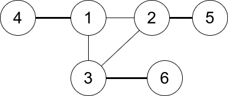
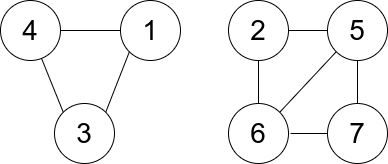

<font size="5">[返回目录](../../目录.md)</font>
<font size="5">[返回算法笔记](../../算法.md/##3.图)</font>
____
# 1. 图
## 1761. 一个图中连通三元组的最小度数([原题](https://leetcode.cn/problems/minimum-degree-of-a-connected-trio-in-a-graph/description/))

给你一个无向图，整数 `n` 表示图中节点的数目，`edges` 数组表示图中的边，其中 `edges[i] = [ui, vi]` ，表示 `ui` 和 `vi` 之间有一条无向边。

一个 连通三元组 指的是 三个 节点组成的集合且这三个点之间 两两 有边。

连通三元组的度数 是所有满足此条件的边的数目：一个顶点在这个三元组内，而另一个顶点不在这个三元组内。

请你返回所有连通三元组中度数的 最小值 ，如果图中没有连通三元组，那么返回 `-1` 。

 

    示例 1：


    输入：n = 6, edges = [[1,2],[1,3],[3,2],[4,1],[5,2],[3,6]]
    输出：3
    解释：只有一个三元组 [1,2,3] 。构成度数的边在上图中已被加粗。

>

    示例 2：


    输入：n = 7, edges = [[1,3],[4,1],[4,3],[2,5],[5,6],[6,7],[7,5],[2,6]]
    输出：0
    解释：有 3 个三元组：
    1) [1,4,3]，度数为 0 。
    2) [2,5,6]，度数为 2 。
    3) [5,6,7]，度数为 2 。

提示：

* `2 <= n <= 400`
* `edges[i].length == 2`
* `1 <= edges.length <= n * (n-1) / 2`
* `1 <= ui, vi <= n`
* `ui != vi`
* `图中没有重复的边。`

### 分析:
明显的图论题，对节点相关的题通常需要将图转换为字典。且据题意可得连通三元组中度数为`三个节点所连接的节点总数-6(三节点互相连接)`

### 本人解法：
主打一个大力出奇迹
```python
class Solution:
    def minTrioDegree(self, n: int, edges: List[List[int]]) -> int:
        
        def adds(a,i,j):
            if i not in a :
                a[i] = set()
            a[i].add(j)
            return a

        a = {}
        b = {}
        for i,j in edges:
            a = adds(a,i,j)
            a = adds(a,j,i)
        for i in a :
            b[i] = len(a[i])

        
        @cache
        def find(i,j):
            if j in a[i]:
                return True 
            return False

        ans = -1

        for i in range(1,n+1):
            if i not in a :
                continue 
            if len(a[i]) > 1 :
                for j in a[i]:
                    if j > i:
                        for t in a[i]:
                            if t > j:
                                if find(j,t):
                                    if ans == -1 :
                                        ans = b[i]+b[j]+b[t]-6
                                    else:
                                        ans = min(ans,b[i]+b[j]+b[t]-6)
                                    if ans == 0 :
                                        return 0 
        return ans 
```

### 他人解法:
同样也是暴力，但是写的就是简洁的多
```python
def minTrioDegree(self, n, edges):
    """
    :type n: int
    :type edges: List[List[int]]
    :rtype: int
    """
    indegrees = collections.defaultdict(lambda: set())
    res = float("inf")
    for u, v in edges:
        indegrees[u].add(v)
        indegrees[v].add(u)
    for i in range(1, n + 1):
        for j in range(i + 1, n + 1):
            for k in range(j + 1, n + 1):
                if j in indegrees[i] and k in indegrees[i] and k in indegrees[j]: 
                    d = len(indegrees[i]) + len(indegrees[j]) + len(indegrees[k]) - 6
                    res = min(res, d)
    return res if res != float("inf") else -1

作者：东主楼守夜人
链接：https://leetcode.cn/problems/minimum-degree-of-a-connected-trio-in-a-graph/
来源：力扣（LeetCode）
著作权归作者所有。商业转载请联系作者获得授权，非商业转载请注明出处。
```


# 2.深度优先遍历 


# 3.广度优先遍历
## 207. 课程表([原题](https://leetcode.cn/problems/course-schedule/?envType=daily-question&envId=2023-09-09))

中等

你这个学期必须选修 numCourses 门课程，记为 0 到 numCourses - 1 。

在选修某些课程之前需要一些先修课程。 先修课程按数组 prerequisites 给出，其中 prerequisites[i] = [ai, bi] ，表示如果要学习课程 ai 则 必须 先学习课程  bi 。

例如，先修课程对 [0, 1] 表示：想要学习课程 0 ，你需要先完成课程 1 。
请你判断是否可能完成所有课程的学习？如果可以，返回 true ；否则，返回 false 。

 

    示例 1：

    输入：numCourses = 2, prerequisites = [[1,0]]
    输出：true
    解释：总共有 2 门课程。学习课程 1 之前，你需要完成课程 0 。这是可能的。
>
    示例 2：

    输入：numCourses = 2, prerequisites = [[1,0],[0,1]]
    输出：false
    解释：总共有 2 门课程。学习课程 1 之前，你需要先完成​课程 0 ；并且学习课程 0 之前，你还应先完成课程 1 。这是不可能的。
 

提示：

- `1 <= numCourses <= 2000`
- `0 <= prerequisites.length <= 5000`
- `prerequisites[i].length == 2`
- `0 <= ai, bi < numCourses`
- `prerequisites[i] 中的所有课程对 互不相同`

### 本人解法

### 他人解法
```python
from collections import deque

class Solution:
    def canFinish(self, numCourses: int, prerequisites: List[List[int]]) -> bool:
        indegrees = [0 for _ in range(numCourses)]
        adjacency = [[] for _ in range(numCourses)]
        queue = deque()
        # Get the indegree and adjacency of every course.
        for cur, pre in prerequisites:
            indegrees[cur] += 1
            adjacency[pre].append(cur)
        # Get all the courses with the indegree of 0.
        for i in range(len(indegrees)):
            if not indegrees[i]: queue.append(i)
        # BFS TopSort.
        while queue:
            pre = queue.popleft()
            numCourses -= 1
            for cur in adjacency[pre]:
                indegrees[cur] -= 1
                if not indegrees[cur]: queue.append(cur)
        return not numCourses

```
#### 分析：
1. 获取每个点的入度，并且将前置课程保存至另一个列表adjacency便于后续操作
2. 初始化队列，对每个点的入度进行判断，如何为0则表示不存在前置课程，所以可以直接进行输出
3. 进入循环，每一次均删除队列中的一个节点，然后将其所有的后置课程的入度均减一，当后置课程的入度等于0时，可以进行学习，将其加入队列。并且每一次删除后均将numCourses(课程总数)-1。
4. 循环结束后，对numCourses进行判断如果不为零，则表示还有节点无法删去，反之则是学习完毕。

可以使用后置题[课程表II ](https://leetcode.cn/problems/course-schedule-ii/description)进行练习