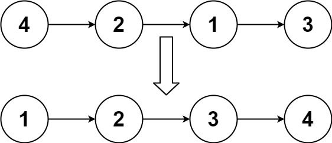
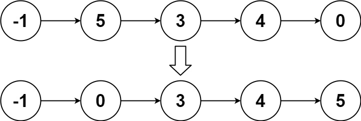

<font size="5">[返回目录](../../目录.md)</font>
<font size="5">[返回算法笔记](../../算法.md/##2.链表)</font>
____

# 链表排序
## 148. 排序链表([原题](https://leetcode.cn/problems/sort-list/))
中等

给你链表的头结点 head ，请将其按 升序 排列并返回 排序后的链表 。

 
>   示例 1：
    
    输入：head = [4,2,1,3]
    输出：[1,2,3,4]

    

>    示例 2：
    
    输入：head = [-1,5,3,4,0]
    输出：[-1,0,3,4,5]

>   示例 3：
    输入：head = []
    输出：[]
 

提示：

- `链表中节点的数目在范围 [0, 5 * 104] 内`
* `-10^5 <= Node.val <= 10^5`
 

进阶：你可以在 O(n log n) 时间复杂度和常数级空间复杂度下，对链表进行排序吗？

本人解法：
```python
# Definition for singly-linked list.
# class ListNode:
#     def __init__(self, val=0, next=None):
#         self.val = val
#         self.next = next
class Solution:
    def sortList(self, head: Optional[ListNode]) -> Optional[ListNode]:

        # 选择排序
        # cur = head
        # while cur:
        #     p = cur
        #     mins = cur
        #     while p :
        #         if mins.val > p.val :mins = p
        #         p = p.next 
        #     cur.val,mins.val =mins.val, cur.val
        #     cur = cur.next
        # return head

        #冒泡排序
        # if not head :
        #     return head
        # flag = True 
        # while flag:
        #     flag = False
        #     p = head
        #     pre = p
        #     p = p.next 
        #     while p :
        #         if p.val < pre.val :
        #             pre.val,p.val = p.val,pre.val
        #             flag = True
        #         pre = p 
        #         p = p.next
        # return head

        #o(n).
        t = []
        q = head 
        while q :
            t.append(q.val)
            q = q.next
        t.sort()

        e  = 0 
        q = head 
        while q  :
            q.val = t[e]
            q = q.next 
            e+=1 
        return head
            
```
原本想试试O(1)能不能解的，发现都会超时，索性就直接暴力了
1. 先把链表q的值复制到列表t中
2. 将t排序
3. 把t中的值重新通过一次链表的遍历赋值给链表


很神奇，明明是O(n),但是好像内存用的比二分的o(1)还少

### 他人解法
#### 快排
```python
# Definition for singly-linked list.
# class ListNode:
#     def __init__(self, x):
#         self.val = x
#         self.next = None

class Solution:
    def sortList(self, head: ListNode) -> ListNode:
        if head is None:
            return head

        # 分成三个链表，分别是比轴心数小，相等，大的数组成的链表
        big = None
        small = None
        equal = None
        cur = head
        while cur is not None:
            t = cur
            cur = cur.next
            if t.val < head.val:
                t.next = small
                small = t
            elif t.val > head.val:
                t.next = big
                big = t
            else:
                t.next = equal
                equal = t
        
        # 拆完各自排序即可，equal 无需排序
        big = self.sortList(big)
        small = self.sortList(small)

        ret = ListNode(None)
        cur = ret

        # 将三个链表组合成一起，这一步复杂度是 o(n)
        # 可以同时返回链表的头指针和尾指针加速链表的合并。
        for p in [small, equal, big]:
            while p is not None:
                cur.next = p
                p = p.next
                cur = cur.next
                cur.next = None
        return ret.next
            

作者：小白二号
链接：https://leetcode.cn/problems/sort-list/solutions/289139/python-by-scut_dell/
来源：力扣（LeetCode）
著作权归作者所有。商业转载请联系作者获得授权，非商业转载请注明出处。
```
#### 归并排序
```python
class Solution:
    def sortList(self, head: ListNode) -> ListNode:
        if not head or not head.next: return head # termination.
        # cut the LinkedList at the mid index.
        slow, fast = head, head.next
        while fast and fast.next:
            fast, slow = fast.next.next, slow.next
        mid, slow.next = slow.next, None # save and cut.
        # recursive for cutting.
        left, right = self.sortList(head), self.sortList(mid)
        # merge `left` and `right` linked list and return it.
        h = res = ListNode(0)
        while left and right:
            if left.val < right.val: h.next, left = left, left.next
            else: h.next, right = right, right.next
            h = h.next
        h.next = left if left else right
        return res.next

作者：Krahets
链接：https://leetcode.cn/problems/sort-list/solutions/13728/sort-list-gui-bing-pai-xu-lian-biao-by-jyd/
来源：力扣（LeetCode）
著作权归作者所有。商业转载请联系作者获得授权，非商业转载请注明出处。
```
