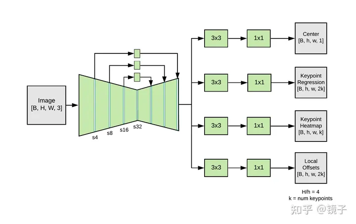

https://zhuanlan.zhihu.com/p/569457464?utm_id=0
使用MoveNet模型

bottom-up的模型 (通常使用于多对象姿态估计)

backbone

使用残差连接来获取浅层特征

Neck
使用FPN进行目标检测 ，进行不同只读的特征学习和融合

Head

有四个预测头：
- Center Heatmap[B, 1, H, W]：预测每个人的几何中心，主要用于存在性检测，用Heatmap上一个锚点来代替目标检测的bbox
- Keypoint Regression[B, 2K, H, W]：基于中心点来回归17个关节点坐标值
- Keypoint Heatmap[B, K, H, W]：每种类型的关键点使用一张Heatmap进行检测，这意味着多人场景下这张Heatmap中会出现多个高斯核
- Offset Regression[B, 2K, H, W]：回归Keypoint Heatmap中各高斯核中心跟真实坐标的偏移值，用于消除Heatmap方法的量化误差，这在UDP中也有用到

后处理
1. Center Heatmap ： 获取所有人体的Gaussian Center
2. 以距离画面中心最近的人作为识别主体（如何确认，反距离加权）
简单来说，对于画面中的每一个像素，我们都可以预先计算好一张权重Mask，每一个像素上的权重等于这个像素到画面中心的集合距离的倒数（严格来说是负幂）。
3. 对获取的Center Heatmap的Keypoint Heatmap即为人体的关键点坐标
4. 同样使用反距离加权来确认主体
5. 通过Offset Regression分支来预测Heatmap到GT点的偏移，从而消除量化误差。

