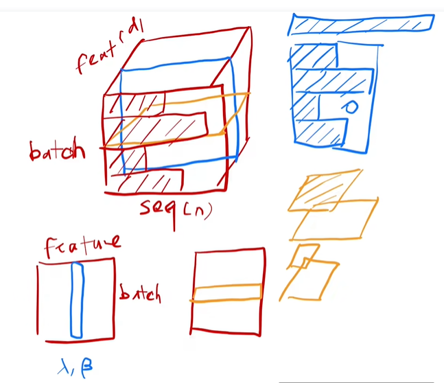
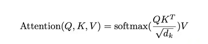
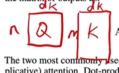
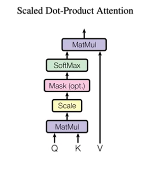
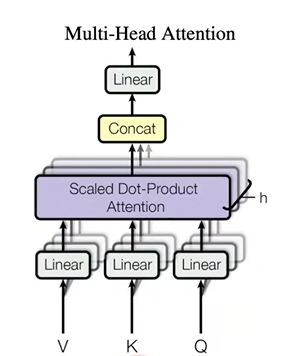

看李沐的视频进行入门[Transformer论文逐段精读【论文精读】](https://www.bilibili.com/video/BV1pu411o7BE/?spm_id_from=333.337.search-card.all.click&vd_source=3b0e33a626cf5e45835cac5d91093908)

编码器一次性看到全局进行输出，解码器一个一个的输出，并且之前的输出同样会作为后一状态的输入（自回归)
编码部分：

为什么使用layernorm而不是 batchNorm：

简单理解，batchNOrm是竖着切，受样本长度影响大，如果样本长度不均匀，同时也会影响到全局方差以及平均值，而layernorm是横着切，局部的方差以及平均值仅是单样本的，受样本长度影响小。

解码部分：
受注意力机制影响，使用一个带掩码的注意力机制，以防止“看到”当前状态以后的值

注意力机制：
以词间余弦相似度作为初始的键值。

scaled dot-product attention
1. query和key等长 == dk
2. value == dv   输出 == dv
3. 每一个query和key做内积，以作为相似度，越大相似度越高
4. 除以根号dk 
5. 以softmax来得到权重
   
6. 将权重作用与value上以得到正式输出
   
优化：
query作为矩阵，

通过矩阵乘法来是实现query与key的内积

当dk较大时，会导致梯度没法下降

加入mask以防止训练中预测时将当前状态及其之后的状态作为输入
-> 将对应位置及其之后位置的值更改为一个极大的负数，在经过softmax后便会趋向于0

多头注意力
