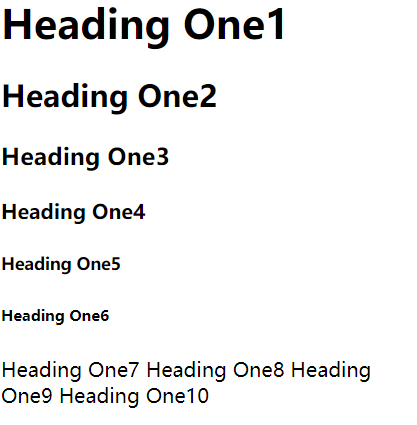
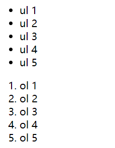
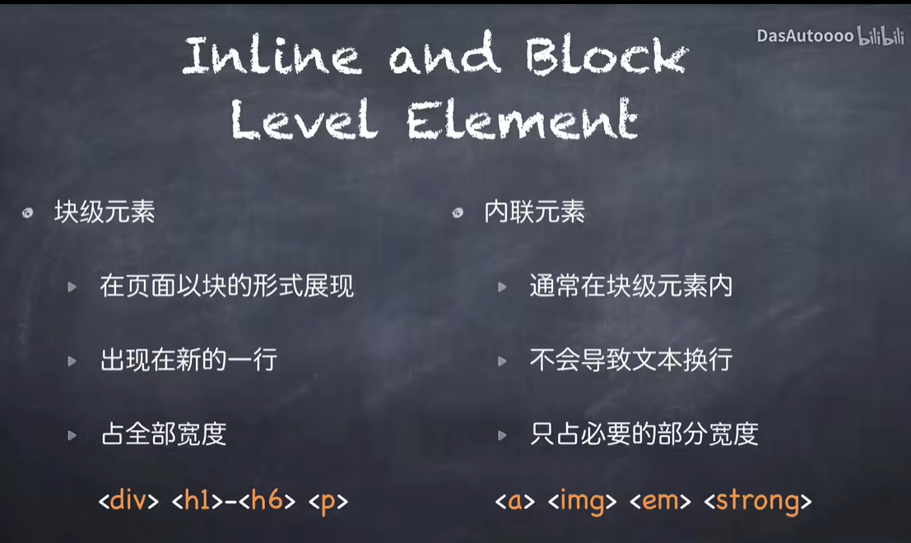

# [笔记目录](目录.md)

基础的html文件的构成
```html
<!DOCTYPE html>   # 解释代码的类型
<html> # 开头
    <head> # 页面的标题部分
        <titile> This is a page titile</title1> # 标题
        
    </head>
    <body> # 页面主体部分
        <h1>This is a heading</h1>
        <p>This is a paragraph</p>
        <p>This is a paragraph</p>
    </body>
</html>d
```
+ `<titile>` 标题  
- `<h n>` 正文部分,n为1~6 之间的整数，超过6会导致失效

- `<p>` 正文部分 ,无特殊效果

- `<ul>` 无序列表, 会自动在行前加冒号 
- `<ol>`有序列表,会自动在行前加数字
- `<li>` `<ul>`与`<ol>`下的行标签，当缺少`<ul>`或者`<ol>`时，默认使用`<ul>`的形式进行修饰






奇怪的函数：
lorem`n` : 生成n个词