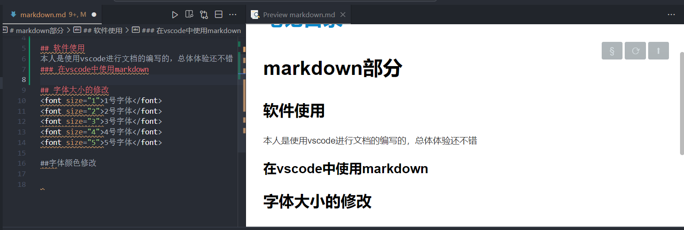
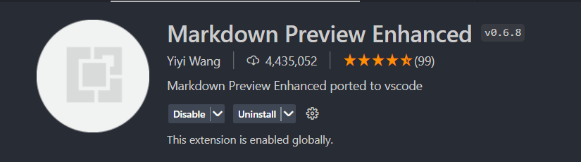
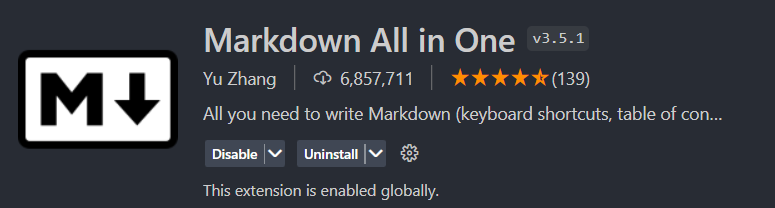
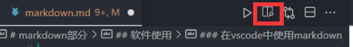
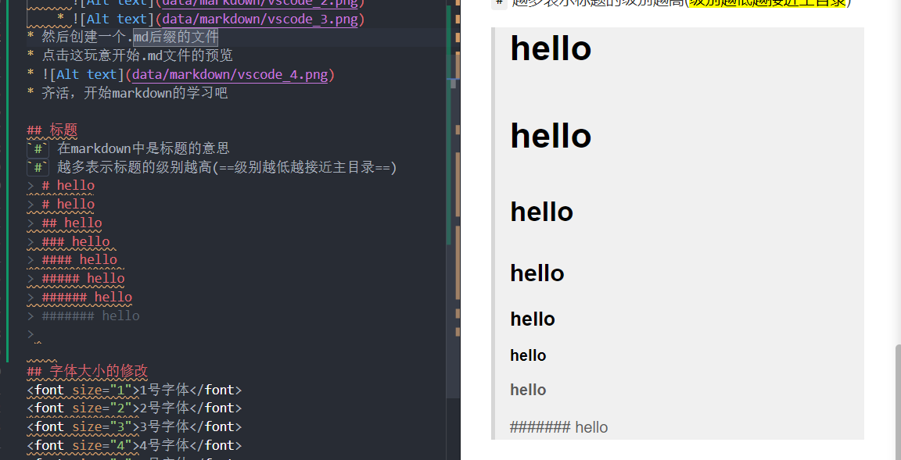

# [笔记目录](目录.md)

# markdown部分
____
## 软件使用
本人是使用vscode进行文档的编写的，总体体验还不错
### 在vscode中使用markdown

* 首先下载vscode中的扩展
    * 
    * 
* 然后创建一个.md后缀的文件
* 点击这玩意开始.md文件的预览
* 
* 齐活，开始markdown的学习吧
___
## 标题
`#` 在markdown中是标题的意思
`#` 越多表示标题的级别越高(==级别越低越接近主目录==)

建议自己试试，多试试就懂了
> 注意`#`后需要填入一个空格才能使得`#`生效
> 
____

## 字体大小的修改
<font size="1">1号字体</font>
<font size="2">2号字体</font>
<font size="3">3号字体</font>
<font size="4">4号字体</font>
<font size="5">5号字体</font>

___

## 字体颜色修改

____
## 缩进
&nbsp;使用`&nbsp;`，可以缩进约1/4个汉字的大小
&ensp; 使用`&ensp;`，可以缩进约1/2个汉字的大小
&emsp; 使用`&emsp;`，可以缩进约1个汉字的大小
汉
_____
## 分隔
&emsp;使用`___`就可以产生以下效果
_____
当然多输一点效果也是一样的，不管是`_____________`还是`__________________________________________`都只会产生和上面一样的分隔线

____
## 表格
### 代码样式
```markdown
|  参数名   | 参数类型 | 
| :-------: | :------: | 
| a________ |   int    | 
```
### 展示情况
|  参数名   | 参数类型 | 
| :-------: | :------: |  
| a________        |   int    | 

&emsp;&emsp;表格的核心在于`| :------: | `,`| :------: | `的个数决定了表格的最大长度。`| :------: | `之上一行为标题，以`|`作为单元格间的分界线

_____

### 实现单元格的合并
&emsp; &emsp; markdown本身并不支持这样的操作，但是markdown支持HTML语言，而HTML可以实现这样的操作
```  html
<table>
    <tr>
        <td>第一列</td> 
        <td>第二列</td> 
   </tr>
    <tr>
        <td rowspan="2">这里是合并列</td>    
        <td >行二列二</td>  
    </tr>
    <tr>
        <td >行三列二</td>  
    </tr>
</table>
```
<table>
    <tr>
        <td>第一列</td> 
        <td>第二列</td> 
   </tr>
    <tr>
        <td rowspan="2">这里是合并列</td>    
        <td >行二列二</td>  
    </tr>
    <tr>
        <td >行三列二</td>  
    </tr>
</table>

&emsp; &emsp; 当然列的合并便可以实现标题的功能了

```  html
<table>
    <tr  align = "center">
        <td colspan="2">这里是合并列</td> 
   </tr>
    <tr>
        <td >行二列一</td>    
        <td >行二列二</td>  
    </tr>
    <tr>
        <td >行三列一</td>  
        <td >行三列二</td>  
    </tr>
</table>
```
<table>
    <tr  align = "center">
        <td colspan="2">这里是合并列</td> 
   </tr>
    <tr>
        <td >行二列一</td>    
        <td >行二列二</td>  
    </tr>
    <tr>
        <td >行三列一</td>  
        <td >行三列二</td>  
    </tr>
</table>


&emsp; &emsp; 记得加上`align`,`align`可以实现文本的`靠右`，`靠左`，`居中`,三种模式的切换。~~怎么变成Html学习笔记了~~
____