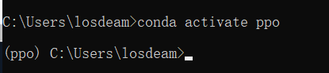

# [笔记目录](目录.md)
# python部分


## 1. ai基础

### 1.1 conda的使用

#### 1.1.1 环境创建 
*  `conda create  -n 环境名 python=版本号`
*  `conda create  --name 环境名 python=版本号`

#### 1.1.2 激活
* `activate 环境名`
  


#### 1.1.3 查看本机中存在的虚拟环境
* `conda info --envs`
* `conda env list`
  
#### 1.1.4 查看当前虚拟环境下已经安装的包
* `conda list`

#### 1.1.5 更改下载源
##### 1.1.5.1 命令行操作
```python
conda config --add channels https://mirrors.tuna.tsinghua.edu.cn/anaconda/pkgs/free/
conda config --add channels https://mirrors.tuna.tsinghua.edu.cn/anaconda/cloud/conda-forge 
conda config --add channels https://mirrors.tuna.tsinghua.edu.cn/anaconda/cloud/msys2/
conda config --set show_channel_urls yes
```
##### 1.1.5.2 寻找本地文件进行修改
1.找到 .condarc文件，并以文本的形式打开(**C:\Users\(你的用户名)\.condarc**)


2.将一下内容覆盖到该文件中
``` python
show_channel_urls: true
ssl_verify: true
channels:
  - https://mirrors.tuna.tsinghua.edu.cn/anaconda/cloud/msys2/
  - https://mirrors.tuna.tsinghua.edu.cn/anaconda/cloud/conda-forge
  - https://mirrors.tuna.tsinghua.edu.cn/anaconda/pkgs/free/
  - defaults
```
[原作者链接点击此处](https://blog.csdn.net/qq_43198568/article/details/105626024)

注： 有时会出现这样的错误，可以使用 `conda config --remove-key channels` 来进行下载源的初始化


#### 1.1.6 删除虚拟环境
*`conda remove -n env_name -all`  删除env_name环境及其所有的包


## 2. pip
### 2.1 更换下载源
[手把手教你进行pip换源，让你的Python库下载嗖嗖的](https://blog.csdn.net/pdcfighting/article/details/104912316?ops_request_misc=%257B%2522request%255Fid%2522%253A%2522169577760416800197074669%2522%252C%2522scm%2522%253A%252220140713.130102334..%2522%257D&request_id=169577760416800197074669&biz_id=0&utm_medium=distribute.pc_search_result.none-task-blog-2~all~sobaiduend~default-1-104912316-null-null.142^v94^insert_down1&utm_term=pip%E6%9B%B4%E6%8D%A2%E6%BA%90&spm=1018.2226.3001.4187)
