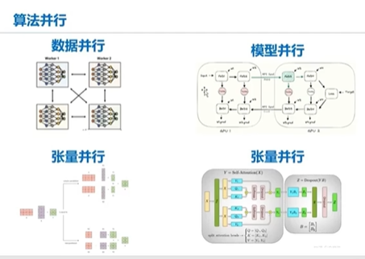
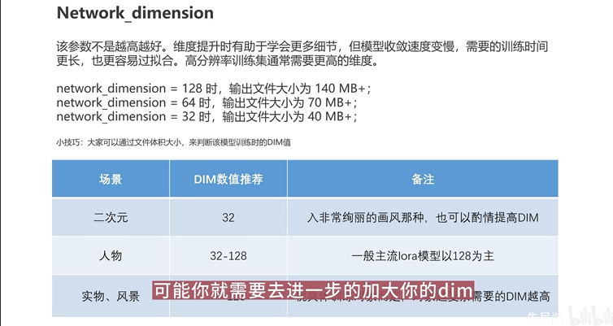
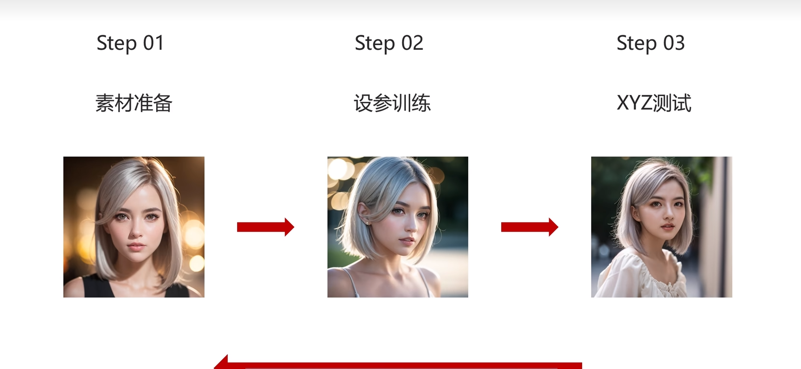
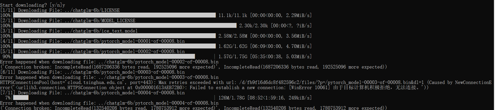
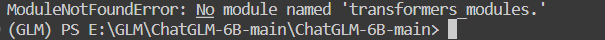
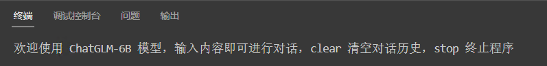
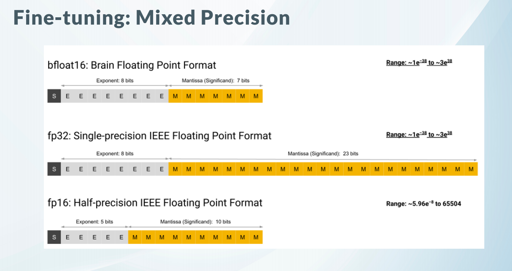
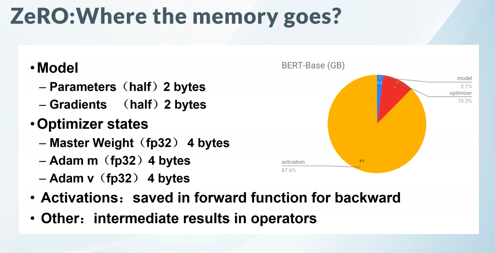
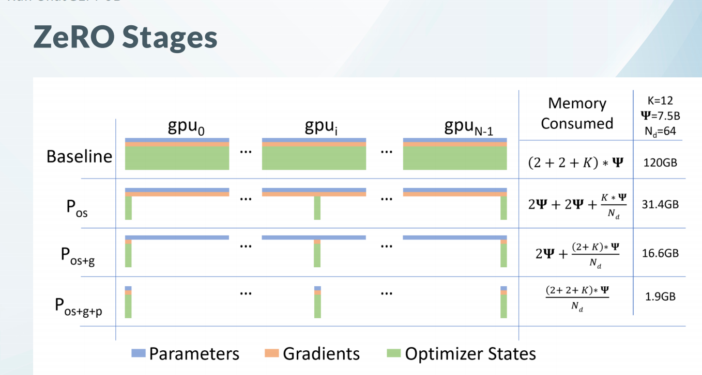

# [笔记目录](目录.md)
# 大模型部分
____
# 1.基础知识
## 1.1 幂律 
模型最终的效果受模型大小，数据集大小和训练强度的影响。但存在上限，当达到一定程度上时，三者的增强并不会影响模型的能力

    参数量决定了理论效果，样本量与训练强度决定了实际效果
## 1.2 分词
分词粒度：
1. **单词分词法**: `英文(空格分词)`,`中文(jieba分词 or 分字)`
2. **单字分词法**: `英文(字母)`,`中文(分字)`
3. **子词分词法**(大模型常用): `BPE` , `WordPiece` ,`Unigram`
子词: 经常出现的词

## 1.3 并行

## 1.4 模型压缩和加速
1. 剪枝
2. 低秩分解
3. 知识蒸馏
4. 量化(大模型常用)

## 1.4.1 量化
* **量化** ： 将浮点数转化为整型(通过格式转换来压缩数据)
* **反量化** ： 将整型转化为浮点数(以使得格式能与模型匹配)
### 1.4.1.1 量化方法
1. 不管误差直接进行量化(常用)
2. 以小样数据微调量化完的模型
3. 训练过程中直接开始量化

___
# 2.微调
## 2.1 方法
### 2.1.1 Prefix-Tuning/Prompt-Tuning
在模型的输入或隐层添加k个额外可训练的前缀tokens(这些前缀是连续的伪tokens，不对应真实的tokens),只训练这些前缀参数

### 2.1.2 Adapter-Tuning 
将较小的神经网络层或模块插入预训练模型的每一层，这些新插入的神经模块称为`adapter`(适配器),下游任务微调时也只训练这些适配器参数

### 2.1.3 LoRA:
通过学习小参数的低秩矩阵来近似模型权重矩阵`W`的参数更新，训练时只优化低秩矩阵参数

# 3.LoRA调参实战
跟随B站视频[[全网最细lora模型训练教程]这时长？你没看错。还教不会的话，我只能说，师弟/妹，仙缘已了，你下山去吧！](https://www.bilibili.com/video/BV1GP411U7fK/?spm_id_from=333.337.search-card.all.click&vd_source=3b0e33a626cf5e45835cac5d91093908)进行学习。~~一搜lora调参全是`stableDiffusion`，果然瑟瑟才是第一生产力。~~
使用stableDiffusion进行学习有个很大的好处就是，可以上手实践，毕竟对硬件要求没那么高的开源大模型可不好找。

LoRA模型:以一定的特征替换底模中的对应元素，向现有的模型插入新的数据处理层，避免了修改原有参数，从而避免将整个模型进行拷贝

1. 注意在样本中需要手动调整标签，ai识别的标签通常效果不好。
2. dim 128
   
   

不是很对劲，stablediffusion的lora模型好像都是封装好的。而且对硬件要求更高。但是用公司的电脑还是能勉强跑跑的
这种有整合包的不确定能不能作为项目经验写到简历中，优先级较低。选择更换ChatGLM-6B 微调来进行实战。stableDiffusion的lora模型将作为附加项进行学习
[【官方教程】ChatGLM-6B 微调：P-Tuning，LoRA，Full parameter](https://www.bilibili.com/video/BV1fd4y1Z7Y5/?spm_id_from=333.788.recommend_more_video.2&vd_source=3b0e33a626cf5e45835cac5d91093908)

1. 前往github下载源代码
2. 前往清华源下载模型文件
3. 由于文件较多推荐了一个一步到位下载的项目
    https://github.com/chenyifanthu/THU-Cloud-Downloader
    * 在`THU-Cloud-Downloader`路径下执行
    `python main.py --link https://cloud.tsinghua.edu.cn/d/fb9f16d6dc8f482596c2/  --save ../chatglm-6b/`开始模型文件的下载
    
    
    
    不知道是不是我的问题，连接一直中断，还是别瞎搞了，自己一个个下吧

由于新项目，建议创建一个新的conda环境
`conda create -n GLM python=3.9`

   由于模型文件较大，需要下载时间较长，决定同步进行环境的配置

4. 模型下载完毕，进行测试
在测试过程中出现readline库的缺失，并且无法使用pip直接进行安装。(windows环境下无法正常安装该包)
使用`python -m pip install pyreadline`即可完成安装
出现"OSError: ../model does not appear to have a file named config.json. Checkout 'https://huggingface.co/../model/None' for available files."

根据资料有可能是transformers版本的问题，可以奇怪的是transformers是requirements.txt中指定的版本。不管了重装以一次试试

成功了，估摸着是下载的代码的版本有冲突。
5. 模型调整开始

通过并行的方式降低训练的显存，

0:35:0开始训练参数的讲解
