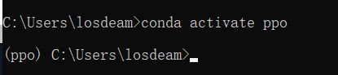
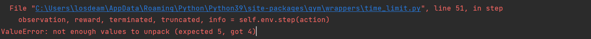
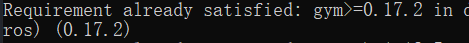

# [笔记目录](目录.md)

## 强化学习部分
跟随天池上的教程 https://tianchi.aliyun.com/course/313/3561，进行基础的入门

### 1.ppo算法(超级玛丽实战)
&emsp;&emsp;`PPO`算法是强化学习中最为常用的算法
#### 1.1 环境构建

#### 1.1.1 使用conda构建一个新的虚拟环境


#### 1.1.2 安装所需的环境
`pip install gym gym_super_mario_bros opencv-python spinup joblib --user`

#### 1.1.3 克隆(抄)教程中的代码
代码内容在`data`文件夹下的`ppo.ipynb`文件中。
在学习过程中发现一个非常严肃的问题，教程的gym版本好像太低了，很多东西都对不上
##### 1.1.3.1 问题
1. env 中的 step 的返回值与所需的不同

> 经过查询后发现，gym已经经历了多次的版本升级。简称，这个问题很复杂。选择性放弃。先不复现了，学了先。
* 解决 ：根据`gym_super_mario_bros`所需的最低gym对gym进行重装，以求得能够复现教程的实例。
  

2. windows环境下无法使用
```python
from gym import wrappers
env = wrappers.Monitor(env,"./gym-results", force=True)
```
函数本身的作用是对训练过程进行录像，由于env.step()的返回值state中保存的就是当前的图像信息，所有我们完全可以通过自己编写显示函数来显示训练的过程
```python
import cv2  
def game_show(state):
# state为传入的图像信息，通常保存在env.step的第一个返回值中
    cv2.imshow("game",state)
    cv2.waitKey(1)
```
在data中的`ppo.ipynb `已经实现了代码的复现。但是由于工作上对于torch以及深度学习其他方面的需要，强化学习的进度暂缓