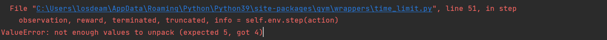

# [笔记目录](目录.md)

## 强化学习部分
跟随天池上的教程 https://tianchi.aliyun.com/course/313/3561，进行基础的入门

### 1.ppo算法(超级玛丽实战)
&emsp;&emsp;`PPO`算法是强化学习中最为常用的算法
#### 1.1 环境构建

#### 1.1.1 使用conda构建一个新的虚拟环境

#### 1.1.2 安装所需的环境
`pip install gym gym_super_mario_bros opencv-python spinup joblib --user`

#### 1.1.3 克隆(抄)教程中的代码
代码内容在`data`文件夹下的`ppo.ipynb`文件中。
在学习过程中发现一个非常严肃的问题，教程的gym版本好像太低了，很多东西都对不上
##### 1.1.4问题
1. even

