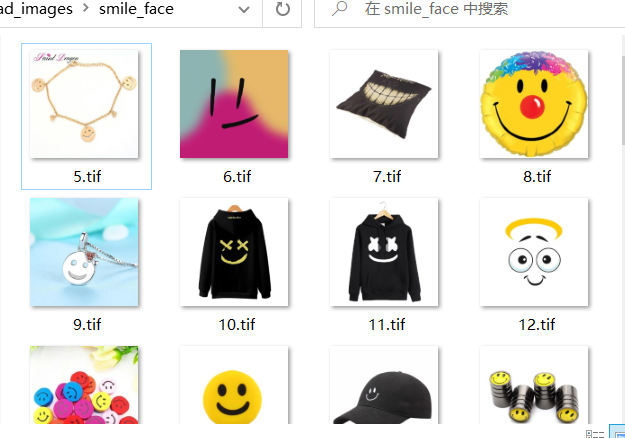

# [笔记目录](目录.md)
# 数据清洗部分
通常情况下，我们爬取到的数据总是很"脏"。也许是不符合我们的要求，也许是格式不统一，也许是命名混乱。为了让后续的处理更为方便，所以需要数据先进行清洗
## 1.数据整理
### 1.1 将图片文件格式统一
```python
import os
import cv2

def listfiles(rootDir,mode,start=1):
    if mode not in (0,1,2):
        return "模式有误"
    mods = {0: ".jpg",1:".png",2:".tif"}
    mod = mods[mode]
    
    list_dirs = os.walk(rootDir)  #嵌套的访问文件夹下的所有文件
    n = start 
    for root, dirs, files in list_dirs:  # 遍历文件夹下的图片
        for d in dirs:
            print((os.path.join(root, d)))
        for f in files:
            fileid = n  # 获得图片的名字，不含后缀
            filepath = os.path.join(root, f) 
            try:
                src = cv2.imread(filepath, 1)  # 读取原始图片，数据会加载到内存中
                print("src=", filepath, src.shape)
                os.remove(filepath) # 移除原来的图片
                cv2.imwrite(os.path.join(root, str(fileid) + mod), src)  # 保存经过格式转换的图片
            except:
                os.remove(filepath)
                continue
            n+=1 

path = "D:\spider\Image-Downloader-master\Image-Downloader-master\download_images\smile_face"  # 输入图片路径即可，可以在这个文件夹下放置各种后缀名的图片，代码会将所有图片统一成 jpg 格式
mode = {0: ".jpg",1:".png",2:".tif"}
listfiles(path,1,5)
```


### 1.2  人脸检测(未检测到人脸就删除)
```python
import  mediapipe as mp
import  cv2
import os 

mpFace = mp.solutions.face_detection
faceDetection = mpFace.FaceDetection(min_detection_confidence=0.8)

img_path = "D:\spider\Image-Downloader-master\download_images\esr" # 测试图片路径
images = os.listdir(img_path)   
for image in images:
    im = cv2.imread(os.path.join(img_path, image), 1) # 读取图片
    rects = faceDetection.process(im)  # 人脸检测函数
    rects = rects.detections
    if rects:
        print("检测到人脸的数量", len(rects))
    else:
        print("未检测到人脸")
        os.remove(os.path.join(img_path, image)) # 
cv2.destroyAllWindows()   
```
教程中原本使用的是`dlib`库，但是由于`dlib`库的识别精度不高，故更改为相同效果且识别精度更高的`mediapipe`。

### 1.3  图像去重
```python
img_list = set()
list_dirs = os.walk(path)  #嵌套的访问文件夹下的所有文件

for root, dirs, files in list_dirs:  # 遍历文件夹下的图片
    for dir in files :
        img_path = os.path.join(root, dir)
        
        #获取当前图片的md5值
        hash = md5()
        img = open(img_path, 'rb')
        hash.update(img.read())
        img.close()
        
        # 如果当前md5值已经存在，则需要删去
        if hash.hexdigest() in img_list:
            os.remove(img_path)
        else:
            img_list.add(hash.hexdigest())
```
[原文在此](https://blog.csdn.net/qq_45057749/article/details/91129088?ops_request_misc=%257B%2522request%255Fid%2522%253A%2522169337502416800215068240%2522%252C%2522scm%2522%253A%252220140713.130102334..%2522%257D&request_id=169337502416800215068240&biz_id=0&utm_medium=distribute.pc_search_result.none-task-blog-2~all~top_positive~default-1-91129088-null-null.142^v93^chatsearchT3_1&utm_term=%E5%9B%BE%E7%89%87%E5%8E%BB%E9%87%8D&spm=1018.2226.3001.4187)，本人对代码进行了一定程度的简化以及性能优化。当然此方法只支持完全相同的图片的去重，而对相似图片则不会进行操作。

____
[返回目录](目录.md)
[返回深度学习部分](深度学习.md/#返回坐标)

