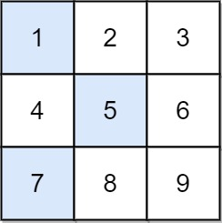

# [笔记目录](目录.md)
# 算法部分

## 1.滑动窗口
&emsp; 当需要保持一个经常发生变动的数组/子串时，并对所给数据中的部分按要求进行截取时可以采用滑动窗口的形式
___
### 1.1 例题
#### 76. 最小覆盖子串([原题](https://leetcode.cn/problems/minimum-window-substring/))

困难

给你一个字符串 s 、一个字符串 t 。返回 s 中涵盖 t 所有字符的最小子串。如果 s 中不存在涵盖 t 所有字符的子串，则返回空字符串 "" 。

 

注意：
* 对于 t 中重复字符，我们寻找的子字符串中该字符数量必须不少于 t 中该字符数量。
  
* 如果 s 中存在这样的子串，我们保证它是唯一的答案。
 

>示例 1：
>输入：s = "ADOBECODEBANC", t = "ABC"
>输出："BANC"
>解释：最小覆盖子串 "BANC" 包含来自字符串 t 的 'A'、'B' 和 'C'。


>示例 2：
>输入：s = "a", t = "a"
>输出："a"
>解释：整个字符串 s 是最小覆盖子串。

>示例 3:
>输入: s = "a", t = "aa"
>输出: ""
>解释: t 中两个字符 'a' 均应包含在 s 的子串中，
>因此没有符合条件的子字符串，返回空字符串。
 

提示：

* m == s.length
* n == t.length
* 1 <= m, n <= 105
* s 和 t 由英文字母组成
 

进阶：你能设计一个在 o(m+n) 时间内解决此问题的算法吗？

##### 本人解法：
######   首次提交
```python
class Solution:
    def minWindow(self, s: str, t: str) -> str:
        a = {}
        b = {}

        for i in t :
            b[i] = b.get(i,0) +1 

        def Count(a,b):
            for i in b :
                if a.get(i,0) < b[i]:
                    return True
            return False
            
        n = len(s)
        l,r = 0,0 
        ans = ""
        temp = inf
        while r < n :
            while r < n and Count(a,b):
                a[s[r]] = a.get(s[r],0) +1 
                r+=1 
            while l<r and a.get(s[l],0) > b.get(s[l],-1):
                a[s[l]] =a.get(s[l],0) -1 
                l+=1 
            if r-l < temp and not Count(a,b) :
                temp = r-l 
                ans = s[l:r]
            if r >=n :
                break
            a[s[l]] =a.get(s[l],0) -1 
            l+=1 
        return ans
```
###### 想法
分析题目，要求取字符串中的子串，可以很快的想到要使用滑动窗口。虽然很丑陋，但是还是勉强满足了要求

###### 他人更优解
```
def minWindow(self, s: str, t: str) -> str:
    need=collections.defaultdict(int)
    for c in t:
        need[c]+=1
    needCnt=len(t)
    i=0
    res=(0,float('inf'))
    for j,c in enumerate(s):
        if need[c]>0:
            needCnt-=1
        need[c]-=1
        if needCnt==0:       #步骤一：滑动窗口包含了所有T元素
            while True:      #步骤二：增加i，排除多余元素
                c=s[i] 
                if need[c]==0:
                    break
                need[c]+=1
                i+=1
            if j-i<res[1]-res[0]:   #记录结果
                res=(i,j)
            need[s[i]]+=1  #步骤三：i增加一个位置，寻找新的满足条件滑动窗口
            needCnt+=1
            i+=1
    return '' if res[1]>len(s) else s[res[0]:res[1]+1]    #如果res始终没被更新过，代表无满足条件的结果

作者：Mcdull
链接：https://leetcode.cn/problems/minimum-window-substring/solutions/258513/tong-su-qie-xiang-xi-de-miao-shu-hua-dong-chuang-k/
来源：力扣（LeetCode）
著作权归作者所有。商业转载请联系作者获得授权，非商业转载请注明出处。
```

## 2.链表
____
## 3.图
&emsp;&emsp;当发现题目中构成了相连的多个节点时，即可认为是图这一方向的题目。主要的算法有**深度优先算法**，**广度优先算法**，**剪枝**等
### 3.1 例题
#### 1466. 重新规划路线([原题](https://leetcode.cn/problems/reorder-routes-to-make-all-paths-lead-to-the-city-zero/description/))

中等

n 座城市，从 0 到 n-1 编号，其间共有 n-1 条路线。因此，要想在两座不同城市之间旅行只有唯一一条路线可供选择（路线网形成一颗树）。去年，交通运输部决定重新规划路线，以改变交通拥堵的状况。

路线用 `connections` 表示，其中 `connections[i] = [a, b]` 表示从城市 a 到 b 的一条有向路线。

今年，城市 0 将会举办一场大型比赛，很多游客都想前往城市 0 。

请你帮助重新规划路线方向，使每个城市都可以访问城市 0 。返回需要变更方向的最小路线数。

题目数据保证每个城市在重新规划路线方向后都能到达城市 0 。

 

    示例 1：
    输入：n = 6, connections = [[0,1],[1,3],[2,3],[4,0],[4,5]]
    输出：3
    解释：更改以红色显示的路线的方向，使每个城市都可以到达城市 0 。
>
    示例 2：
    输入：n = 5, connections = [[1,0],[1,2],[3,2],[3,4]]
    输出：2
    解释：更改以红色显示的路线的方向，使每个城市都可以到达城市 0 。

>

    示例 3：
    输入：n = 3, connections = [[1,0],[2,0]]
    输出：0
 

提示：

* 2 <= n <= 5 * 10^4^
* `connections.length` == n-1
* `connections[i].length` == 2
* 0 <= `connections[i][0], connections[i][1]` <= n-1
* `connections[i][0]` != `connections[i][1]`

##### 本人解法
```python
class Solution:
    def minReorder(self, n: int, connections: List[List[int]]) -> int:
        inputs  = {}
        outputs  = {}
        ans = 0 
        for i,j in connections:
            if i not in outputs :
                outputs[i] = [j]
            else:
                outputs[i].append(j)
            if j not in inputs :
                inputs[j] = [i]
            else:
                inputs[j].append(i)
            
        def find(node,pre):
            temp = 0 
            for next in outputs.get(node,[]):
                if next != pre:
                    temp += 1+find(next,node)
            for next in inputs.get(node,[]):
                if next != pre :
                    temp += find(next,node)
            return temp

        if 0 in outputs :
            for i in outputs[0]:
                ans +=1
                if 0 in inputs :
                    inputs[0].append(i)
                else:
                    inputs[0] = [i]

        for i in inputs[0]:
            ans += find(i,0)
        return ans 
        

```
##### 思路
&emsp;&emsp;由题目中的铁路与各个城市相连，可以很清晰的得出本题使用的是图。由于所有的城市均要前往0城市，所以要以0城市为中心进行构图。
1. 由于路线总数有且仅有n-1条，所以不可能存在离开0城市的路线
2. 所有路线均要向着0城市方向移动
3. 所有远离0城市方向的路线均需要被改造

&emsp;&emsp;由以上三个规则可以得出需要构建两张图，一张用于存储入点的路线，一张用于获取出点的路线
&emsp;&emsp;在图构建完成后，从0城市开始向外进行搜索。
1. 先将从0城市远离的路线进行改造，以使得我们的搜索能够起步。
2. 先遍历出点图，若该点存在上一点之外的出点时，那么该出点的路线便是需要改造的。
3. 后遍历入点图，将搜索范围进行放大(同时要防止回到上一点)
____
#### 1926. 迷宫中离入口最近的出口([原题](https://leetcode.cn/problems/nearest-exit-from-entrance-in-maze/description/?envType=study-plan-v2&envId=leetcode-75))

中等

给你一个 `m x n` 的迷宫矩阵 `maze` （下标从 0 开始），矩阵中有空格子（用 '.' 表示）和墙（用 '+' 表示）。同时给你迷宫的入口 entrance ，用 `entrance = [entrancerow, entrancecol]` 表示你一开始所在格子的行和列。

每一步操作，你可以往 上，下，左 或者 右 移动一个格子。你不能进入墙所在的格子，你也不能离开迷宫。你的目标是找到离 entrance 最近 的出口。出口 的含义是 maze 边界 上的 空格子。entrance 格子 不算 出口。

请你返回从 entrance 到最近出口的最短路径的 步数 ，如果不存在这样的路径，请你返回 -1 。

 

    示例 1：

    输入：maze = [["+","+",".","+"],[".",".",".","+"],["+","+","+","."]], entrance = [1,2]
    输出：1
    解释：总共有 3 个出口，分别位于 (1,0)，(0,2) 和 (2,3) 。
    一开始，你在入口格子 (1,2) 处。
    - 你可以往左移动 2 步到达 (1,0) 。
    - 你可以往上移动 1 步到达 (0,2) 。
    从入口处没法到达 (2,3) 。
    所以，最近的出口是 (0,2) ，距离为 1 步。

&emsp;

    示例 2：

    输入：maze = [["+","+","+"],[".",".","."],["+","+","+"]], entrance = [1,0]
    输出：2
    解释：迷宫中只有 1 个出口，在 (1,2) 处。
    (1,0) 不算出口，因为它是入口格子。
    初始时，你在入口与格子 (1,0) 处。
    - 你可以往右移动 2 步到达 (1,2) 处。
    所以，最近的出口为 (1,2) ，距离为 2 步。

&emsp;

    示例 3：


    输入：maze = [[".","+"]], entrance = [0,0]
    输出：-1
    解释：这个迷宫中没有出口。
 

提示：

* `maze.length == m`
* `maze[i].length == n`
* `1 <= m, n <= 100`
* `maze[i][j] 要么是 '.' ，要么是 '+' 。`
* `entrance.length == 2`
* `0 <= entrancerow < m`
* `0 <= entrancecol < n`
* `entrance 一定是空格子。`

##### 本人解法
```python
class Solution:
    def nearestExit(self, maze: List[List[str]], entrance: List[int]) -> int:
        a ={(1,0),(-1,0),(0,1),(0,-1)}
        q = [entrance]
        m,n = len(maze) ,len(maze[0])
        ans  = -1

        while q :
            t = q 
            q = []
            ans +=1 
            for x_,y_ in t :
                maze[x_][y_ ] = "x"
                for x,y in a :
                    if x_-x < 0 or x_ - x >= m or y_-y <0 or y_ -y >= n :
                        if ans != 0 :
                            return ans 
                    elif maze[x_ - x ][y_ - y] == "."   : 
                        q.append([x_ - x , y_ - y])

        return -1   
```

##### 想法
&emsp;&emsp; 本题要求寻找最短路径，可以快速定位到`广度优先搜索`。
* 空间复杂度分析
    1. 由于需要记录最短路径，则需声明一个变量`ans`用于保存当前的路径长度。
    2. 由于行走方向固定只有四种，所有需要声明一个列表来对其进行储存。
    3. 广度优先搜索需要一个列表`q`来储存当前待遍历的`点`
    4. 需要对图的长宽进行记录以防止越界现象的发生
    5. 在遍历过程中需要一个列表`t`来临时储存待搜索点，使得遍历时加入点的操作可以实现。

`出现超出内存限制现象`
##### 分析
&emsp;&emsp;应该是列表`q`,在执行过程中出现了重复加入同一点的情况。将存储方式更改为集合后可以避免这种情况。
##### 第二次提交
```python
class Solution:
    def nearestExit( self,maze, entrance) -> int:
        a ={(1,0),(-1,0),(0,1),(0,-1)}
        q = {tuple(entrance)}
        m,n = len(maze) ,len(maze[0])
        ans  = -1
        while q :
            t = q 
            q = set()
            ans +=1 
            for i in t :
                x_,y_ = i[0],i[1]
                maze[x_  ][y_] = "x"
                for x,y in a :
                    if x_-x < 0 or x_ - x >= m or y_-y <0 or y_ -y >= n :
                        if ans != 0 :
                            return ans 
                    elif maze[x_ - x ][y_ - y] == "."   : 
                        q.add(tuple([x_ - x , y_ - y]))
        return -1 
```
勉强完成


一定有更好的形式可以适用于广度优先搜索情况的下的数据存储。
##### 他人解法
```python
class Solution:
    def nearestExit(self, maze: List[List[str]], entrance: List[int]) -> int:
        Row = len(maze)
        Col = len(maze[0])
        
        Q = collections.deque()
        Q.append(entrance)
        maze[entrance[0]][entrance[1]] = '+'
        step = 0
        while Q:
            step += 1
            for _ in range(len(Q)):
                r, c = Q.popleft()
                
                for nr, nc in [[r-1,c], [r+1,c], [r, c-1], [r,c+1]]:
                    if 0 <= nr < Row and 0 <= nc < Col:
                        if maze[nr][nc] == '.':
                            if nr in (0, Row - 1) or nc in (0, Col - 1):
                                return step
                            maze[nr][nc] = '+'
                            Q.append([nr, nc])
        return -1
```


___
## 4.哈希表
&emsp;&emsp;在python中使用字典可以很快的构建一个哈希表，其本质其实就是通过下标来快速获取对应的值
```python
    dict = {}
```
### 4.1 例题
#### 41. 缺失的第一个正数([原题](https://leetcode.cn/problems/first-missing-positive/?envType=study-plan-v2&envId=top-100-liked))[原地哈希]
提示困难

给你一个未排序的整数数组 nums ，请你找出其中没有出现的最小的正整数。

请你实现时间复杂度为 O(n) 并且只使用常数级别额外空间的解决方案。
 

    示例 1：

    输入：nums = [1,2,0]
    输出：3

>

    示例 2：

    输入：nums = [3,4,-1,1]
    输出：2

>

    示例 3：

    输入：nums = [7,8,9,11,12]
    输出：1
 

提示：

* `1 <= nums.length <= 5 * 105`
* `-231 <= nums[i] <= 231 - 1`
  
##### 本人解法
   完全不熟，决定利用他人题解进行学习

##### 他人解法
```python
from typing import List

class Solution:

    # 3 应该放在索引为 2 的地方
    # 4 应该放在索引为 3 的地方

    def firstMissingPositive(self, nums: List[int]) -> int:
        size = len(nums)
        for i in range(size):
            # 先判断这个数字是不是索引，然后判断这个数字是不是放在了正确的地方
            while 1 <= nums[i] <= size and nums[i] != nums[nums[i] - 1]:
                self.__swap(nums, i, nums[i] - 1)

        for i in range(size):
            if i + 1 != nums[i]:
                return i + 1

        return size + 1

    def __swap(self, nums, index1, index2):
        nums[index1], nums[index2] = nums[index2], nums[index1]

作者：liweiwei1419
链接：https://leetcode.cn/problems/first-missing-positive/
来源：力扣（LeetCode）
著作权归作者所有。商业转载请联系作者获得授权，非商业转载请注明出处。
```
根据题意分析得，所求的值必然在数组的大小范围内。而不在数组长度范围内的所有数值均可忽略。那么可以得出
  1. 通过**遍历**来**将在数组的大小范围内的数值排列到其对应的下标上**，**忽略超出范围的值**
   
此时可能会出现换回来的值依旧在范围内的情况，所以需要
1. 进行一个**while循环**，保证在经过多次交换后，所遍历到的位置上必定为**越界数值**或者**下标与值对应**

在遍历交换完成后，数组中所有范围内的数值均已到了对应下标的位置上。所以，
1. 通过一次遍历获取第一个数值与对应下标不同的值即为所求


____

## 5.堆
&emsp;&emsp; 当需要保持一个经常发生变动的列表的有序性时可以采用堆的形式
________________________________________________

### 5.1 python中的使用
&emsp;&emsp; python中内置了`heapq`来方便我们构建根堆(默认只有小根堆)
#### 常用函数
> * `heappush(heap,n)` # 往堆中添加新值
> * `heapify(list)` #以线性时间将一个列表转化为小根堆
> * `heappop(heap)` # 从堆中弹出并返回最小的值
> * `heapreplace(heap,n)` #先将堆顶的数据出堆，然后将n添加到堆中。
> * `nlargest(num, heap)` #从堆中取出num个数据，从最大的数据开始取，返回结果是一个列表(即使只取一个数据)。如果num大于等于堆中的数据数量，则从大到小取出堆中的所有数据，不会报错。
> * `nsmallest(num, heap)` #从堆中取出num个数据，从最小的数据开始取，返回结果是一个列表。
> * `merge(list1, list2)`，将两个有序的列表合并成一个新的有序列表，返回结果是一个迭代器。


_____________________________________________
### 5.2 例题
#### 23. 合并 K 个升序链表([原题](https://leetcode.cn/problems/merge-k-sorted-lists/description/))
困难
&emsp;给你一个链表数组，每个链表都已经按升序排列。

&emsp;请你将所有链表合并到一个升序链表中，返回合并后的链表。

 

    示例 1：

    输入：lists = [[1,4,5],[1,3,4],[2,6]]
    输出：[1,1,2,3,4,4,5,6]
    解释：链表数组如下：
    [
    1->4->5,
    1->3->4,
    2->6
    ]
    将它们合并到一个有序链表中得到。
    1->1->2->3->4->4->5->6

>
    示例 2：

    输入：lists = []
    输出：[]

>
    示例 3：

    输入：lists = [[]]
    输出：[]
    

提示：

* k == lists.length
* 0 <= k <= 10^4
* 0 <= lists[i].length <= 500
* -10^4 <= lists[i][j] <= 10^4
* lists[i] 按 升序 排列
* lists[i].length 的总和不超过 10^4

题解:
```python
class Solution:
    def mergeKLists(self, lists: List[ListNode]) -> ListNode:
        import heapq
        que = []
        for index, node in enumerate(lists):
                if node!=None:
                    heapq.heappush(que ,(node.val, index))
    
        dummy_node = ListNode(-1)
        cur = dummy_node
        while que:
            val, index =  heapq.heappop(que)
            cur.next = lists[index]
            cur = cur.next
            lists[index] = lists[index].next
            if lists[index] != None:
                heapq.heappush(que, (lists[index].val, index))
        return dummy_node.next

```
_____________________________________________
## 6.动态规划


### 6.1 例题

####  1289. 下降路径最小和 II ([原题](https://leetcode.cn/problems/minimum-falling-path-sum-ii/description/))
提示 困难
给你一个 n x n 整数矩阵 grid ，请你返回 非零偏移下降路径 数字和的最小值。

非零偏移下降路径 定义为：从 grid 数组中的每一行选择一个数字，且按顺序选出来的数字中，相邻数字不在原数组的同一列。

 

示例 1：



输入：grid = `[[1,2,3],[4,5,6],[7,8,9]]`
输出：13
解释：
所有非零偏移下降路径包括：
[1,5,9], [1,5,7], [1,6,7], [1,6,8],
[2,4,8], [2,4,9], [2,6,7], [2,6,8],
[3,4,8], [3,4,9], [3,5,7], [3,5,9]
下降路径中数字和最小的是 [1,5,7] ，所以答案是 13 。
示例 2：

输入：grid = `[[7]]`
输出：7
 

提示：

* n == grid.length == grid[i].length
* 1 <= n <= 200
* -99 <= grid[i][j] <= 99

##### 本人解法：
######   首次提交
```python
class Solution:
    def minFallingPathSum(self, grid: List[List[int]]) -> int:
        n = len(grid)
        a = {}

        #利用递归实现动态规划
        def get(index_x,index_y):
            temp = inf
            if (index_x,index_y) in a :
                return a[(index_x,index_y)]
            else:
                if index_x+1 < n :
                    for index , i in enumerate(grid[index_x]):
                        #不在同列时,搜索最佳答案并保留结果
                        if index != index_y:
                            temp = min(temp,get(index_x+1,index)+grid[index_x][index_y])
                    a[(index_x,index_y)] = temp
                    return temp
                else:
                    a[(index_x,index_y)] = grid[index_x][index_y]
                    return a[(index_x,index_y)]
        
        return min( get(0,i) for i in range(n))
```
###### 想法
&emsp; &emsp;分析题目可得，下降路径中每一行都是独立的，有且只有上一行的同列不可取。可以使用递归的方式实现动态规划，并使用字典来防止重复计算。
* 时间复杂度分析:**O(n^2^)**
* 空间复杂度分析:**O(n^2^)**
  
&emsp; &emsp;原本以为200^2^还是能接受的，可是还是出现的超时

###### 分析
&emsp; &emsp;每一行实际上都只用到了最小和次小值(当无法取得最小值时取次大值)，可将空间复杂度压缩为**O(n)**，同时大大缩短了查找的时间

###### 第二次提交
```python
class Solution:
    def minFallingPathSum(self, grid: List[List[int]]) -> int:
        n = len(grid)
        a = {}
        if n ==1 : #由于n==1 时无法取得次大值，故需要特殊判断
            return grid[0][0]

        def get(index_x,index_y):
            temp = [inf,-1] #最大值
            temp_1 = [inf,-1]#次大值
            if index_x in a :
                return a[index_x][1] if index_y != a[index_x][0] else a[index_x][2] 
            else:
                if index_x+1 < n :
                    for index in range(n):
                        temp_2 = get(index_x+1,index)+grid[index_x][index]
                        if temp_2 < temp[0] :
                            temp_1 = temp
                            temp = (temp_2,index)
                        elif temp_2 < temp_1[0]:
                            temp_1 = (temp_2,index)
                    a[index_x] = (temp[1],temp[0],temp_1[0])
                else:
                    for index in range(n):
                        temp_2 = grid[n-1][index]
                        if temp_2 < temp[0] :
                            temp_1 = temp
                            temp = (temp_2,index)
                        elif temp_2 < temp_1[0]:
                            temp_1 = (temp_2,index)
                    a[index_x] = (temp[1],temp[0],temp_1[0])
            return a[index_x][1] if index_y != a[index_x][0] else a[index_x][2]
        return min( get(0,i) for i in range(n))
```
* 时间复杂度分析:**O(n^2^)**
* 空间复杂度分析:**O(n)**
成功通过


###### 他人更优解
``` python
class Solution:
    def minFallingPathSum(self, grid: List[List[int]]) -> int:
        f = g = 0
        fp = -1
        for row in grid:
            ff = gg = inf
            ffp = -1
            for j, v in enumerate(row):
                s = (g if j == fp else f) + v
                if s < ff:
                    gg = ff
                    ff = s
                    ffp = j
                elif s < gg:
                    gg = s
            f, g, fp = ff, gg, ffp
        return f

作者：ylb
链接：https://leetcode.cn/problems/minimum-falling-path-sum-ii/solutions/2381174/python3javacgotypescript-yi-ti-yi-jie-do-sko0/
来源：力扣（LeetCode）
著作权归作者所有。商业转载请联系作者获得授权，非商业转载请注明出处。
```
* 时间复杂度分析:**O(n^2^)**
* 空间复杂度分析:**O(1)**
  
#### 1388. 3n 块披萨([原题](https://leetcode.cn/problems/minimum-falling-path-sum-ii/description/))
提示 困难

给你一个披萨，它由 3n 块不同大小的部分组成，现在你和你的朋友们需要按照如下规则来分披萨：

你挑选 任意 一块披萨。
Alice 将会挑选你所选择的披萨逆时针方向的下一块披萨。
Bob 将会挑选你所选择的披萨顺时针方向的下一块披萨。
重复上述过程直到没有披萨剩下。
每一块披萨的大小按顺时针方向由循环数组 slices 表示。

请你返回你可以获得的披萨大小总和的最大值。

 

    示例 1：

    输入：slices = [1,2,3,4,5,6]
    输出：10
    解释：选择大小为 4 的披萨，Alice 和 Bob 分别挑选大小为 3 和 5 的披萨。然后你选择大小为 6 的披萨，Alice 和 Bob 分别挑选大小为 2 和 1 的披萨。你获得的披萨总大小为 4 + 6 = 10 。

>


    示例 2：

    输入：slices = [8,9,8,6,1,1]
    输出：16
    解释：两轮都选大小为 8 的披萨。如果你选择大小为 9 的披萨，你的朋友们就会选择大小为 8 的披萨，这种情况下你的总和不是最大的。
 

提示：

- `1 <= slices.length <= 500`
- `slices.length % 3 == 0`
- `1 <= slices[i] <= 1000`

##### 本人解法
&emsp; &emsp;完全不熟，决定利用他人题解进行学习

##### 他人解法
```python
class Solution:
    def maxSizeSlices(self, slices: List[int]) -> int:
        def calculate(slices):
            N, n = len(slices), (len(slices) + 1) // 3
            dp = [[-10**9 for i in range(n + 1)] for j in range(N)]
            dp[0][0], dp[0][1] = 0, slices[0]
            dp[1][0], dp[1][1] = 0, max(slices[0], slices[1])
            for i in range(2, N, 1):
                dp[i][0] = 0
                for j in range(1, n + 1, 1):
                    dp[i][j] = max(dp[i - 1][j], dp[i - 2][j - 1] + slices[i])
            return dp[N - 1][n]
        v1 = slices[1:]
        v2 = slices[0:-1]
        ans1 = calculate(v1)
        ans2 = calculate(v2)
        return max(ans1, ans2)

作者：力扣官方题解
链接：https://leetcode.cn/problems/pizza-with-3n-slices/
来源：力扣（LeetCode）
著作权归作者所有。商业转载请联系作者获得授权，非商业转载请注明出处。
```
根据描述，可以得出几个结论。
  1. 每个人所取得的披萨总数是固定不变的
  2. 披萨所取值的大小总和可以进行递推

每块披萨只需要进行两种情况的记录与分析。
  1. 当前披萨为第几块
  2. 当前披萨的前一块是否被取了
   
所以可以使用`动态规划`的方式进行推导。对每一块披萨(**第二块以后的**)，都只需要进行两种值的获取。
  1. 当前块是披萨总块数的第i块
  2. 当前块属于当前所取披萨序列中的第j块

所以只需要进行以下两种情况的比较
  1. 此块披萨之前属于第j块披萨的最大值(不取本块披萨)
  2. 此块披萨之前属于第j-1块披萨的最大值+当前披萨的大小(取本块披萨)
   
由于披萨可以循环的取，所以当选择第一块披萨时就不能选择最后一块了，反之亦然。

## 7.二分查找
&emsp;&emsp;二分查找是算法中重要的一部分，通常用于在较大基数的数据中心寻找某些特定的值。**时间复杂度**为`o(log n)`
### 7.1 python中的使用
&emsp;&emsp;在python可以使用bisect库来快速调用二分查找。
#### 常用函数
* `bisect(lx, num)`  : lx 为查询列表，num 为待查询数值
* `bisect_left(ls, x)`
* `bisec_right(ls, x)`
  > 

> case 1
> 如果列表中没有元素x，那么bisect_left(ls, x)和bisec_right(ls, x)返回相同的值，该值是x在ls中“合适的插入点索引，使得数组有序”。> 此时，ls[index2] > x，ls[index3] > x。


>case 2
如果列表中只有一个元素等于x，那么bisect_left(ls, x)的值是x在ls中的索引，ls[index2] = x。而bisec_right(ls, x)的值是x在ls中的索引加1，ls[index3] > x。

>case 3
如果列表中存在多个元素等于x，那么bisect_left(ls, x)返回最左边的那个索引，此时ls[index2] = x。bisect_right(ls, x)返回最右边的那个索引加1，此时ls[index3] > x。

————————————————
版权声明：本文为CSDN博主「YMWM_」的原创文章，遵循CC 4.0 BY-SA版权协议，转载请附上原文出处链接及本声明。
原文链接：https://blog.csdn.net/YMWM_/article/details/122378152

### 7.2 例题
#### 2300. 咒语和药水的成功对数([原题](https://leetcode.cn/problems/successful-pairs-of-spells-and-potions/?envType=study-plan-v2&envId=leetcode-75))

中等

给你两个正整数数组 `spells` 和 `potions` ，长度分别为 `n` 和 `m `，其中 `spells[i]` 表示第 `i` 个咒语的能量强度，`potions[j]` 表示第 `j` 瓶药水的能量强度。

同时给你一个整数 `success` 。一个咒语和药水的能量强度 相乘 如果 大于等于 `success` ，那么它们视为一对 成功 的组合。

请你返回一个长度为 `n` 的整数数组 `pairs`，其中 `pairs[i]` 是能跟第 `i` 个咒语成功组合的 药水 数目。

 

    示例 1：

    输入：spells = [5,1,3], potions = [1,2,3,4,5], success = 7
    输出：[4,0,3]
    解释：
    - 第 0 个咒语：5 * [1,2,3,4,5] = [5,10,15,20,25] 。总共 4 个成功组合。
    - 第 1 个咒语：1 * [1,2,3,4,5] = [1,2,3,4,5] 。总共 0 个成功组合。
    - 第 2 个咒语：3 * [1,2,3,4,5] = [3,6,9,12,15] 。总共 3 个成功组合。
    所以返回 [4,0,3] 。

> 

    示例 2：
    输入：spells = [3,1,2], potions = [8,5,8], success = 16
    输出：[2,0,2]
    解释：
    - 第 0 个咒语：3 * [8,5,8] = [24,15,24] 。总共 2 个成功组合。
    - 第 1 个咒语：1 * [8,5,8] = [8,5,8] 。总共 0 个成功组合。
    - 第 2 个咒语：2 * [8,5,8] = [16,10,16] 。总共 2 个成功组合。
    所以返回 [2,0,2] 。
 

提示：

* `n == spells.length`
* `m == potions.length`
* `1 <= n, m <= 105`
* `1 <= spells[i], potions[i] <= 105`
* `1 <= success <= 1010`
##### 本人解法
```python
class Solution:
    def successfulPairs(self, spells: List[int], potions: List[int], success: int) -> List[int]:
        potions.sort()
        n = len(potions)
        a = {}
        def li(num):
            l,r = 0,n-1
            while l<r :
                mid = (l+r)//2
                temp = potions[mid] * num 
                if temp >= success :
                    r = mid 
                else  :
                    l = mid +1 
            if potions[l] * num  >= success :
                return r 
            return n
        
        return [n-li(i) for i in spells]
```
##### 思路
&emsp;&emsp;首先分析题目可以得到以下条件
1. 如果将药水按大小进行排序不会影响结果
2. 排序后只需要寻找最小能满足success的药水，其后所有药水均满足要求
   
可以看到很明显的二分条件，在有序数组中寻找满足特定值的最小/最大值。


##### 他人解法
```python
class Solution:
    def successfulPairs(self, spells: List[int], potions: List[int], success: int) -> List[int]:
        potions.sort()
        return [len(potions) - bisect_right(potions, (success - 1) // x) for x in spells]
```
&emsp;&emsp;思路一致，但是使用了库函数。


#### 162. 寻找峰值([原题](https://leetcode.cn/problems/find-peak-element/?envType=study-plan-v2&envId=leetcode-75))
中等
峰值元素是指其值严格大于左右相邻值的元素。

给你一个整数数组 nums，找到峰值元素并返回其索引。数组可能包含多个峰值，在这种情况下，返回 任何一个峰值 所在位置即可。

你可以假设 nums[-1] = nums[n] = -∞ 。

你必须实现时间复杂度为 `O(log n)` 的算法来解决此问题。


    示例 1：

    输入：nums = [1,2,3,1]
    输出：2
    解释：3 是峰值元素，你的函数应该返回其索引 2。
>

    示例 2：

    输入：nums = [1,2,1,3,5,6,4]
    输出：1 或 5 
    解释：你的函数可以返回索引 1，其峰值元素为 2；
        或者返回索引 5， 其峰值元素为 6。
 

提示：

* `1 <= nums.length <= 1000`
* -2^31^ <= nums[i] <= 2^31^ - 1
* `对于所有有效的 i 都有 nums[i] != nums[i + 1]`

#### 本人解法：
&emsp;&emsp;看到最大长度只有1000，决定直接遍历。
```python
class Solution:
    def findPeakElement(self, nums: List[int]) -> int:
        n = len(nums)

        if n == 1 :
            return 0 

        i = 0 
        a = -inf
        b = nums[0]
        c = nums[1]
        while i <n-1 :
            if b > a  and b > c:
                return i
            i+=1 
            if i+1 < n :
                a,b,c = b,c,nums[i+1]
        return n-1
```


#### 他人解法：
&emsp;&emsp;完全想不出来如何进行二分
```python
class Solution:
    def findPeakElement(self, nums: List[int]) -> int:
        left, right = -1, len(nums) - 1  # 开区间 (-1, n-1)
        while left + 1 < right:  # 开区间不为空
            mid = (left + right) // 2
            if nums[mid] > nums[mid + 1]:  # 蓝色
                right = mid
            else:  # 红色
                left = mid
        return right

作者：灵茶山艾府
链接：https://leetcode.cn/problems/find-peak-element/
来源：力扣（LeetCode）
著作权归作者所有。商业转载请联系作者获得授权，非商业转载请注明出处。
```
##### 分析
本质为求导，当导数发生骤变时，必定出现峰值。

## 8.回溯
&emsp;&emsp;其实回溯本身可以理解为简单一点的动态规划问题

### 8.1 例题
#### 216. 组合总和 III([原题](https://leetcode.cn/problems/combination-sum-iii/description/?envType=study-plan-v2&envId=leetcode-75))
中等
找出所有相加之和为 n 的 k 个数的组合，且满足下列条件：

只使用数字1到9
每个数字 最多使用一次 
返回 所有可能的有效组合的列表 。该列表不能包含相同的组合两次，组合可以以任何顺序返回。

 

    示例 1:

    输入: k = 3, n = 7
    输出: [[1,2,4]]
    解释:
    1 + 2 + 4 = 7
    没有其他符合的组合了。

>

    示例 2:

    输入: k = 3, n = 9
    输出: [[1,2,6], [1,3,5], [2,3,4]]
    解释:
    1 + 2 + 6 = 9
    1 + 3 + 5 = 9
    2 + 3 + 4 = 9
    没有其他符合的组合了。
>
> 
    示例 3:

    输入: k = 4, n = 1
    输出: []
    解释: 不存在有效的组合。
    在[1,9]范围内使用4个不同的数字，我们可以得到的最小和是1+2+3+4 = 10，因为10 > 1，没有有效的组合。
 

提示:

* `2 <= k <= 9`
* `1 <= n <= 60`

#### 解法
```python
class Solution:
    def combinationSum3(self, k: int, n: int) -> List[List[int]]:
        ans = []
        path = []
        def dfs(i: int, t: int) -> None:
            d = k - len(path)  # 还要选 d 个数
            if t < 0 or t > (i * 2 - d + 1) * d // 2:  # 剪枝（已有数据过大，或是后续能取总数过小）
                return
            if d == 0:
                ans.append(path.copy())
                return
            # 不选 i
            if i > d: dfs(i - 1, t)
            # 选 i
            path.append(i)
            dfs(i - 1, t - i)
            path.pop()
        dfs(9, n)
        return ans
```